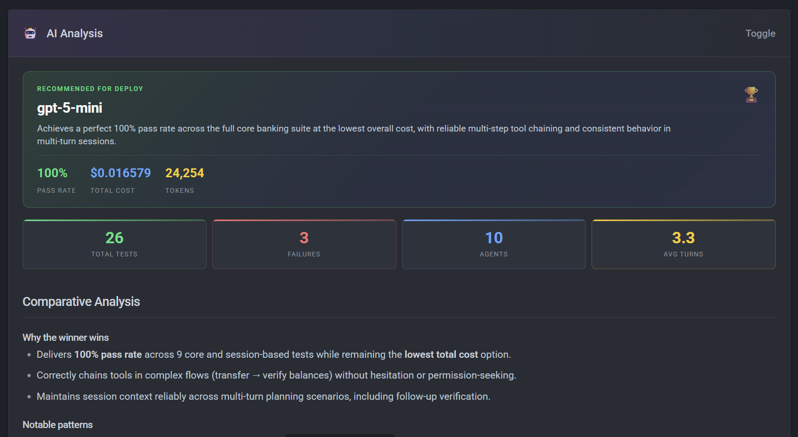

# pytest-aitest

[](https://pypi.org/project/pytest-aitest/)
[](https://pypi.org/project/pytest-aitest/)
[](https://github.com/sbroenne/pytest-aitest/actions/workflows/ci.yml)
[](https://opensource.org/licenses/MIT)

**Test your AI interfaces. AI analyzes your results.**

A pytest plugin for test-driven development of MCP servers, tools, prompts, and skills. Write tests first. Let the AI analysis drive your design.

## Why?

Your MCP server passes all unit tests. Then an LLM tries to use it and picks the wrong tool, passes garbage parameters, or ignores your system prompt.

**Because you tested the code, not the AI interface.** For LLMs, your API is tool descriptions, schemas, and prompts — not functions and types. No compiler catches a bad tool description. No linter flags a confusing schema. Traditional tests can't validate them.

## How It Works

So I built pytest-aitest: write tests as natural language prompts. An **Agent** bundles an LLM with your tools — you assert on what happened:

```python
from pytest_aitest import Agent, Provider, MCPServer

async def test_balance_query(aitest_run):
    agent = Agent(
        provider=Provider(model="azure/gpt-5-mini"),
        mcp_servers=[MCPServer(command=["python", "-m", "my_banking_server"])],
    )

    result = await aitest_run(agent, "What's my checking balance?")

    assert result.success
    assert result.tool_was_called("get_balance")
```

If the test fails, your tool descriptions need work — not your code. This is **test-driven development for AI interfaces**:

1. **Write a test** — a prompt that describes what a user would say
2. **Run it** — the LLM tries to use your tools and fails
3. **Fix the interface** — improve tool descriptions, schemas, or prompts until it passes
4. **AI analysis tells you what else to optimize** — cost, redundant calls, unused tools

## AI Analysis

AI analyzes your results and tells you **what to fix**: which model to deploy, how to improve tool descriptions, where to cut costs. [See a sample report →](https://sbroenne.github.io/pytest-aitest/demo/hero-report.html)



## Quick Start

Install:

```bash
uv add pytest-aitest
```

Configure in `pyproject.toml`:

```toml
[tool.pytest.ini_options]
addopts = """
--aitest-summary-model=azure/gpt-5.2-chat
"""
```

Set credentials and run:

```bash
export AZURE_API_BASE=https://your-resource.openai.azure.com/
az login
pytest tests/
```

## Features

- **MCP Server Testing** — Real models against real tool interfaces
- **CLI Server Testing** — Wrap CLIs as testable tool servers
- **Agent Comparison** — Compare models, prompts, skills, and server versions
- **Agent Leaderboard** — Auto-ranked by pass rate and cost
- **Multi-Turn Sessions** — Test conversations that build on context
- **AI Analysis** — Actionable feedback on tool descriptions, prompts, and costs
- **Multi-Provider** — Any model via [Pydantic AI](https://ai.pydantic.dev/) (OpenAI, Anthropic, Gemini, Azure, Bedrock, Mistral, and more)
- **Clarification Detection** — Catch agents that ask questions instead of acting
- **Semantic Assertions** — Built-in `llm_assert` fixture powered by [pydantic-evals](https://ai.pydantic.dev/evals/) LLM judge
- **Image Assertions** — `llm_assert_image` for AI-graded visual evaluation of screenshots and charts

## Who This Is For

- **MCP server authors** — Validate that LLMs can actually use your tools
- **Agent builders** — Compare models, prompts, and skills to find the best configuration
- **Teams shipping AI systems** — Catch LLM-facing regressions in CI/CD

## Documentation

📚 **[Full Documentation](https://sbroenne.github.io/pytest-aitest/)**

## Requirements

- Python 3.11+
- pytest 9.0+
- An LLM provider (Azure, OpenAI, Anthropic, etc.)

## Acknowledgments

Inspired by [agent-benchmark](https://github.com/mykhaliev/agent-benchmark).

## License

MIT
