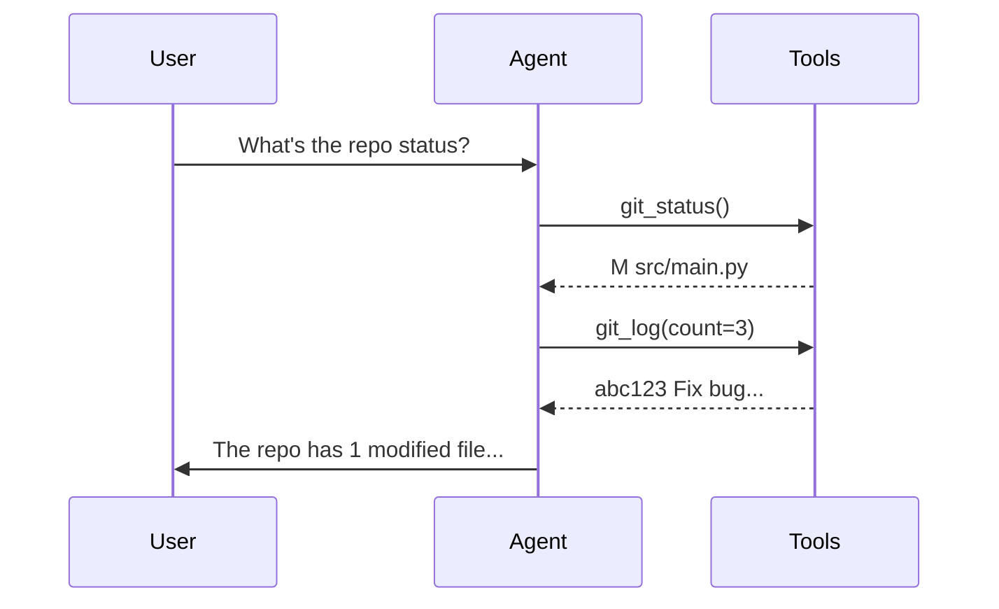

# pytest-aitest Design Document

A pytest plugin for testing AI agent behavior with MCP servers and CLI tools.

> **Note:** This document describes both implemented features and planned designs.
> See the [API Reference](api-reference.md) for what's currently available.

**Part of a two-package ecosystem:**
- **`pytest-llm-assert`** — Lightweight LLM-powered assertions for any test
- **`pytest-aitest`** — Full AI agent testing framework (depends on pytest-llm-assert)

## 1. Overview

### What is pytest-aitest?

pytest-aitest is a pytest plugin that enables testing of AI agents — specifically how they interact with tools like MCP servers and CLI commands. It brings the familiar pytest experience to AI agent testing:

- Define infrastructure (providers, servers, agents) as pytest fixtures
- Write tests as regular Python functions
- Use `@pytest.mark.parametrize` for matrix testing
- Keep prompts in YAML files for readability
- Assert on agent behavior using result methods and AI judge

### Goals

1. **Feel native to pytest users** — No new CLI, no special test format, just pytest
2. **Test agent behavior** — Validate that agents use tools correctly
3. **Support real-world scenarios** — Coding agents using git/npm, file agents using MCP
4. **Leverage pytest ecosystem** — Fixtures, markers, parametrization, plugins

### Non-Goals

- Testing MCP servers directly (use MCP SDK test utilities)
- Testing CLI tools directly (use standard `subprocess`)
- Replacing unit tests for agent implementation code

### Core Concepts

| Concept | Description |
|---------|-------------|
| **Provider** | LLM backend (OpenAI, Azure, Anthropic, etc.) |
| **MCPServer** | Tool server using Model Context Protocol |
| **CLIServer** | Tool server wrapping shell commands |
| **Agent** | Provider + servers + system prompt |
| **Judge** | LLM evaluator for semantic assertions |
| **Test** | Python function that runs agent with prompt and asserts behavior |

## 2. Installation

```bash
pip install pytest-aitest
```

### Requirements

- Python >= 3.11
- pytest >= 8.0

### Modern Python Standards

Both packages follow modern Python conventions (3.11+):

```python
# Type hints with modern syntax
from typing import Self, Protocol
from collections.abc import Sequence, Mapping

def tool_called(self, name: str) -> Self:  # Fluent API returns Self
    ...

def run(
    self,
    prompt: str,
    variables: dict[str, str] | None = None,  # Union with |
    timeout_ms: int | None = None,
) -> AgentResult:
    ...

# Dataclasses with slots for performance
@dataclass(slots=True, frozen=True)
class ToolCall:
    name: str
    arguments: dict[str, Any]
    result: str
    duration_ms: int

# Pattern matching for control flow
match server.type:
    case "stdio":
        return StdioClient(server.command)
    case "sse":
        return SSEClient(server.url)
    case _:
        raise ValueError(f"Unknown server type: {server.type}")

# Pathlib for file operations
from pathlib import Path
template_dir = Path(__file__).parent / "templates"

# Built-in tomllib for config
import tomllib
with open("pyproject.toml", "rb") as f:
    config = tomllib.load(f)

# Async/await for IO operations
async def execute_tool(self, name: str, args: dict) -> str:
    async with self._lock:
        return await self._client.call_tool(name, args)

# Protocol for structural typing (duck typing with type safety)
class ToolServer(Protocol):
    async def list_tools(self) -> list[Tool]: ...
    async def call_tool(self, name: str, args: dict) -> str: ...

# importlib.resources for package data
from importlib.resources import files
template = files("pytest_aitest.templates").joinpath("report.html").read_text()
```

**Build System:** `pyproject.toml` only — no `setup.py`, no `setup.cfg`.

**Tooling:**

```toml
# pyproject.toml
[tool.ruff]
target-version = "py311"
line-length = 100

[tool.ruff.lint]
select = [
    "E",      # pycodestyle errors
    "W",      # pycodestyle warnings
    "F",      # Pyflakes
    "I",      # isort
    "UP",     # pyupgrade (modernize syntax)
    "B",      # flake8-bugbear
    "SIM",    # flake8-simplify
    "TCH",    # flake8-type-checking
    "RUF",    # Ruff-specific rules
]

[tool.ruff.lint.isort]
known-first-party = ["pytest_aitest", "pytest_llm_assert"]

[tool.mypy]
python_version = "3.11"
strict = true
warn_unreachable = true

[tool.pytest.ini_options]
asyncio_mode = "auto"
testpaths = ["tests"]
```

**Development commands:**
```bash
ruff check .          # Lint
ruff check . --fix    # Lint + auto-fix
ruff format .         # Format (replaces Black)
mypy src/             # Type check
pytest                # Test
```

### Dependencies

- [LiteLLM](https://docs.litellm.ai/) — Unified LLM API (supports 100+ providers)
- [MCP SDK](https://github.com/modelcontextprotocol/python-sdk) — Model Context Protocol client
- [pytest-llm-assert](https://pypi.org/project/pytest-llm-assert/) — LLM-powered assertions (included)

## 3. Configuration

All configuration is done through pytest fixtures in `conftest.py`. This provides full Python flexibility and IDE support.

### 3.1 Providers

Providers define the LLM backend for agents. Uses [LiteLLM](https://docs.litellm.ai/) under the hood, supporting 100+ LLM providers with a unified interface.

```python
# conftest.py
import pytest
from pytest_aitest import Provider

@pytest.fixture(scope="session")
def openai_provider():
    return Provider(
        model="openai/gpt-4o-mini",  # LiteLLM model string
        api_key="${OPENAI_API_KEY}",  # Environment variable expansion
    )

@pytest.fixture(scope="session")
def azure_provider():
    return Provider(
        model="azure/my-gpt4-deployment",  # Azure deployment name
        api_key="${AZURE_OPENAI_API_KEY}",
        api_base="https://my-resource.openai.azure.com",
        api_version="2024-02-15-preview",
    )

@pytest.fixture(scope="session")
def anthropic_provider():
    return Provider(
        model="anthropic/claude-sonnet-4-20250514",
        api_key="${ANTHROPIC_API_KEY}",
    )

@pytest.fixture(scope="session")
def bedrock_provider():
    return Provider(
        model="bedrock/anthropic.claude-3-sonnet-20240229-v1:0",
        aws_region_name="us-east-1",
    )
```

#### Provider Parameters

All parameters are passed directly to LiteLLM. Common ones:

| Parameter | Type | Required | Description |
|-----------|------|----------|-------------|
| `model` | str | Yes | LiteLLM model string (e.g., `openai/gpt-4o`, `anthropic/claude-3-opus`) |
| `api_key` | str | Often | API key (supports `${ENV_VAR}` expansion) |
| `api_base` | str | No | Custom API endpoint |
| `api_version` | str | No | API version (Azure) |
| `aws_region_name` | str | No | AWS region (Bedrock) |
| `timeout` | float | No | Request timeout in seconds |
| `max_retries` | int | No | Max retry attempts (default: 2) |

See [LiteLLM Provider Documentation](https://docs.litellm.ai/docs/providers) for provider-specific parameters.

#### Rate Limiting

Built-in rate limiting using LiteLLM's router:

```python
@pytest.fixture(scope="session")
def openai_provider():
    return Provider(
        model="openai/gpt-4o-mini",
        api_key="${OPENAI_API_KEY}",
        rpm=500,   # Requests per minute
        tpm=100000, # Tokens per minute
    )
```

### 3.2 MCPServer

MCP servers provide tools via the Model Context Protocol. The fixture handles server lifecycle (startup/shutdown) automatically.

```python
@pytest.fixture(scope="session")
def filesystem_server():
    server = MCPServer(
        name="filesystem",
        type="stdio",
        command="npx @modelcontextprotocol/server-filesystem /tmp",
        env={"NODE_ENV": "production"},
        server_delay="2s",  # Wait for server startup
    )
    yield server  # Server connects on first use, disconnects after session

@pytest.fixture(scope="session")
def database_server():
    server = MCPServer(
        name="database",
        type="sse",
        url="https://mcp.example.com/sse",
        headers={"Authorization": "Bearer ${API_TOKEN}"},
    )
    yield server
```

**Lifecycle:** Servers connect lazily (on first tool call) and disconnect when the fixture scope ends. Use `yield` to ensure proper cleanup.

#### Wait Strategies

For servers that need time to start, use wait strategies:

```python
from pytest_aitest import MCPServer, Wait

@pytest.fixture(scope="session")
def slow_server():
    server = MCPServer(
        name="slow",
        type="stdio",
        command="python start_server.py",
        wait_for=Wait.for_log("Server ready"),  # Wait for log message
        # Or: wait_for=Wait.for_tools(["tool1", "tool2"]),  # Wait for tools
        # Or: wait_for=Wait.for_seconds(5),  # Simple delay
    )
    yield server
```

#### MCPServer Parameters

| Parameter | Type | Required | Description |
|-----------|------|----------|-------------|
| `name` | str | Yes | Unique identifier |
| `type` | str | Yes | Server type: `stdio`, `sse`, `http` |
| `command` | str | For stdio | Command to spawn server process |
| `url` | str | For sse/http | Server endpoint URL |
| `env` | dict | No | Environment variables for process |
| `headers` | dict | No | HTTP headers for sse/http |
| `server_delay` | str | No | Startup delay (e.g., `"2s"`) |
| `allowed_tools` | list | No | Restrict available tools |

### 3.3 CLIServer

CLI servers wrap command-line tools as MCP-like servers.

```python
@pytest.fixture(scope="session")
def git_server():
    return CLIServer(
        name="git-cli",
        command="git",           # CLI executable to wrap
        tool_prefix="git",       # Creates "git_execute" tool
        shell="bash",            # Optional: auto-detects (bash/powershell)
        cwd="/path/to/repo",     # Optional: working directory
        discover_help=True,      # Default: runs --help for tool description
    )
```

#### How CLI Tools Work

1. Creates a single tool: `{tool_prefix}_execute` that accepts an `args` parameter
2. Automatically discovers usage via `--help` (configurable)
3. Returns structured JSON: `{exit_code, stdout, stderr}`

```python
# The LLM calls the tool like this:
git_execute(args="status --porcelain")
git_execute(args="log -n 5 --oneline")
```

#### CLIServer Parameters

| Parameter | Type | Required | Description |
|-----------|------|----------|-------------|
| `name` | str | Yes | Server identifier |
| `command` | str | Yes | CLI executable to wrap |
| `tool_prefix` | str | Yes | Prefix for generated tool name |
| `shell` | str | No | Shell: `bash`, `sh`, `zsh`, `powershell`, `pwsh`, `cmd` (auto-detect) |
| `cwd` | str | No | Working directory for commands |
| `env` | dict | No | Environment variables |
| `discover_help` | bool | No | Run `--help` for tool description (default: `True`) |

### 3.4 Agent

Agents combine a provider with servers and a system prompt.

```python
@pytest.fixture(scope="module")
def coding_agent(openai_provider, git_tools, filesystem_server):
    agent = Agent(
        name="coder",
        provider=openai_provider,
        servers=[git_tools, filesystem_server],
        system_prompt="""You are a coding assistant. 
You help with git operations and file management.
Always explain what you're doing before taking action.""",
        settings={
            "max_iterations": 10,
            "tool_timeout": "30s",
        }
    )
    yield agent
    agent.cleanup()  # Release server references
```

**Note:** Use `yield` to ensure proper cleanup ordering with server fixtures.

#### Agent Parameters

| Parameter | Type | Required | Description |
|-----------|------|----------|-------------|
| `name` | str | Yes | Unique identifier |
| `provider` | Provider | Yes | LLM provider fixture |
| `servers` | list | Yes | List of MCPServer/CLIServer fixtures |
| `system_prompt` | str | No | System prompt for the agent |
| `settings` | dict | No | Agent settings (see below) |
| `allowed_tools` | list | No | Restrict available tools |
| `skill` | dict | No | Agent skill configuration |

#### Agent Settings

| Setting | Type | Default | Description |
|---------|------|---------|-------------|
| `max_iterations` | int | 10 | Maximum tool call iterations |
| `tool_timeout` | str | "30s" | Timeout per tool call |
| `verbose` | bool | False | Enable detailed logging |

### 3.5 Judge

A Judge is an LLM used to evaluate agent responses semantically. Required for clarification detection and custom semantic assertions.

```python
from pytest_aitest import Judge

@pytest.fixture(scope="session")
def judge(openai_provider):
    """LLM judge for semantic evaluation."""
    return Judge(provider=openai_provider)

# Or use a different (cheaper) model for judging
@pytest.fixture(scope="session")
def judge():
    return Judge(
        provider=Provider(
            model="openai/gpt-4o-mini",  # Cheaper model for evaluation
            api_key="${OPENAI_API_KEY}"
        )
    )
```

#### Judge Parameters

| Parameter | Type | Required | Description |
|-----------|------|----------|-------------|
| `provider` | Provider | Yes | LLM provider for evaluation |

#### Usage

```python
def test_no_clarification(self, coding_agent, aitest_run, judge):
    result = aitest_run(agent=coding_agent, prompt="Check git status")
    
    # Clarification detection requires judge (LLM-based)
    assert result.no_clarification_questions(judge)
    
    # Custom semantic evaluation
    assert judge(result, "Is the response helpful and actionable?")
    assert judge(result, "Does the output explain what was done?")
    
    # Scored evaluation (returns 0.0-1.0)
    assert judge.score(result, "code quality") >= 0.7
```

## 4. Writing Tests

### 4.1 Basic Test Structure

```python
# tests/test_coding_agent.py
import pytest

class TestCodingAgent:
    
    def test_checks_git_status(self, coding_agent, aitest_run):
        """Agent should use git_status when asked about repo state."""
        result = aitest_run(
            agent=coding_agent,
            prompt="What's the current state of this git repository?"
        )
        
        assert result.success
        assert result.tool_was_called("git_status")
    
    def test_runs_tests(self, coding_agent, aitest_run):
        """Agent should run pytest when asked to test code."""
        result = aitest_run(
            agent=coding_agent,
            prompt="Run the tests in the tests/ directory",
            timeout_ms=60000,  # Long-running test needs more time
        )
        
        assert result.success
        assert result.tool_was_called("run_tests")
```

**Note:** The `@pytest.mark.aitest` marker is optional. Tests are identified as AI tests by their use of the `aitest_run` fixture. Use the marker only when you need to pass options like `timeout_ms`.
```

### 4.2 The `@pytest.mark.aitest` Marker

The marker is **optional**. Tests using `aitest_run` are automatically identified as AI tests (like pytest-asyncio's `auto` mode). Use the marker only for:

```python
@pytest.mark.aitest  # Explicit marking (for filtering with -m)
@pytest.mark.aitest(skip_on_rate_limit=True)  # Skip instead of fail on 429
def test_example(self, agent, aitest_run):
    ...
```

**Note:** Execution parameters like `timeout_ms` and `max_iterations` go in the `aitest_run()` call, not the marker (see Section 4.3).

### 4.3 The `aitest_run` Fixture

The `aitest_run` fixture executes the agent and returns a result object:

```python
def test_example(self, coding_agent, aitest_run):
    result = aitest_run(
        agent=coding_agent,
        prompt="Your prompt here",
        variables={"key": "value"},  # Template variables
        timeout_ms=60000,             # Override timeout for this run
        max_iterations=5,             # Override max iterations
    )
```

#### Parameters

| Parameter | Type | Required | Description |
|-----------|------|----------|-------------|
| `agent` | Agent | Yes | Agent fixture to run |
| `prompt` | str | Yes | User prompt (or use `load_prompt()`) |
| `variables` | dict | No | Variables for template expansion |
| `timeout_ms` | int | No | Timeout for this run (overrides agent setting) |
| `max_iterations` | int | No | Max tool call iterations (overrides agent setting) |

### 4.4 Multi-Turn Conversations

> **Not Yet Implemented.** Each test is isolated. Multi-turn support is planned.

Each test runs in isolation. For testing multi-step workflows, use a single detailed prompt:

```python
async def test_multi_step_workflow(self, coding_agent, aitest_run):
    # Combine steps into one prompt for now
    result = await aitest_run(
        agent=coding_agent,
        prompt=\"\"\"
        1. Create a file called hello.txt with 'Hello World'
        2. Read the file back and confirm its contents
        \"\"\"
    )
    
    assert result.success
    assert result.tool_was_called("write_file")
    assert result.tool_was_called("read_file")
```

### 4.5 Prompt Files (YAML)

Keep prompts in YAML files for readability:

```yaml
# prompts/git_status.yaml
prompt: |
  Check the current git status of the repository.
  List any modified, staged, or untracked files.
  Summarize the state in a few sentences.

variables:
  include_untracked: true
```

Use in tests:

```python
from pytest_aitest import load_prompt

def test_git_status(self, coding_agent, aitest_run):
    result = aitest_run(
        agent=coding_agent,
        prompt=load_prompt("prompts/git_status.yaml"),
        variables={"include_untracked": False}  # Override default
    )
    assert result.tool_called("git_status")
```

#### Template Variables

Prompts support Jinja2-style variable expansion:

```yaml
# prompts/create_file.yaml
prompt: |
  Create a file named {{filename}} in the {{directory}} directory.
  Write the following content: {{content}}
  
variables:
  filename: "default.txt"
  directory: "/tmp"
  content: "Hello World"
```

Built-in variables:

| Variable | Description |
|----------|-------------|
| `{{RUN_ID}}` | Unique test run identifier |
| `{{TEMP_DIR}}` | System temp directory |
| `{{TEST_DIR}}` | Directory containing test file |
| `{{AGENT_NAME}}` | Current agent name |
| `{{ENV_VAR}}` | Any environment variable |

Built-in helpers:

```yaml
prompt: |
  Create user {{faker "Name.first_name"}} with ID {{randomValue type=UUID}}
  Timestamp: {{now format="yyyy-MM-dd"}}
```

### 4.6 Parametrization

Use pytest's native parametrization for matrix testing:

```python
class TestCodingAgent:
    
    @pytest.mark.parametrize("task,expected_tool", [
        ("Check git status", "git_status"),
        ("Show recent commits", "git_log"),
        ("Run the tests", "run_tests"),
        ("Show file changes", "git_diff"),
    ])
    def test_uses_correct_tool(self, coding_agent, aitest_run, task, expected_tool):
        result = aitest_run(agent=coding_agent, prompt=task)
        assert result.tool_called(expected_tool)
    
    @pytest.mark.parametrize("count", [1, 5, 10])
    def test_git_log_count(self, coding_agent, aitest_run, count):
        result = aitest_run(
            agent=coding_agent,
            prompt=f"Show me the last {count} commits"
        )
        assert result.tool_called("git_log")
        assert result.tool_param_equals("git_log", count=count)
```

## 5. Assertions API

> **Implementation Status:** Core assertions are implemented. Extended assertions marked with ⚠️ are planned.

The result object from `aitest_run` provides assertion methods.

### 5.1 Tool Assertions (Implemented)

```python
# Tool was called
assert result.tool_was_called("git_status")
assert result.tool_was_called("git_status", times=2)  # Exact count

# Get call count
assert result.tool_call_count("git_status") >= 1

# Get tool argument
city = result.tool_call_arg("get_weather", "city")
assert city == "Paris"

# Get all calls to a tool
calls = result.get_tool_calls("get_weather")
for call in calls:
    print(call.arguments, call.result)
```

### 5.2 Output Assertions (Use Standard Python)

```python
# Check response content
assert "success" in result.final_response.lower()
assert "error" not in result.final_response.lower()

# Regex matching
import re
assert re.search(r"\d+ files? changed", result.final_response)
```

### 5.3 AI Judge (Implemented)

Semantic evaluation via the `judge` fixture:

```python
async def test_quality(aitest_run, agent, judge):
    result = await aitest_run(agent, "Write hello world")
    
    assert result.success
    assert judge(result.final_response, "Is this valid Python code?")
    assert judge(result.final_response, """
        - Contains a print statement
        - Prints 'hello world'
    """)
```

### 5.4 Performance Assertions (Implemented)

```python
# Token usage
assert result.token_usage.total_tokens < 5000

# Duration
assert result.duration_ms < 30000

# Cost (if available)
print(f"Cost: ${result.cost_usd:.4f}")
```

### 5.5 Extended Assertions ⚠️ (Planned)

These are designed but not yet implemented:

```python
# ⚠️ Planned: Tool parameter validation
assert result.tool_param_equals("git_log", count=5)

# ⚠️ Planned: Tool call order
assert result.tool_call_order(["git_status", "git_log"])

# ⚠️ Planned: Combinators
assert result.any_of(
    result.tool_was_called("git_status"),
    result.tool_was_called("git_diff"),
)
```

### 5.6 Raw Access

For custom assertions, access raw data:

```python
# All tool calls
for call in result.tool_calls:
    print(f"{call.name}({call.arguments}) -> {call.result}")

# Full message history
for msg in result.messages:
    print(f"{msg.role}: {msg.content}")

# Final output
print(result.final_output)

# Errors
for error in result.errors:
    print(f"Error: {error}")
```

## 6. CLI Options

pytest-aitest adds command-line options (all prefixed with `--aitest-` for consistency):

```bash
# Verbose AI logging
pytest tests/ --aitest-verbose

# Limit iterations (override agent settings globally)
pytest tests/ --aitest-max-iterations=5

# Override timeout globally
pytest tests/ --aitest-timeout=60000

# Dry run (validate setup without calling LLMs)
pytest tests/ --aitest-dry-run

# Show token usage summary at end
pytest tests/ --aitest-show-tokens

# Save conversation transcripts on failure (like playwright screenshots)
pytest tests/ --aitest-save-conversations
pytest tests/ --aitest-save-conversations=always  # Save even on pass
```

### Reporting Options

```bash
# Generate rich AI test reports (separate from pytest's output)
pytest tests/ --aitest-html=report.html      # HTML report
pytest tests/ --aitest-json=report.json      # JSON report
pytest tests/ --aitest-html=report.html --aitest-json=report.json

# AI-powered summary (calls judge LLM to analyze results)
pytest tests/ --aitest-html=report.html --aitest-summary
pytest tests/ --aitest-summary-provider=openai/gpt-4o-mini --aitest-html=report.html
```

## 7. Reporting

pytest-aitest generates rich reports alongside pytest's standard output. Reports are behavior-centric (what did the agent do?) rather than just test-centric (did it pass?).

### 7.1 Report Formats

| Format | Use Case | Content |
|--------|----------|---------|
| **HTML** | Human review | Interactive drill-down, tool call timelines, Mermaid diagrams |
| **JSON** | CI/CD integration | Machine-readable structured data |

### 7.2 HTML Report Features

**Summary Dashboard:**
- Pass/fail counts with pass rate
- Token usage (total, min, max, avg)
- **Cost tracking (USD)** — total, min, max, avg (via LiteLLM)
- Duration metrics
- Agent/session counts

**Test Overview Table:**
- Test name, status, duration, tokens, tool call count
- Click to expand detailed view

**Multi-Agent Mode** (when testing multiple agents):
- **Comparison Matrix** — Tests as rows, agents as columns
- **Agent Leaderboard** — Ranked by success rate with medals (🥇🥈🥉)
- **Efficiency Metrics** — Tokens per successful test

**Per-Test Details** (expandable):
- Assertions list with pass/fail status
- Error messages (if any)
- Rate limiting stats (throttles, 429s, retries)
- Clarification stats (detected questions)
- **Tool Call Timeline** — Every tool invocation with:
  - Tool name, parameters, result
  - Duration per call
  - Expandable parameter/result details
- **Mermaid Sequence Diagram** — Visual flow of agent ↔ tool interactions
- **Conversation History** — Full message thread (system, user, assistant)
- Final output

**Adaptive Layout:**
- Single-agent mode: Focus on test details
- Multi-agent mode: Comparison features enabled
- Multi-session: Session groupings displayed

### 7.3 JSON Report Schema

```json
{
  "name": "pytest-aitest",
  "timestamp": "2026-01-31T12:00:00Z",
  "duration_ms": 45000,
  "summary": {
    "total": 10,
    "passed": 8,
    "failed": 2,
    "skipped": 0,
    "pass_rate": 80.0,
    "total_tokens": 5000,
    "total_cost_usd": 0.0234,
    "token_stats": {"min": 200, "max": 800, "avg": 500},
    "cost_stats": {"min": 0.002, "max": 0.008, "avg": 0.005}
  },
  "tests": [
    {
      "name": "test_git_status",
      "outcome": "passed",
      "duration_ms": 3500,
      "agent_result": {
        "success": true,
        "duration_ms": 3200,
        "token_usage": {"prompt": 300, "completion": 150},
        "cost_usd": 0.0052,
        "turns": [...],
        "final_response": "...",
        "tools_called": ["git_status"]
      }
    }
  ]
}
```

### 7.4 AI Summary

When `--aitest-summary` is passed, calls a judge LLM to analyze results:

**Single-Agent Analysis:**
- Verdict: Fit / Partially Fit / Not Fit for purpose
- Capabilities demonstrated (strengths)
- Limitations discovered (failures, edge cases)
- Tool usage patterns
- Actionable recommendations

**Multi-Agent Analysis:**
- Recommended agent with reasoning
- Trade-offs (most accurate, most cost-effective, avoid)
- Behavioral differences between agents
- Failure root cause analysis
- Selection recommendations

```bash
# Generate HTML report with AI summary
pytest tests/ --aitest-html=report.html --aitest-summary
```

### 7.5 Mermaid Sequence Diagrams

Every test in HTML reports includes a sequence diagram showing the interaction flow. **Mermaid diagrams are always included** — no configuration needed.



Diagrams are rendered client-side using Mermaid.js (loaded from CDN).

## 8. pyproject.toml Configuration

Configure defaults using standard pytest conventions in `pyproject.toml`:

```toml
[tool.pytest.ini_options]
markers = [
    "aitest: AI agent test",
]

# Set default CLI options for AI tests (recommended)
addopts = """
--aitest-model=azure/gpt-5-mini
--aitest-html=aitest-reports/report.html
--aitest-summary
"""
```

All settings are controlled via CLI options (see Section 6). Use `addopts` to set project defaults and keep command lines clean. CLI overrides are still supported for one-off runs. With Azure Entra ID, just run `az login` and set `AZURE_API_BASE` (no API key needed). This follows pytest conventions — no custom `[tool.pytest-aitest]` section needed.

**Test auto-detection:** Like pytest-asyncio's `auto` mode, tests using `aitest_run` fixture are automatically identified as AI tests. No marker required.

## 9. Examples

> **Note:** These examples illustrate the design vision. Some use planned-but-not-implemented APIs. 
> See the [docs/](.) folder for current working examples.

### 9.1 Testing a Coding Agent

```python
# conftest.py
import pytest
from pytest_aitest import Provider, CLIServer, Agent

@pytest.fixture(scope="session")
def openai():
    return Provider(model="openai/gpt-4o-mini")  # Auth via OPENAI_API_KEY env var

@pytest.fixture(scope="session")
def dev_tools():
    return CLIServer(
        name="dev",
        shell="bash",
        working_dir="${WORKSPACE}",
        tools={
            "git_status": "git status --porcelain",
            "git_log": "git log --oneline -n {count}",
            "git_diff": "git diff {file}",
            "run_tests": "pytest {path} -v",
            "lint": "ruff check {path}",
            "format": "ruff format {path}",
        }
    )

@pytest.fixture(scope="module")
def coding_agent(openai, dev_tools):
    return Agent(
        name="coder",
        provider=openai,
        servers=[dev_tools],
        system_prompt="""You are a senior Python developer.
You help with code review, testing, and git operations.
Always check the current state before making changes."""
    )
```

```python
# tests/test_coding_agent.py
import pytest

class TestCodeReview:
    
    def test_checks_status_before_commit(self, coding_agent, aitest_run):
        result = aitest_run(
            agent=coding_agent,
            prompt="I'm ready to commit. What should I do?"
        )
        assert result.tool_called("git_status")
        assert result.tool_call_order(["git_status"])  # First action
    
    @pytest.mark.parametrize("action,tool", [
        ("check for lint errors", "lint"),
        ("format the code", "format"),
        ("run the tests", "run_tests"),
    ])
    def test_dev_workflow(self, coding_agent, aitest_run, action, tool):
        result = aitest_run(
            agent=coding_agent,
            prompt=f"Please {action} in the src/ directory"
        )
        assert result.tool_called(tool)
        assert result.tool_param_matches(tool, path=r"src/?")
```

### 9.2 Testing a File Management Agent

```python
# conftest.py
from pytest_aitest import MCPServer, Agent

@pytest.fixture(scope="session")
def filesystem():
    return MCPServer(
        name="fs",
        type="stdio",
        command="npx @modelcontextprotocol/server-filesystem /tmp/test-workspace",
        server_delay="2s"
    )

@pytest.fixture(scope="module")
def file_agent(openai, filesystem):
    return Agent(
        name="file-manager",
        provider=openai,
        servers=[filesystem],
        system_prompt="You manage files. Be careful and confirm actions."
    )
```

```python
# tests/test_file_agent.py
class TestFileOperations:
    
    def test_creates_file(self, file_agent, aitest_run):
        result = aitest_run(
            agent=file_agent,
            prompt="Create a file called hello.txt with content 'Hello World'"
        )
        assert result.tool_called("write_file")
        assert result.tool_param_equals("write_file", 
            path="/tmp/test-workspace/hello.txt"
        )
        assert result.no_errors()
    
    def test_lists_directory(self, file_agent, aitest_run):
        result = aitest_run(
            agent=file_agent,
            prompt="What files are in the current directory?"
        )
        assert result.tool_called("list_directory")
        assert result.output_contains("hello.txt")
```

### 9.3 Testing with Prompt Files

```yaml
# prompts/analyze_repo.yaml
prompt: |
  Analyze this git repository:
  1. Check the current status
  2. Show the last {{commit_count}} commits
  3. Identify any uncommitted changes
  
  Provide a summary of the repository state.

variables:
  commit_count: 5
```

```python
# tests/test_analysis.py
from pytest_aitest import load_prompt

class TestRepoAnalysis:
    
    def test_full_analysis(self, coding_agent, aitest_run):
        result = aitest_run(
            agent=coding_agent,
            prompt=load_prompt("prompts/analyze_repo.yaml"),
            variables={"commit_count": 10}
        )
        
        assert result.tool_called("git_status")
        assert result.tool_called("git_log")
        assert result.tool_param_equals("git_log", count=10)
        assert result.output_contains("commit")
```

## 10. Migration from agent-benchmark

### Concept Mapping

| agent-benchmark | pytest-aitest |
|-----------------|---------------|
| YAML test file | Python test module + prompt YAML |
| `providers:` section | Provider fixtures in conftest.py |
| `servers:` section | MCPServer/CLIServer fixtures |
| `agents:` section | Agent fixtures |
| `sessions:` | Test classes (for grouping) |
| `tests:` | Test functions with `@aitest` |
| `matrix:` | `@pytest.mark.parametrize` |
| `assertions:` | Fluent assertions on result |
| `variables:` | `variables={}` parameter |

### Example Migration

**Before (agent-benchmark YAML):**

```yaml
providers:
  - name: openai
    type: OPENAI
    model: gpt-4o-mini
    token: "{{OPENAI_API_KEY}}"

servers:
  - name: git
    type: cli
    shell: bash
    tools:
      - name: git_status
        command: "git status --porcelain"

agents:
  - name: coder
    provider: openai
    servers: [git]
    system_prompt: "You are a coding assistant"

sessions:
  - name: Git Operations
    tests:
      - name: Check status
        prompt: "What's the git status?"
        assertions:
          - type: tool_called
            tool: git_status
```

**After (pytest-aitest):**

```python
# conftest.py
@pytest.fixture(scope="session")
def openai():
    return Provider(model="openai/gpt-4o-mini", api_key="${OPENAI_API_KEY}")

@pytest.fixture(scope="session")
def git():
    return CLIServer(name="git", tools={"git_status": "git status --porcelain"})

@pytest.fixture(scope="module")
def coder(openai, git):
    return Agent(provider=openai, servers=[git], system_prompt="You are a coding assistant")
```

```python
# tests/test_git_operations.py
class TestGitOperations:
    
    def test_check_status(self, coder, aitest_run):
        result = aitest_run(agent=coder, prompt="What's the git status?")
        assert result.tool_called("git_status")
```

### Migration Steps

1. Create `conftest.py` with provider/server/agent fixtures
2. Convert each session to a test class
3. Convert each test to a `@aitest` function
4. Convert assertions to fluent API calls
5. Move complex prompts to YAML files

## 11. Package Architecture

### Project Structure

```
pytest-aitest/
├── src/
│   └── pytest_aitest/
│       ├── __init__.py              # Public API exports
│       ├── plugin.py                # Pytest hooks + CLI options
│       ├── hooks.py                 # Custom hook specs
│       │
│       ├── core/                    # Core types and models
│       │   ├── __init__.py
│       │   ├── agent.py             # Provider, MCPServer, CLIServer, Agent, Wait
│       │   ├── result.py            # AgentResult, Turn, ToolCall
│       │   ├── prompt.py            # Prompt, load_prompts(), load_prompt()
│       │   └── errors.py            # AITestError, ServerStartError, RateLimitError
│       │
│       ├── execution/               # Agent execution engine
│       │   ├── __init__.py
│       │   ├── engine.py            # AgentEngine with retry support
│       │   ├── servers.py           # MCPServerProcess, CLIServerProcess, ServerManager
│       │   └── retry.py             # RetryConfig, with_retry()
│       │
│       ├── fixtures/                # Pytest fixtures
│       │   ├── __init__.py
│       │   ├── run.py               # aitest_run, _aitest_auto_cleanup
│       │   ├── judge.py             # judge fixture (uses pytest-llm-assert)
│       │   └── factories.py         # agent_factory, provider_factory
│       │
│       ├── reporting/               # Adaptive reporting system
│       │   ├── __init__.py
│       │   ├── collector.py         # ReportCollector, TestReport, SuiteReport
│       │   ├── aggregator.py        # DimensionAggregator, smart grouping
│       │   ├── generator.py         # ReportGenerator, Mermaid diagrams
│       │   └── renderers/           # Composable HTML renderers
│       │       ├── __init__.py
│       │       ├── base.py          # BaseRenderer
│       │       ├── summary.py       # SummaryRenderer
│       │       ├── test_list.py     # TestListRenderer
│       │       ├── comparison.py    # ComparisonRenderer (model/prompt)
│       │       └── matrix.py        # MatrixRenderer (2D grid)
│       │
│       ├── testing/                 # Built-in test harness
│       │   ├── __init__.py
│       │   ├── mcp_server.py        # Test MCP server
│       │   ├── cli_server.py        # Test CLI server
│       │   └── store.py             # KeyValueStore backend
│       │
│       ├── templates/
│       │   └── report.html          # HTML report template
│       │
│       │── config.py                # Backwards-compat shim → core/
│       ├── result.py                # Backwards-compat shim → core/
│       ├── engine.py                # Backwards-compat shim → execution/
│       ├── servers.py               # Backwards-compat shim → execution/
│       ├── fixtures.py              # Backwards-compat shim → fixtures/
│       └── reporting.py             # Backwards-compat shim → reporting/
│
├── tests/
│   ├── unit/                        # Unit tests (no LLM/network calls)
│   └── integration/                 # Integration tests (require API keys)
│
├── docs/
│   ├── DESIGN.md                    # This document
│   └── RESTRUCTURE_PLAN.md          # Restructure implementation plan
│
└── examples/
    ├── coding_agent/
    └── file_agent/
```

### Module Responsibilities

| Module | Responsibility |
|--------|---------------|
| `core/` | Data models and types. No I/O, no pytest dependencies. |
| `execution/` | Agent engine, server management, retry logic. Handles all LLM/MCP I/O. |
| `fixtures/` | Pytest fixtures only. Thin wrappers around execution/ and core/. |
| `reporting/` | Report collection, aggregation, and generation. Auto-detects test dimensions. |
| `testing/` | Built-in test servers for integration testing. |

### Backwards Compatibility

Root-level modules (`config.py`, `result.py`, etc.) are shims that re-export from the new package structure:

```python
# config.py (shim)
from pytest_aitest.core.agent import Agent, Provider, MCPServer, ...
```

This ensures existing imports continue to work:
```python
# These all work:
from pytest_aitest import Agent, Provider  # Direct
from pytest_aitest.config import Agent     # Legacy
from pytest_aitest.core import Agent       # New
```

### Smart Reporting

The reporting system automatically detects test dimensions from `@pytest.mark.parametrize`:

| Pattern | Detected Mode | Report Layout |
|---------|--------------|---------------|
| No parametrization | `SIMPLE` | Standard test list |
| `@parametrize("model", [...])` | `MODEL_COMPARISON` | Side-by-side model table |
| `@parametrize("prompt", [...])` | `PROMPT_COMPARISON` | Prompt variant comparison |
| Both model + prompt | `MATRIX` | 2D grid (models × prompts) |

Example:
```python
@pytest.mark.parametrize("model", ["gpt-4o", "claude-3-haiku"])
@pytest.mark.parametrize("prompt", [PROMPT_V1, PROMPT_V2])
async def test_comparison(aitest_run, model, prompt):
    ...
```

Generates a matrix report showing pass/fail for each model × prompt combination.

### YAML Prompts

Prompts can be loaded from YAML files:

```yaml
# prompts/weather.yaml
name: weather-assistant
version: "1.0"
description: Concise weather responses
system_prompt: |
  You are a weather assistant.
  Be brief and always include temperature in Celsius.
```

```python
from pytest_aitest import load_prompts, Prompt

# Load all prompts from directory
prompts = load_prompts("prompts/")

@pytest.mark.parametrize("prompt", prompts, ids=lambda p: p.name)
async def test_prompts(aitest_run, prompt):
    agent = Agent(system_prompt=prompt.system_prompt, ...)
```

### Monorepo Structure

Both packages live in a single GitHub repository using **uv workspaces**:

```
pytest-aitest/                          # GitHub repo
├── packages/
│   ├── pytest-llm-assert/              # Lightweight LLM assertions
│   │   ├── src/
│   │   │   └── pytest_llm_assert/
│   │   │       ├── __init__.py         # Public API: LLMAssert
│   │   │       ├── plugin.py           # Pytest plugin hooks + llm_assert fixture
│   │   │       └── core.py             # LLMAssert, AssertionResult, ScoreResult
│   │   ├── tests/
│   │   │   └── test_llm_assert.py
│   │   ├── pyproject.toml
│   │   └── README.md
│   │
│   └── pytest-aitest/                  # Full agent testing framework
│       ├── src/
│       │   └── pytest_aitest/
│       │       ├── __init__.py         # Public API exports
│       │       ├── plugin.py           # Pytest hooks + CLI options
│       │       ├── hooks.py            # Custom hook specs
│       │       ├── fixtures.py         # aitest_run, judge, agent_factory
│       │       ├── config.py           # Provider, MCPServer, CLIServer, Agent, Wait
│       │       ├── result.py           # AgentResult, Turn, ToolCall
│       │       ├── engine.py           # Agent execution engine
│       │       ├── servers.py          # MCP/CLI server management
│       │       ├── reporting.py        # ReportCollector, ReportGenerator
│       │       └── templates/
│       │           └── report.html     # HTML report template
│       ├── tests/
│       │   ├── test_config.py
│       │   └── test_result.py
│       ├── pyproject.toml
│       └── README.md
│
├── docs/
│   └── DESIGN.md
├── .github/
│   └── workflows/
│       ├── ci.yml                      # Test both packages
│       └── release.yml                 # Publish to PyPI
├── pyproject.toml                      # Workspace root (dev deps, tooling)
├── README.md
└── LICENSE
```

### Workspace Configuration

**Root `pyproject.toml`:**
```toml
[project]
name = "pytest-aitest-workspace"
version = "0.0.0"
requires-python = ">=3.11"

[tool.uv.workspace]
members = ["packages/*"]

[tool.uv.sources]
# During development, use local packages
pytest-llm-assert = { workspace = true }

[dependency-groups]
dev = [
    "ruff>=0.8",
    "mypy>=1.13",
    "pytest>=8.0",
    "pytest-asyncio>=0.24",
]

[tool.ruff]
target-version = "py311"
line-length = 100

[tool.ruff.lint]
select = ["E", "W", "F", "I", "UP", "B", "SIM", "TCH", "RUF"]

[tool.ruff.lint.isort]
known-first-party = ["pytest_aitest", "pytest_llm_assert"]

[tool.mypy]
python_version = "3.11"
strict = true
```

**`packages/pytest-llm-assert/pyproject.toml`:**
```toml
[project]
name = "pytest-llm-assert"
version = "0.1.0"
description = "Simple LLM-powered assertions for any pytest test"
requires-python = ">=3.11"
dependencies = [
    "pytest>=8.0",
    "litellm>=1.55",
]

[project.entry-points.pytest11]
llm_assert = "pytest_llm_assert.plugin"

[build-system]
requires = ["hatchling"]
build-backend = "hatchling.build"
```

**`packages/pytest-aitest/pyproject.toml`:**
```toml
[project]
name = "pytest-aitest"
version = "0.1.0"
description = "AI agent testing framework for pytest"
requires-python = ">=3.11"
dependencies = [
    "pytest>=8.0",
    "pytest-llm-assert>=0.1",
    "litellm>=1.55",
    "mcp>=1.0",
    "jinja2>=3.1",
    "pyyaml>=6.0",
]

[project.entry-points.pytest11]
aitest = "pytest_aitest.plugin"

[build-system]
requires = ["hatchling"]
build-backend = "hatchling.build"
```

### Development Workflow

```bash
# Install uv (if needed)
curl -LsSf https://astral.sh/uv/install.sh | sh

# Clone and setup
git clone https://github.com/yourorg/pytest-aitest
cd pytest-aitest
uv sync                          # Install all deps + both packages in dev mode

# Development
uv run ruff check .              # Lint all packages
uv run ruff format .             # Format all packages
uv run mypy packages/            # Type check all
uv run pytest                    # Test all packages

# Test single package
uv run pytest packages/pytest-llm-assert/tests/
uv run pytest packages/pytest-aitest/tests/

# Build packages
uv build --package pytest-llm-assert
uv build --package pytest-aitest
```

### CI/CD

**`.github/workflows/ci.yml`:**
```yaml
name: CI
on: [push, pull_request]

jobs:
  test:
    runs-on: ubuntu-latest
    strategy:
      matrix:
        python: ["3.11", "3.12", "3.13"]
    steps:
      - uses: actions/checkout@v4
      - uses: astral-sh/setup-uv@v4
      - run: uv sync --python ${{ matrix.python }}
      - run: uv run ruff check .
      - run: uv run mypy packages/
      - run: uv run pytest --cov
```

**`.github/workflows/release.yml`:**
```yaml
name: Release
on:
  push:
    tags: ["v*"]

jobs:
  publish:
    runs-on: ubuntu-latest
    steps:
      - uses: actions/checkout@v4
      - uses: astral-sh/setup-uv@v4
      - run: uv build --package pytest-llm-assert
      - run: uv build --package pytest-aitest
      - run: uv publish --token ${{ secrets.PYPI_TOKEN }}
```

## 12. Hooks

pytest-aitest provides hooks for extensibility (like pytest-bdd):

```python
# conftest.py
def pytest_aitest_before_run(agent, prompt):
    """Called before each agent run."""
    print(f"Running agent {agent.name} with prompt: {prompt[:50]}...")

def pytest_aitest_after_run(agent, prompt, result):
    """Called after each agent run."""
    print(f"Agent used {result.tokens_used} tokens")

def pytest_aitest_on_tool_call(agent, tool_name, arguments, result):
    """Called after each tool invocation."""
    print(f"Tool {tool_name} returned: {result[:100]}...")

def pytest_aitest_on_failure(agent, prompt, result, error):
    """Called when a test fails — useful for custom artifact capture."""
    save_debug_info(agent, result)
```

## 13. Test Harness

pytest-aitest includes a built-in test harness for integration testing. The harness provides both MCP and CLI server implementations with identical functionality, enabling tests that verify agent reasoning capabilities.

### 13.1 Test Server Tools

The test server implements a key-value store with utilities designed to require agent reasoning:

| Tool | Parameters | Returns | Purpose |
|------|------------|---------|---------|
| `get` | `key: str` | Value or error | Basic retrieval |
| `set` | `key: str, value: str` | Confirmation | Basic storage |
| `delete` | `key: str` | Confirmation | State mutation |
| `list_keys` | - | JSON array of keys | Discovery |
| `calculate` | `expression: str` | Numeric result | Math: `"2+3*4"` → `14` |
| `compare` | `a: str, b: str` | `"greater"`, `"less"`, `"equal"` | Comparison |
| `search` | `pattern: str` | Keys matching regex | Pattern matching |
| `transform` | `key: str, operation: str` | Transformed value | `uppercase`, `reverse`, `length` |
| `fail` | `message: str` | Always errors | Error handling tests |
| `slow` | `ms: int, message: str` | Message after delay | Timeout tests |

### 13.2 Server Implementations

**MCP Server** (`testing/mcp_test_server.py`):
```bash
# Start as stdio MCP server
python -m pytest_aitest.testing.mcp_server
```

**CLI Server** (`testing/cli_test_server.py`):
```bash
# Interactive CLI mode
python -m pytest_aitest.testing.cli_server
> get mykey
> set mykey myvalue
```

Both servers share the same `TestStore` backend for consistent behavior.

### 13.3 Integration Test Scenarios

Tests are organized by reasoning complexity:

#### Basic Tool Usage (no reasoning)
```python
@pytest.mark.integration
async def test_simple_store_retrieve(aitest_run, test_agent):
    """Agent can store and retrieve a value."""
    result = await aitest_run(test_agent, "Store 'hello' under key 'greeting', then read it back")
    assert result.tool_was_called("set")
    assert result.tool_was_called("get")
    assert "hello" in result.final_response.lower()
```

#### Multi-Step Reasoning
```python
@pytest.mark.integration
async def test_calculation_from_stored_value(aitest_run, test_agent):
    """Agent retrieves value, performs calculation, stores result."""
    # Pre-populate
    await aitest_run(test_agent, "Set 'count' to '5'")
    
    result = await aitest_run(
        test_agent,
        "Get the value at 'count', double it, and store as 'doubled'"
    )
    # Agent must: get(count) → calculate(5*2) → set(doubled, 10)
    assert result.tool_was_called("get")
    assert result.tool_was_called("calculate") or "10" in str(result.all_tool_calls)
    assert result.tool_was_called("set")
```

#### Conditional Logic
```python
@pytest.mark.integration  
async def test_conditional_operation(aitest_run, test_agent):
    """Agent evaluates condition before acting."""
    await aitest_run(test_agent, "Set 'threshold' to '10'")
    await aitest_run(test_agent, "Set 'current' to '15'")
    
    result = await aitest_run(
        test_agent,
        "If 'current' is greater than 'threshold', set 'status' to 'high', otherwise 'low'"
    )
    # Verify correct decision made
    assert result.tool_was_called("get")  # Must check values
    assert result.tool_was_called("set")
```

#### Aggregation
```python
@pytest.mark.integration
async def test_aggregate_values(aitest_run, test_agent):
    """Agent discovers keys, retrieves values, computes aggregate."""
    await aitest_run(test_agent, "Set 'score_a' to '10'")
    await aitest_run(test_agent, "Set 'score_b' to '20'")
    await aitest_run(test_agent, "Set 'score_c' to '30'")
    
    result = await aitest_run(
        test_agent,
        "Find all keys starting with 'score_', sum their values, store as 'total'"
    )
    # Agent must: list_keys/search → get each → calculate sum → set
    assert result.tool_was_called("search") or result.tool_was_called("list_keys")
    assert result.tool_call_count("get") >= 3
    assert result.tool_was_called("set")
```

#### Error Handling
```python
@pytest.mark.integration
async def test_handles_missing_key(aitest_run, test_agent):
    """Agent handles errors gracefully."""
    result = await aitest_run(
        test_agent,
        "Get the value at 'nonexistent_key' and tell me what happened"
    )
    assert result.success  # Agent should recover, not crash
    assert "not found" in result.final_response.lower() or "error" in result.final_response.lower()
```

### 13.4 Running Integration Tests

```bash
# Run all integration tests (requires OPENAI_API_KEY)
pytest tests/ -m integration -v

# Run with specific model
pytest tests/ -m integration --aitest-model=openai/gpt-4o

# Skip integration tests in CI without API key
pytest tests/ -m "not integration"
```

### 13.5 Test Fixtures

```python
# conftest.py for integration tests
import pytest
from pytest_aitest import Agent, Provider, MCPServer, Wait

@pytest.fixture(scope="module")
def test_mcp_server():
    """MCP server for integration testing."""
    return MCPServer(
        command=["python", "-m", "pytest_aitest.testing.mcp_server"],
        wait=Wait.for_tools(["get", "set", "list_keys"]),
    )

@pytest.fixture(scope="module")
def test_agent(test_mcp_server):
    """Agent configured with test server."""
    return Agent(
        provider=Provider(model="openai/gpt-4o-mini"),
        mcp_servers=[test_mcp_server],
        system_prompt="You are a helpful assistant. Use the available tools to complete tasks.",
        max_turns=10,
    )
```

## 14. Future Considerations

- **Parallel test execution**: Worker-isolated MCP server connections for pytest-xdist
- **Snapshot testing**: Compare agent outputs across runs
- **Coverage**: Track which tools are exercised
- **Mocking**: Mock LLM responses for unit testing
- **Replay mode**: Record/replay for deterministic tests

## 14. Compatibility

### Tested With

| Plugin | Status | Notes |
|--------|--------|-------|
| **pytest** | ✅ | 8.0+ required |
| **pytest-cov** | ✅ | Coverage works normally |
| **pytest-html** | ✅ | Generates alongside our reports |
| **pytest-xdist** | ⚠️ | Use `scope="session"` carefully; servers may need worker isolation |
| **pytest-asyncio** | ✅ | We handle async internally; no conflict |
| **pytest-timeout** | ✅ | Works; our `--ai-timeout` is per-agent-run, theirs is per-test |

### Standard pytest Features

| Feature | Status |
|---------|--------|
| Test discovery (`test_*.py`) | ✅ |
| Fixtures with scopes | ✅ |
| `@pytest.mark.parametrize` | ✅ |
| `@pytest.mark.skip` / `skipif` | ✅ |
| `conftest.py` hierarchy | ✅ |
| `-k` expression filtering | ✅ |
| `--collect-only` | ✅ |
| JUnit XML output | ✅ |
| Exit codes (0=pass, 1=fail) | ✅ |
