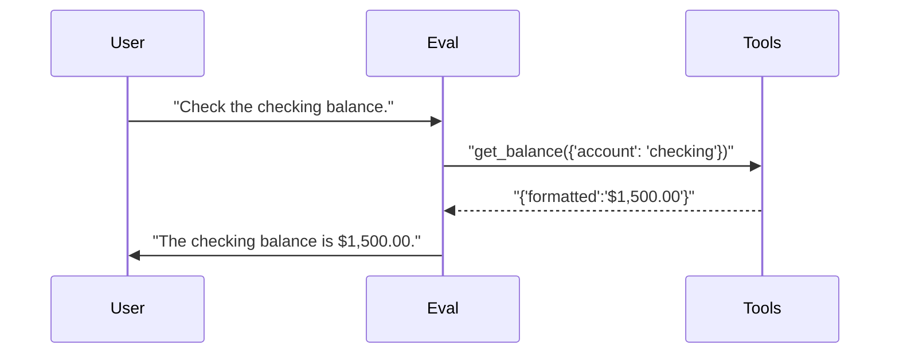
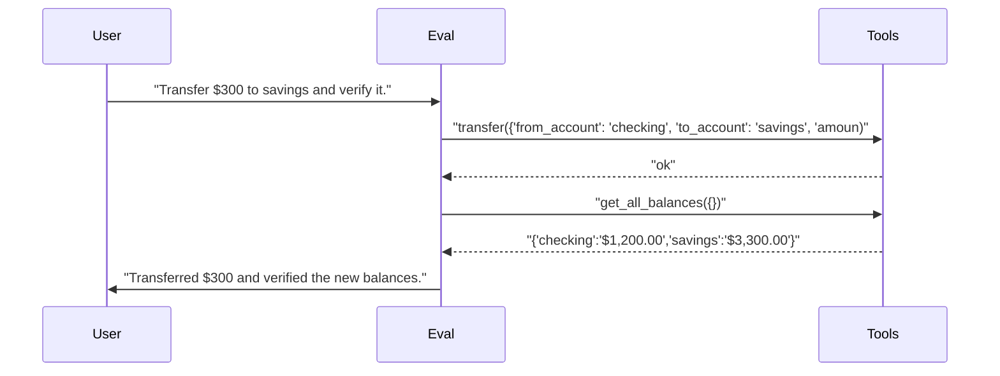

# hero-report

> **4** tests | **3** passed | **1** failed | **75%** pass rate  
> Duration: 12.0s | Cost: 🧪 3 PR · 🤖 $0.001200 · 💰 $0.001200 | Tokens: 195–195  
> August 10, 2026 at 08:10 PM

*Hero showcase report for docs/demo.*

## Eval Leaderboard

|#|Eval|Tests|Pass Rate|Tokens|Cost|Duration|
| :---: | :--- | :---: | :---: | ---: | ---: | ---: |
|🥇|gpt-5.4-mini 🏆|2/2|100%|390|2 PR|6.0s|
|🥈|claude-haiku-4.5|1/2|50%|195|1 PR|6.0s|

## AI Analysis

## 🎯 Recommendation

Deploy the strongest passing eval for **hero showcase**.

## ❌ Failure Analysis

At least one compared result failed, so the report must keep the failure visible.

## 🔧 MCP Tool Feedback

Tool names are deterministic in these fixture reports.

## Test Results

### Session: Showcase: banking tasks, sessions, and custom agent comparisons.

#### ✅ Check one account balance. [gpt-5.4-mini]

✅ gpt-5.4-mini — 3.0s · 195 tokens · 3 turns · 1 PR

**Tool Calls:**

|Tool|Status|Args|
| :--- | :---: | :--- |
|`get_balance`|✅|account='checking'|

**Response:**

> The checking balance is $1,500.00.

```mermaid
sequenceDiagram
    participant User
    participant Eval
    participant Tools

    User->>Eval: "Check the checking balance."
    Eval->>Tools: "get_balance({'account': 'checking'})"
    Tools-->>Eval: "{'formatted':'$1,500.00'}"
    Eval->>User: "The checking balance is $1,500.00."
```

#### ✅ Check one account balance. [claude-haiku-4.5]

✅ claude-haiku-4.5 — 3.0s · 195 tokens · 3 turns · 1 PR

**Tool Calls:**

|Tool|Status|Args|
| :--- | :---: | :--- |
|`get_balance`|✅|account='checking'|

**Response:**

> The checking balance is $1,500.00.

```mermaid
sequenceDiagram
    participant User
    participant Eval
    participant Tools

    User->>Eval: "Check the checking balance."
    Eval->>Tools: "get_balance({'account': 'checking'})"
    Tools-->>Eval: "{'formatted':'$1,500.00'}"
    Eval->>User: "The checking balance is $1,500.00."
```

#### ✅ Transfer funds and verify the updated balances. [gpt-5.4-mini]

✅ gpt-5.4-mini — 3.0s · 195 tokens · 3 turns · 1 PR

**Assertions:**

- ✅ `llm_score`: 4/5 (80%)

**Scores:**

|Dimension|Score|Max|Pct|Weight|
| :--- | ---: | ---: | ---: | ---: |
|correctness|4|5|80%|1.0|

Overall: **4/5** (80%)

> Deterministic score reasoning.

**Tool Calls:**

|Tool|Status|Args|
| :--- | :---: | :--- |
|`transfer`|✅|from_account='checking', to_account='savings', amount=300|
|`get_all_balances`|✅||

**Response:**

> Transferred $300 and verified the new balances.

```mermaid
sequenceDiagram
    participant User
    participant Eval
    participant Tools

    User->>Eval: "Transfer $300 to savings and verify it."
    Eval->>Tools: "transfer({'from_account': 'checking', 'to_account': 'savings', 'amoun)"
    Tools-->>Eval: "ok"
    Eval->>Tools: "get_all_balances({})"
    Tools-->>Eval: "{'checking':'$1,200.00','savings':'$3,300.00'}"
    Eval->>User: "Transferred $300 and verified the new balances."
```

#### ❌ Transfer funds and verify the updated balances. [claude-haiku-4.5]

❌ claude-haiku-4.5 — 3.0s · 0 tokens · 0 turns · N/A

**Assertions:**

- ❌ `llm`: verifies the post-transfer balance

**Error:** `AssertionError: verification step was missing`

*Generated by [pytest-skill-engineering](https://github.com/sbroenne/pytest-skill-engineering) on August 10, 2026 at 08:10 PM*
