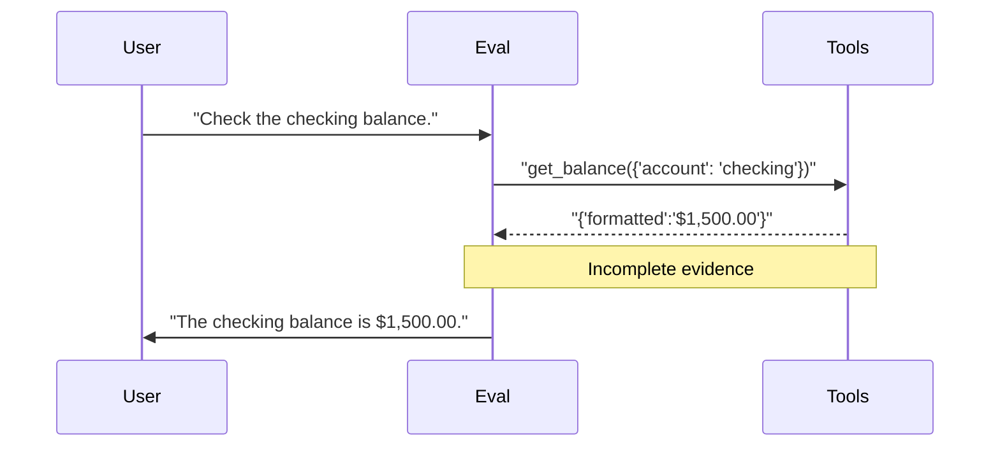
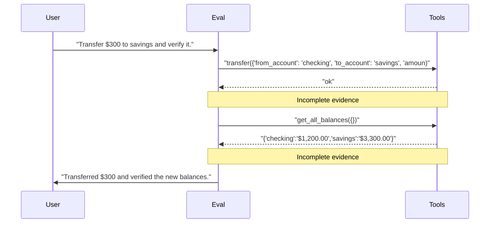
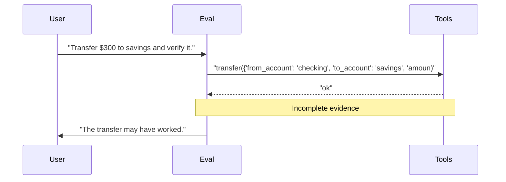

# hero-report

> **4** tests | **3** passed | **1** failed | **75%** pass rate  
> Duration: 12.0s | Cost: 🧪 4 PR · 🤖 $0.001200 · 💰 $0.001200 | Tokens: 195–195  
> August 10, 2026 at 08:10 PM

*Hero showcase report for docs/demo.*

## Eval Leaderboard

|#|Eval|Tests|Pass Rate|Tokens|Cost|Duration|
| :---: | :--- | :---: | :---: | ---: | ---: | ---: |
|🥇|gpt-5.4-mini 🏆|2/2|100%|390|2 PR|6.0s|
|🥈|claude-haiku-4.5|1/2|50%|390|2 PR|6.0s|

## AI Analysis

## 🎯 Recommendation

Deploy the strongest passing eval for **hero showcase**.

## ❌ Failure Analysis

At least one compared result failed, so the report must keep the failure visible.

## 🔧 MCP Tool Feedback

Tool names are deterministic in these fixture reports.

## Test Results

### Session: Showcase: banking tasks, sessions, and custom agent comparisons.

#### ✅ Check one account balance. [gpt-5.4-mini]

✅ gpt-5.4-mini — 3.0s · 195 tokens · 3 turns · 1 PR

Execution and verification evidence
<pre>{
  &quot;session_success&quot;: true,
  &quot;evidence_complete&quot;: null,
  &quot;capture_errors&quot;: [],
  &quot;properties&quot;: [],
  &quot;configuration&quot;: {}
}</pre>

**Tool Calls:**

|Tool|Status|Args|
| :--- | :---: | :--- |
|`get_balance`|Incomplete evidence|account='checking'|

Call evidence
<pre>Call: None
Completion received: None; tool success: None
Arguments: {&quot;account&quot;: &quot;checking&quot;}
Output: {&quot;formatted&quot;:&quot;$1,500.00&quot;}
Error: None</pre>

**Response:**

> The checking balance is $1,500.00.

```mermaid
sequenceDiagram
    participant User
    participant Eval
    participant Tools

    User->>Eval: "Check the checking balance."
    Eval->>Tools: "get_balance({'account': 'checking'})"
    Tools-->>Eval: "{'formatted':'$1,500.00'}"
    Note over Tools,Eval: Incomplete evidence
    Eval->>User: "The checking balance is $1,500.00."
```

#### ✅ Check one account balance. [claude-haiku-4.5]

✅ claude-haiku-4.5 — 3.0s · 195 tokens · 3 turns · 1 PR

Execution and verification evidence
<pre>{
  &quot;session_success&quot;: true,
  &quot;evidence_complete&quot;: null,
  &quot;capture_errors&quot;: [],
  &quot;properties&quot;: [],
  &quot;configuration&quot;: {}
}</pre>

**Tool Calls:**

|Tool|Status|Args|
| :--- | :---: | :--- |
|`get_balance`|Incomplete evidence|account='checking'|

Call evidence
<pre>Call: None
Completion received: None; tool success: None
Arguments: {&quot;account&quot;: &quot;checking&quot;}
Output: {&quot;formatted&quot;:&quot;$1,500.00&quot;}
Error: None</pre>

**Response:**

> The checking balance is $1,500.00.

```mermaid
sequenceDiagram
    participant User
    participant Eval
    participant Tools

    User->>Eval: "Check the checking balance."
    Eval->>Tools: "get_balance({'account': 'checking'})"
    Tools-->>Eval: "{'formatted':'$1,500.00'}"
    Note over Tools,Eval: Incomplete evidence
    Eval->>User: "The checking balance is $1,500.00."
```

#### ✅ Transfer funds and verify the updated balances. [gpt-5.4-mini]

✅ gpt-5.4-mini — 3.0s · 195 tokens · 3 turns · 1 PR

**Assertions:**

- ✅ `llm_score`: 4/5 (80%)

**Scores:**

|Dimension|Score|Max|Pct|Weight|
| :--- | ---: | ---: | ---: | ---: |
|correctness|4|5|80%|1.0|

Overall: **4/5** (80%)

> Deterministic score reasoning.

Execution and verification evidence
<pre>{
  &quot;session_success&quot;: true,
  &quot;evidence_complete&quot;: null,
  &quot;capture_errors&quot;: [],
  &quot;properties&quot;: [],
  &quot;configuration&quot;: {}
}</pre>

**Tool Calls:**

|Tool|Status|Args|
| :--- | :---: | :--- |
|`transfer`|Incomplete evidence|from_account='checking', to_account='savings', amount=300|
|`get_all_balances`|Incomplete evidence||

Call evidence
<pre>Call: None
Completion received: None; tool success: None
Arguments: {&quot;from_account&quot;: &quot;checking&quot;, &quot;to_account&quot;: &quot;savings&quot;, &quot;amount&quot;: 300}
Output: ok
Error: None</pre>

Call evidence
<pre>Call: None
Completion received: None; tool success: None
Arguments: {}
Output: {&quot;checking&quot;:&quot;$1,200.00&quot;,&quot;savings&quot;:&quot;$3,300.00&quot;}
Error: None</pre>

**Response:**

> Transferred $300 and verified the new balances.

```mermaid
sequenceDiagram
    participant User
    participant Eval
    participant Tools

    User->>Eval: "Transfer $300 to savings and verify it."
    Eval->>Tools: "transfer({'from_account': 'checking', 'to_account': 'savings', 'amoun)"
    Tools-->>Eval: "ok"
    Note over Tools,Eval: Incomplete evidence
    Eval->>Tools: "get_all_balances({})"
    Tools-->>Eval: "{'checking':'$1,200.00','savings':'$3,300.00'}"
    Note over Tools,Eval: Incomplete evidence
    Eval->>User: "Transferred $300 and verified the new balances."
```

#### ❌ Transfer funds and verify the updated balances. [claude-haiku-4.5]

❌ claude-haiku-4.5 — 3.0s · 195 tokens · 3 turns · 1 PR

**Assertions:**

- ❌ `llm`: verifies the post-transfer balance

Execution and verification evidence
<pre>{
  &quot;session_success&quot;: false,
  &quot;evidence_complete&quot;: null,
  &quot;capture_errors&quot;: [],
  &quot;properties&quot;: [],
  &quot;configuration&quot;: {}
}</pre>

**Tool Calls:**

|Tool|Status|Args|
| :--- | :---: | :--- |
|`transfer`|Incomplete evidence|from_account='checking', to_account='savings', amount=300|

Call evidence
<pre>Call: None
Completion received: None; tool success: None
Arguments: {&quot;from_account&quot;: &quot;checking&quot;, &quot;to_account&quot;: &quot;savings&quot;, &quot;amount&quot;: 300}
Output: ok
Error: None</pre>

**Error:** `AssertionError: verification step was missing`

**Response:**

> The transfer may have worked.

```mermaid
sequenceDiagram
    participant User
    participant Eval
    participant Tools

    User->>Eval: "Transfer $300 to savings and verify it."
    Eval->>Tools: "transfer({'from_account': 'checking', 'to_account': 'savings', 'amoun)"
    Tools-->>Eval: "ok"
    Note over Tools,Eval: Incomplete evidence
    Eval->>User: "The transfer may have worked."
```

*Generated by [pytest-skill-engineering](https://github.com/sbroenne/pytest-skill-engineering) on August 10, 2026 at 08:10 PM*
