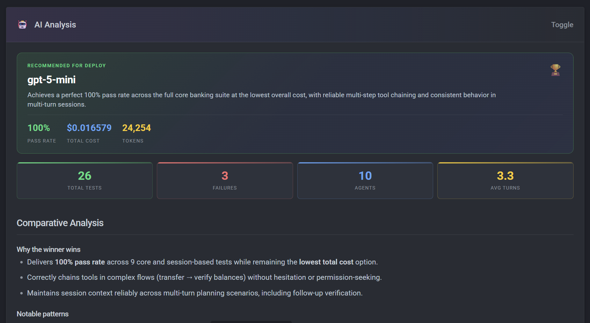

# Test your AI interfaces. AI analyzes your results.

A pytest plugin for validating whether language models can understand and operate your MCP servers, tools, prompts, skills, and custom agents. AI analyzes your test results and tells you *what to fix*, not just *what failed*.

## The Problem

Your MCP server passes all unit tests. Then an LLM tries to use it and:

- Picks the wrong tool
- Passes garbage parameters
- Can't recover from errors
- Ignores the skill instructions you bundled with it

**Why?** Because you tested the code, not the AI interface.

For LLMs, your API isn't functions and types — it's **tool descriptions, skills, custom agent instructions, and schemas**. These are what the LLM actually sees. Traditional tests can't validate them.

## The Solution

Write tests as natural language prompts. An **Eval** is your test harness — it combines an LLM provider, MCP servers, and the configuration you want to evaluate:

```python
async def test_balance_and_transfer(eval_run, banking_server):
    agent = Eval(
        provider=Provider(model="azure/gpt-5-mini"),   # LLM provider
        mcp_servers=[banking_server],                  # MCP servers with tools
        skill=financial_skill,                         # Eval Skill (optional)
    )

    result = await eval_run(
        agent,
        "Transfer $200 from checking to savings and show me the new balances.",
    )

    assert result.success
    assert result.tool_was_called("transfer")
```

The LLM runs your prompt, calls tools, and returns results. You assert on what happened. If the test fails, your tool descriptions or skill need work — not your code.

This is **skill engineering**: design a test for what a user would say, watch the LLM fail, refine your tool descriptions until it passes, then let AI analysis tell you what else to optimize. See [Skill Engineering](explanation/skill-engineering.md) for the full concept.

**What you're testing:**

| Component | Question It Answers |
|-----------|---------------------|
| MCP Server Tools | Can an LLM understand and use my tools? |
| MCP Server Prompts | Do my bundled prompt templates render correctly and produce the right LLM behavior? |
| Prompt Files (Slash Commands) | Does invoking `/my-command` produce the right agent behavior? |
| Skill | Does this domain knowledge help the LLM perform? |
| Custom Agent | Do my `.agent.md` instructions produce the right behavior and subagent dispatch? |

## What Makes This Different?

AI analyzes your test results and tells you **what to fix**, not just what failed. It generates [interactive HTML reports](explanation/ai-analysis.md#sample-reports) with eval leaderboards, comparison tables, and sequence diagrams.



[See a full sample report →](demo/hero-report.html){ .md-button }

    **Suggested improvement for `get_all_balances`:**

    > Return balances for all accounts belonging to the current user in a single call. Use instead of calling `get_balance` separately for each account.

    **💡 Optimizations**

    **Cost reduction opportunity:** Strengthen `get_all_balances` description to encourage single-call logic instead of multiple `get_balance` calls. **Estimated impact: ~15–25% cost reduction** on multi-account queries.


## Quick Start

### GitHub Copilot (recommended)

Test what your users actually experience — zero model setup:

```python
from pytest_skill_engineering.copilot import CopilotEval

async def test_skill(copilot_eval):
    agent = CopilotEval(skill_directories=["skills/my-skill"])
    result = await copilot_eval(agent, "What can you help me with?")
    assert result.success
```

> 📁 See [copilot/test_01_basic.py](https://github.com/sbroenne/pytest-skill-engineering/blob/main/tests/integration/copilot/test_01_basic.py) for complete examples.

### Bring your own model (Azure, OpenAI, Anthropic…)

Full control over model, introspection, and cost tracking:

```python
from pytest_skill_engineering import Eval, Provider, MCPServer

banking_server = MCPServer(command=["python", "banking_mcp.py"])

async def test_balance_check(eval_run):
    agent = Eval(
        provider=Provider(model="azure/gpt-5-mini"),
        mcp_servers=[banking_server],
    )
    result = await eval_run(agent, "What's my checking account balance?")
    assert result.success
    assert result.tool_was_called("get_balance")
```

> 📁 See [pydantic/test_01_basic.py](https://github.com/sbroenne/pytest-skill-engineering/blob/main/tests/integration/pydantic/test_01_basic.py) for complete examples.

## Features

- **MCP Server Testing** — Real models against real tool interfaces; verify LLMs can discover and use your tools
- **MCP Server Prompts** — Test bundled prompt templates exposed via `prompts/list`; verify they render correctly and produce the right LLM behavior
- **Prompt File Testing** — Test VS Code `.prompt.md` and Claude Code command files (slash commands) with `load_prompt_file()` / `load_prompt_files()`
- **A/B Test Servers** — Compare MCP server versions or implementations
- **Test CLI Tools** — Wrap command-line interfaces as testable servers
- **Compare Models** — Benchmark different LLMs against your tools
- **Eval Skills** — Add domain knowledge following [agentskills.io](https://agentskills.io)
- **Custom Agents** — Test `.agent.md` custom agent files with `Eval.from_agent_file()` or load them as subagents in `CopilotEval`; A/B test custom agent versions
- **Real Coding Agent Testing** — Test real coding agents like GitHub Copilot via the SDK (native OAuth, skill loading, exact user experience)
- **Eval Leaderboard** — Auto-ranked by pass rate and cost; AI analysis tells you what to fix
- **Multi-Turn Sessions** — Test conversations that build on context
- **Copilot Model Provider** — Use `copilot/gpt-5-mini` for all LLM calls — zero Azure/OpenAI setup
- **Clarification Detection** — Catch evals that ask questions instead of acting
- **Semantic Assertions** — `llm_assert` for binary pass/fail checks on response content
- **Multi-Dimension Scoring** — `llm_score` for granular quality measurement across named dimensions
- **Image Assertions** — AI-graded visual evaluation of screenshots and visual tool output
- **Cost Estimation** — Automatic per-test cost tracking with pricing from litellm + custom overrides

## Installation

```bash
uv add pytest-skill-engineering
```

## Who This Is For

- **MCP server authors** — Validate tool descriptions work
- **Eval builders** — Compare models and prompts
- **Copilot skill and custom agent authors** — Test exactly what your users experience, before you ship
- **Teams shipping AI systems** — Catch LLM-facing regressions

## Why pytest?

This is a **pytest plugin**, not a standalone tool. Use existing fixtures, markers, parametrize. Works with CI/CD pipelines. No new syntax to learn.

## Documentation

- [Getting Started](getting-started/index.md) — Write your first test
- [How-To Guides](how-to/index.md) — Solve specific problems
- [Reference](reference/index.md) — API and configuration details
- [Explanation](explanation/index.md) — Understand the design

## License

MIT
