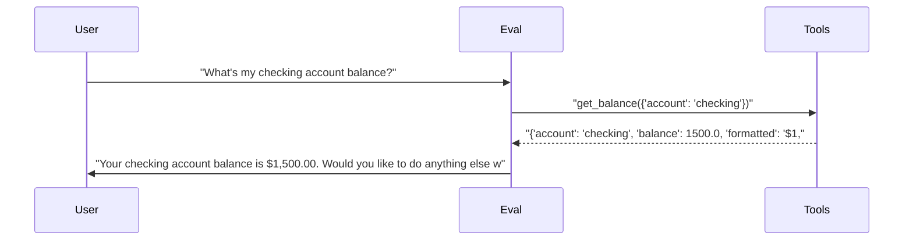
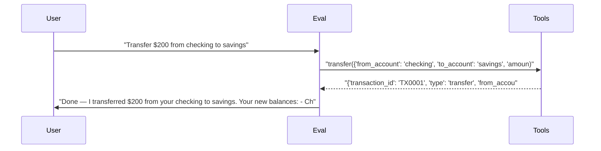
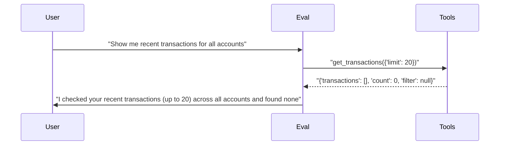
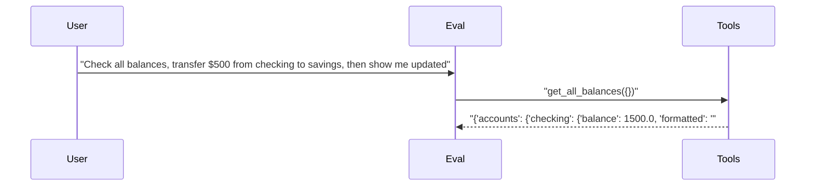

# pytest-skill-engineering

> **4** tests | **3** passed | **1** failed | **75%** pass rate  
> Duration: 37.2s | Cost: 🧪 $0.002150 · 🤖 $0.0235 · 💰 $0.0256 | Tokens: 509–1,322  
> February 07, 2026 at 07:19 PM

*Single agent tests - basic report without comparison UI.*

> **banking-agent** — ❌ 1 Failed  
> 3/4 tests | $0.002150 | 3,786 tokens | 37.2s


## AI Analysis

## 🎯 Recommendation

**Deploy: banking-agent (gpt-5-mini, default prompt)**

**Reasoning:** Achieves a 75% pass rate (3/4) at very low cost ($0.002151 total across all tests). All core single-step banking actions (balance, transfer, transactions) pass reliably and use tools correctly. The only failure is due to a configured turn limit, not tool misuse or model behavior.

**Alternatives:** None — only one configuration tested.

## ❌ Failure Analysis

### Test that fails due to turn limit — for report variety. (banking-agent)
- **Problem:** The agent could not complete a multi-step request (check balances → transfer → show updated balances → show transactions) because the test enforces `max_turns=1`.
- **Root Cause:** Test configuration limits the session to a single turn, but the user request explicitly requires multiple tool calls and responses. The agent correctly initiated the first step (`get_all_balances`) but was blocked before completing the sequence.
- **Fix:** Increase allowed turns for this test.
  - **Exact change:** Set `max_turns` from `1` to `4` (or higher) for this test case.
  - **Alternative fix (if max_turns must remain 1):** Split into separate tests:
    1. “Check all balances — should pass”
    2. “Transfer $500 from checking to savings — should pass”
    3. “Show updated balances and transaction history — should pass”

## 🔧 MCP Tool Feedback

### pytest_skill_engineering.testing.banking_mcp
Overall, tools are discoverable and used correctly. Naming is clear and aligned with user intents.

| Tool | Status | Calls | Issues |
|------|--------|-------|--------|
| get_balance | ✅ | 1 | Working well |
| transfer | ✅ | 1 | Working well |
| get_transactions | ✅ | 1 | Working well |
| get_all_balances | ⚠️ | 1 | Tool works, but multi-step usage blocked by test turn limit |
| deposit | ✅ | 0 | Not exercised in tests |
| withdraw | ✅ | 0 | Not exercised in tests |

## 📝 System Prompt Feedback

### default (mixed)
- **Token count:** ~24 tokens
- **Problem:** The prompt does not address multi-step planning or constraints like turn limits. In multi-action requests, the agent attempts to proceed sequentially, which conflicts with tests that cap turns.
- **Suggested change:** Add an explicit instruction to batch tool usage when possible.
  - **Exact text to append:**
    ```
    If a user request requires multiple actions and turn limits may apply, plan all required tool calls up front and execute them in the minimum number of turns.
    ```

## 💡 Optimizations

1. **Align test turn limits with realistic user tasks** (recommended)
   - Current: Complex, multi-action requests are tested with `max_turns=1`.
   - Change: Allow 3–4 turns for composite banking workflows or decompose them into atomic tests.
   - Impact: Prevents false negatives; improves effective pass rate from 75% to 100% with no additional model cost.

2. **Reduce verbose assistant follow-ups** (suggestion)
   - Current: Assistant frequently asks multiple follow-up questions after completing tasks.
   - Change: Add instruction to ask at most one follow-up question or offer a concise menu.
   - Impact: Minor cost reduction (~5–10% fewer tokens per test).

## 📦 Tool Response Optimization

### get_balance (from pytest_skill_engineering.testing.banking_mcp)
- **Current response size:** ~18 tokens
- **Issues found:** Redundant formatted string duplicates numeric balance.
- **Suggested optimization:** Omit `formatted` and let the assistant format.
- **Estimated savings:** ~6 tokens per call (~33% reduction)

**Example current vs optimized:**
```json
// Current (~18 tokens)
{"account":"checking","balance":1500.0,"formatted":"$1,500.00"}

// Optimized (~12 tokens)
{"account":"checking","balance":1500.0}
```

### transfer (from pytest_skill_engineering.testing.banking_mcp)
- **Current response size:** ~45 tokens
- **Issues found:** Both `message` and formatted fields duplicate information already present in structured fields.
- **Suggested optimization:** Remove `message` and `amount_formatted`.
- **Estimated savings:** ~15 tokens per call (~33% reduction)

**Example current vs optimized:**
```json
// Current (~45 tokens)
{
  "transaction_id":"TX0001",
  "type":"transfer",
  "from_account":"checking",
  "to_account":"savings",
  "amount":200,
  "amount_formatted":"$200.00",
  "new_balance_from":1300.0,
  "new_balance_to":3200.0,
  "message":"Successfully transferred $200.00 from checking to savings."
}

// Optimized (~30 tokens)
{
  "transaction_id":"TX0001",
  "from_account":"checking",
  "to_account":"savings",
  "amount":200,
  "new_balance_from":1300.0,
  "new_balance_to":3200.0
}
```

### get_transactions (from pytest_skill_engineering.testing.banking_mcp)
- **Current response size:** ~14 tokens
- **Issues found:** Includes `filter: null`, which is unused.
- **Suggested optimization:** Omit null fields.
- **Estimated savings:** ~2 tokens per call (~14% reduction)

**Example current vs optimized:**
```json
// Current (~14 tokens)
{"transactions":[],"count":0,"filter":null}

// Optimized (~12 tokens)
{"transactions":[],"count":0}
```


## Test Results


### tests/fixtures/scenario_01_single_agent.py


#### ✅ Basic balance check — should pass.

<details>
<summary>13.7s · 931 tokens · 3 turns · $0.000338</summary>

**Assertions:**

- ✅ `llm`: mentions the checking account balance amount

**Tool Calls:**


|Tool|Status|Args|
| :--- | :---: | :--- |
|`get_balance`|✅|account='checking'|


**Response:**

> Your checking account balance is $1,500.00. Would you like to do anything else with your accounts (transfer, withdraw, deposit, see transactions)?


```mermaid
sequenceDiagram
    participant User
    participant Eval
    participant Tools

    User->>Eval: "What's my checking account balance?"
    Eval->>Tools: "get_balance({'account': 'checking'})"
    Tools-->>Eval: "{'account': 'checking', 'balance': 1500.0, 'formatted': '$1,"
    Eval->>User: "Your checking account balance is $1,500.00. Would you like to do anything else w"
```

</details>


#### ✅ Transfer money — tests the transfer tool.

<details>
<summary>7.1s · 1,024 tokens · 3 turns · $0.000401</summary>

**Assertions:**

- ✅ `llm`: confirms the transfer was completed

**Tool Calls:**


|Tool|Status|Args|
| :--- | :---: | :--- |
|`transfer`|✅|from_account='checking', to_account='savings', amount=200|


**Response:**

> Done — I transferred $200 from your checking to savings. Your new balances:
> - Checking: $1,300.00
> - Savings: $3,200.00
> 
> Would you like a receipt or anything else?


```mermaid
sequenceDiagram
    participant User
    participant Eval
    participant Tools

    User->>Eval: "Transfer $200 from checking to savings"
    Eval->>Tools: "transfer({'from_account': 'checking', 'to_account': 'savings', 'amoun)"
    Tools-->>Eval: "{'transaction_id': 'TX0001', 'type': 'transfer', 'from_accou"
    Eval->>User: "Done — I transferred $200 from your checking to savings. Your new balances: - Ch"
```

</details>


#### ✅ View transactions — multiple tool calls possible.

<details>
<summary>11.9s · 1,322 tokens · 3 turns · $0.001134</summary>

**Assertions:**

- ✅ `llm`: shows transaction or balance information

**Tool Calls:**


|Tool|Status|Args|
| :--- | :---: | :--- |
|`get_transactions`|✅|limit=20|


**Response:**

> I checked your recent transactions (up to 20) across all accounts and found none. That means there are no posted transactions in the timeframe queried.
> 
> Would you like to:
> - Show current balances for all accounts?
> - Check transactions for a specific account (checking or savings) or a different number of transactions?
> - Look for pending transactions?
> - Make a deposit, withdrawal, or transfer?
> 
> Tell me which option and any details (account, amount, or how many transactions to retrieve) and I’ll ta


```mermaid
sequenceDiagram
    participant User
    participant Eval
    participant Tools

    User->>Eval: "Show me recent transactions for all accounts"
    Eval->>Tools: "get_transactions({'limit': 20})"
    Tools-->>Eval: "{'transactions': [], 'count': 0, 'filter': null}"
    Eval->>User: "I checked your recent transactions (up to 20) across all accounts and found none"
```

</details>


#### ❌ Test that fails due to turn limit — for report variety.

<details>
<summary>4.5s · 509 tokens · 2 turns · $0.000278</summary>

**Tool Calls:**


|Tool|Status|Args|
| :--- | :---: | :--- |
|`get_all_balances`|✅||


**Error:** `      AssertionError: Agent exceeded turn limit - unable to process multi-step request (max_turns=1)`


```mermaid
sequenceDiagram
    participant User
    participant Eval
    participant Tools

    User->>Eval: "Check all balances, transfer $500 from checking to savings, then show me updated"
    Eval->>Tools: "get_all_balances({})"
    Tools-->>Eval: "{'accounts': {'checking': {'balance': 1500.0, 'formatted': '"
```

</details>

*Generated by [pytest-skill-engineering](https://github.com/sbroenne/pytest-skill-engineering) on February 07, 2026 at 07:19 PM*
