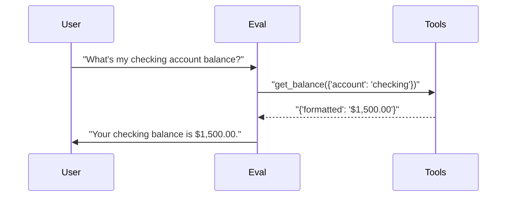
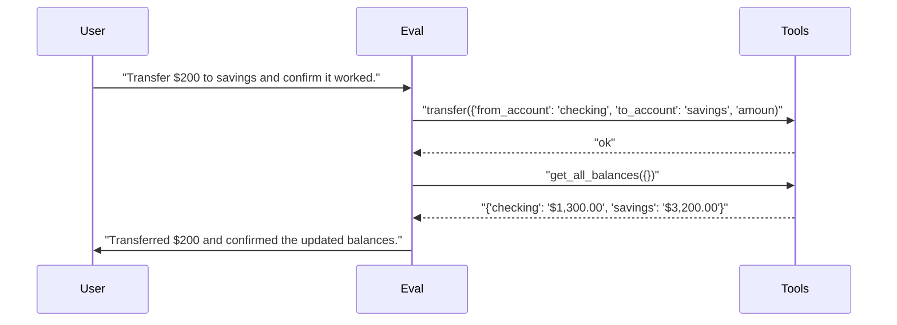

# fixture-01-single-agent

> **2** tests | **2** passed | **0** failed | **100%** pass rate  
> Duration: 6.0s | Cost: 🧪 2 PR · 🤖 $0.001200 · 💰 $0.001200 | Tokens: 195–195  
> August 10, 2026 at 08:00 PM

*Single agent banking smoke report.*

> **gpt-5.4-mini** — ✅ All Passed  
> 2/2 tests | 2 PR | 390 tokens | 6.0s

## AI Analysis

## 🎯 Recommendation

Deploy the strongest passing eval for **single-agent coverage**.

## ❌ Failure Analysis

At least one compared result failed, so the report must keep the failure visible.

## 🔧 MCP Tool Feedback

Tool names are deterministic in these fixture reports.

## Test Results

### tests/fixtures/scenario_01_single_agent.py

#### ✅ Check a single account balance.

3.0s · 195 tokens · 3 turns · 1 PR

**Assertions:**

- ✅ `llm`: mentions the current balance

**Tool Calls:**

|Tool|Status|Args|
| :--- | :---: | :--- |
|`get_balance`|✅|account='checking'|

**Response:**

> Your checking balance is $1,500.00.

```mermaid
sequenceDiagram
    participant User
    participant Eval
    participant Tools

    User->>Eval: "What's my checking account balance?"
    Eval->>Tools: "get_balance({'account': 'checking'})"
    Tools-->>Eval: "{'formatted': '$1,500.00'}"
    Eval->>User: "Your checking balance is $1,500.00."
```

#### ✅ Transfer funds and verify the result.

3.0s · 195 tokens · 3 turns · 1 PR

**Assertions:**

- ✅ `llm`: confirms the transfer outcome
- ✅ `llm_score`: 4/5 (80%)

**Scores:**

|Dimension|Score|Max|Pct|Weight|
| :--- | ---: | ---: | ---: | ---: |
|correctness|4|5|80%|1.0|

Overall: **4/5** (80%)

> Deterministic score reasoning.

**Tool Calls:**

|Tool|Status|Args|
| :--- | :---: | :--- |
|`transfer`|✅|from_account='checking', to_account='savings', amount=200|
|`get_all_balances`|✅||

**Response:**

> Transferred $200 and confirmed the updated balances.

```mermaid
sequenceDiagram
    participant User
    participant Eval
    participant Tools

    User->>Eval: "Transfer $200 to savings and confirm it worked."
    Eval->>Tools: "transfer({'from_account': 'checking', 'to_account': 'savings', 'amoun)"
    Tools-->>Eval: "ok"
    Eval->>Tools: "get_all_balances({})"
    Tools-->>Eval: "{'checking': '$1,300.00', 'savings': '$3,200.00'}"
    Eval->>User: "Transferred $200 and confirmed the updated balances."
```

*Generated by [pytest-skill-engineering](https://github.com/sbroenne/pytest-skill-engineering) on August 10, 2026 at 08:00 PM*
