# pytest-aitest

> **4** tests | **3** passed | **1** failed | **75%** pass rate  
> Duration: 37.2s | Cost: 🧪 $-0.016434 · 🤖 $0.0186 · 💰 $0.002150 | Tokens: 509–1,322  
> February 07, 2026 at 07:19 PM

*Single agent tests - basic report without comparison UI.*

> **banking-agent** — ❌ 1 Failed  
> 3/4 tests | $0.002150 | 3,786 tokens | 37.2s


## AI Analysis

<div class="winner-card">
<div class="winner-title">Recommended for Deploy</div>
<div class="winner-name">banking-agent</div>
<div class="winner-summary">Reliable single-agent setup that passes core banking workflows with correct tool usage at very low cost. One failure is attributable to an artificially strict turn limit, not tool or prompt correctness.</div>
<div class="winner-stats">
<div class="winner-stat"><span class="winner-stat-value amber">75%</span><span class="winner-stat-label">Pass Rate</span></div>
<div class="winner-stat"><span class="winner-stat-value blue">$0.002150</span><span class="winner-stat-label">Total Cost</span></div>
<div class="winner-stat"><span class="winner-stat-value amber">3,786</span><span class="winner-stat-label">Tokens</span></div>
</div>
</div>

<div class="metric-grid">
<div class="metric-card green">
<div class="metric-value green">4</div>
<div class="metric-label">Total Tests</div>
</div>
<div class="metric-card red">
<div class="metric-value red">1</div>
<div class="metric-label">Failures</div>
</div>
<div class="metric-card blue">
<div class="metric-value blue">1</div>
<div class="metric-label">Agents</div>
</div>
<div class="metric-card amber">
<div class="metric-value amber">2.8</div>
<div class="metric-label">Avg Turns</div>
</div>
</div>

## ❌ Failure Analysis

### Failure Summary

**banking-agent** (1 failure)

| Test | Root Cause | Fix |
|------|------------|-----|
| Test that fails due to turn limit — for report variety. | max_turns=1 prevents multi-step execution | Increase turn limit or allow tool chaining in one turn |

### Test that fails due to turn limit — for report variety. (banking-agent)
- **Problem:** The user requested a compound workflow: check balances, transfer funds, then show updated balances and transaction history.
- **Root Cause:** The test enforces `max_turns=1`, but the workflow inherently requires multiple tool calls and at least one follow-up response. The agent correctly initiated the first step (`get_all_balances`) but was cut off before completing the sequence.
- **Behavioral Mechanism:** Not prompt-induced. The failure is caused by the test harness constraint, not by hesitation or permission-seeking language in the system prompt.
- **Fix:** Increase the test configuration to `max_turns >= 3`, or refactor the test to assert partial progress when `max_turns=1`.

## 🔧 MCP Tool Feedback

### banking-mcp
Overall, tools are clearly named and correctly invoked. The agent consistently selects the right tool without confusion.

| Tool | Status | Calls | Issues |
|------|--------|-------|--------|
| get_balance | ✅ | 1 | Working well |
| transfer | ✅ | 1 | Working well |
| get_transactions | ✅ | 1 | Working well |
| get_all_balances | ✅ | 1 | Working well |

## 💡 Optimizations

| # | Optimization | Priority | Estimated Savings |
|---|-------------|----------|-------------------|
| 1 | Increase turn limit for compound tasks | recommended | Prevents 25% test failure rate |
| 2 | Trim verbose assistant follow-ups | suggestion | ~10–15% token reduction |

#### 1. Increase turn limit for compound tasks (recommended)
- Current: Complex requests are tested with `max_turns=1`, causing premature failure.
- Change: Set `max_turns` to at least 3 for workflows involving multiple tool calls.
- Impact: Eliminates the only observed failure without increasing per-test cost.

#### 2. Trim verbose assistant follow-ups (suggestion)
- Current: After successful tool calls, the assistant offers multiple optional next steps, adding tokens.
- Change: Replace multi-option follow-ups with a single concise question, e.g., “Anything else I can help with?”
- Impact: ~10–15% cost reduction through fewer output tokens.

## 📦 Tool Response Optimization

### transfer (from banking-mcp)
- **Current response size:** ~70–80 tokens
- **Issues found:** Includes redundant formatted fields and a human-readable message that the assistant restates anyway.
- **Suggested optimization:** Remove `message` and pre-formatted fields when not required by tests.
- **Estimated savings:** ~25 tokens per call (~30% reduction)

**Example current vs optimized:**
```json
// Current (~75 tokens)
{
  "transaction_id": "TX0001",
  "type": "transfer",
  "from_account": "checking",
  "to_account": "savings",
  "amount": 200,
  "amount_formatted": "$200.00",
  "new_balance_from": 1300.0,
  "new_balance_to": 3200.0,
  "message": "Successfully transferred $200.00 from checking to savings."
}

// Optimized (~50 tokens)
{
  "transaction_id": "TX0001",
  "from_account": "checking",
  "to_account": "savings",
  "amount": 200,
  "new_balance_from": 1300.0,
  "new_balance_to": 3200.0
}
```


## Test Results


### tests/fixtures/scenario_01_single_agent.py


#### ✅ Basic balance check — should pass.

<details>
<summary>13.7s · 931 tokens · 3 turns · $0.000338</summary>

**Assertions:**

- ✅ `llm`: mentions the checking account balance amount

**Tool Calls:**


|Tool|Status|Args|
| :--- | :---: | :--- |
|`get_balance`|✅|account='checking'|


**Response:**

> Your checking account balance is $1,500.00. Would you like to do anything else with your accounts (transfer, withdraw, deposit, see transactions)?


</details>


#### ✅ Transfer money — tests the transfer tool.

<details>
<summary>7.1s · 1,024 tokens · 3 turns · $0.000401</summary>

**Assertions:**

- ✅ `llm`: confirms the transfer was completed

**Tool Calls:**


|Tool|Status|Args|
| :--- | :---: | :--- |
|`transfer`|✅|from_account='checking', to_account='savings', amount=200|


**Response:**

> Done — I transferred $200 from your checking to savings. Your new balances:
> - Checking: $1,300.00
> - Savings: $3,200.00
> 
> Would you like a receipt or anything else?

```mermaid
sequenceDiagram
    participant User
    participant Agent
    participant Tools

    User->>Agent: "Transfer $200 from checking to savings"
    Agent->>Tools: "transfer({'from_account': 'checking', 'to_account': 'savings', 'amoun)"
    Tools-->>Agent: "{'transaction_id': 'TX0001', 'type': 'transfer', 'from_accou"
    Agent->>User: "Done — I transferred $200 from your checking to savings. Your new balances: - Ch"
```



</details>


#### ✅ View transactions — multiple tool calls possible.

<details>
<summary>11.9s · 1,322 tokens · 3 turns · $0.001134</summary>

**Assertions:**

- ✅ `llm`: shows transaction or balance information

**Tool Calls:**


|Tool|Status|Args|
| :--- | :---: | :--- |
|`get_transactions`|✅|limit=20|


**Response:**

> I checked your recent transactions (up to 20) across all accounts and found none. That means there are no posted transactions in the timeframe queried.
> 
> Would you like to:
> - Show current balances for all accounts?
> - Check transactions for a specific account (checking or savings) or a different number of transactions?
> - Look for pending transactions?
> - Make a deposit, withdrawal, or transfer?
> 
> Tell me which option and any details (account, amount, or how many transactions to retrieve) and I’ll ta


</details>


#### ❌ Test that fails due to turn limit — for report variety.

<details>
<summary>4.5s · 509 tokens · 2 turns · $0.000278</summary>

**Tool Calls:**


|Tool|Status|Args|
| :--- | :---: | :--- |
|`get_all_balances`|✅||


**Error:** `      AssertionError: Agent exceeded turn limit - unable to process multi-step request (max_turns=1)`


</details>

*Generated by [pytest-aitest](https://github.com/sbroenne/pytest-aitest) on February 07, 2026 at 07:19 PM*
