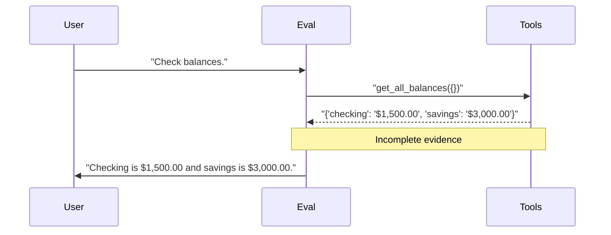
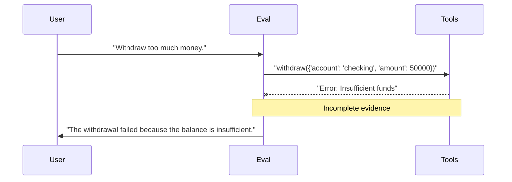
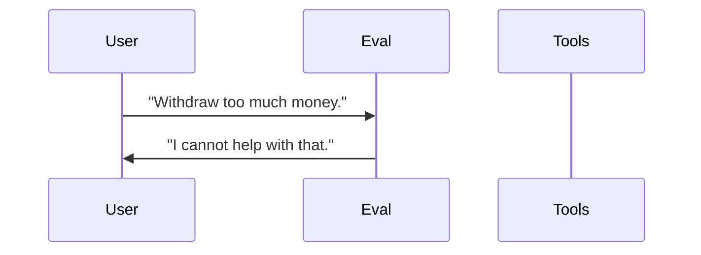

# fixture-02-multi-agent

> **4** tests | **3** passed | **1** failed | **75%** pass rate  
> Duration: 12.0s | Cost: 🧪 4 PR · 🤖 $0.001200 · 💰 $0.001200 | Tokens: 195–195  
> August 10, 2026 at 08:01 PM

*Two agents compared on shared banking workflows.*

## Eval Leaderboard

|#|Eval|Tests|Pass Rate|Tokens|Cost|Duration|
| :---: | :--- | :---: | :---: | ---: | ---: | ---: |
|🥇|gpt-5.4-mini 🏆|2/2|100%|390|2 PR|6.0s|
|🥈|claude-haiku-4.5|1/2|50%|390|2 PR|6.0s|

## AI Analysis

## 🎯 Recommendation

Deploy the strongest passing eval for **multi-agent comparison**.

## ❌ Failure Analysis

At least one compared result failed, so the report must keep the failure visible.

## 🔧 MCP Tool Feedback

Tool names are deterministic in these fixture reports.

## Test Results

### tests/fixtures/scenario_02_multi_agent.py

#### ✅ Compare balance handling across agents. [gpt-5.4-mini]

✅ gpt-5.4-mini — 3.0s · 195 tokens · 3 turns · 1 PR

Execution and verification evidence
<pre>{
  &quot;session_success&quot;: true,
  &quot;evidence_complete&quot;: null,
  &quot;capture_errors&quot;: [],
  &quot;properties&quot;: [],
  &quot;configuration&quot;: {}
}</pre>

**Tool Calls:**

|Tool|Status|Args|
| :--- | :---: | :--- |
|`get_all_balances`|Incomplete evidence||

Call evidence
<pre>Call: None
Completion received: None; tool success: None
Arguments: {}
Output: {&quot;checking&quot;: &quot;$1,500.00&quot;, &quot;savings&quot;: &quot;$3,000.00&quot;}
Error: None</pre>

**Response:**

> Checking is $1,500.00 and savings is $3,000.00.

```mermaid
sequenceDiagram
    participant User
    participant Eval
    participant Tools

    User->>Eval: "Check balances."
    Eval->>Tools: "get_all_balances({})"
    Tools-->>Eval: "{'checking': '$1,500.00', 'savings': '$3,000.00'}"
    Note over Tools,Eval: Incomplete evidence
    Eval->>User: "Checking is $1,500.00 and savings is $3,000.00."
```

#### ✅ Compare balance handling across agents. [claude-haiku-4.5]

✅ claude-haiku-4.5 — 3.0s · 195 tokens · 3 turns · 1 PR

Execution and verification evidence
<pre>{
  &quot;session_success&quot;: true,
  &quot;evidence_complete&quot;: null,
  &quot;capture_errors&quot;: [],
  &quot;properties&quot;: [],
  &quot;configuration&quot;: {}
}</pre>

**Tool Calls:**

|Tool|Status|Args|
| :--- | :---: | :--- |
|`get_all_balances`|Incomplete evidence||

Call evidence
<pre>Call: None
Completion received: None; tool success: None
Arguments: {}
Output: {&quot;checking&quot;: &quot;$1,500.00&quot;, &quot;savings&quot;: &quot;$3,000.00&quot;}
Error: None</pre>

**Response:**

> Checking is $1,500.00 and savings is $3,000.00.

```mermaid
sequenceDiagram
    participant User
    participant Eval
    participant Tools

    User->>Eval: "Check balances."
    Eval->>Tools: "get_all_balances({})"
    Tools-->>Eval: "{'checking': '$1,500.00', 'savings': '$3,000.00'}"
    Note over Tools,Eval: Incomplete evidence
    Eval->>User: "Checking is $1,500.00 and savings is $3,000.00."
```

#### ✅ Reject overdrawn withdrawals cleanly. [gpt-5.4-mini]

✅ gpt-5.4-mini — 3.0s · 195 tokens · 3 turns · 1 PR

Execution and verification evidence
<pre>{
  &quot;session_success&quot;: true,
  &quot;evidence_complete&quot;: null,
  &quot;capture_errors&quot;: [],
  &quot;properties&quot;: [],
  &quot;configuration&quot;: {}
}</pre>

**Tool Calls:**

|Tool|Status|Args|
| :--- | :---: | :--- |
|`withdraw`|Incomplete evidence|account='checking', amount=50000|

Call evidence
<pre>Call: None
Completion received: None; tool success: None
Arguments: {&quot;account&quot;: &quot;checking&quot;, &quot;amount&quot;: 50000}
Output: Output not captured
Error: Insufficient funds</pre>

**Response:**

> The withdrawal failed because the balance is insufficient.

```mermaid
sequenceDiagram
    participant User
    participant Eval
    participant Tools

    User->>Eval: "Withdraw too much money."
    Eval->>Tools: "withdraw({'account': 'checking', 'amount': 50000})"
    Tools--xEval: "Error: Insufficient funds"
    Note over Tools,Eval: Incomplete evidence
    Eval->>User: "The withdrawal failed because the balance is insufficient."
```

#### ❌ Reject overdrawn withdrawals cleanly. [claude-haiku-4.5]

❌ claude-haiku-4.5 — 3.0s · 195 tokens · 2 turns · 1 PR

**Assertions:**

- ❌ `llm`: calls the withdraw tool before explaining the failure

Execution and verification evidence
<pre>{
  &quot;session_success&quot;: false,
  &quot;evidence_complete&quot;: null,
  &quot;capture_errors&quot;: [],
  &quot;properties&quot;: [],
  &quot;configuration&quot;: {}
}</pre>

**Error:** `AssertionError: withdraw tool was never called`

**Response:**

> I cannot help with that.

```mermaid
sequenceDiagram
    participant User
    participant Eval
    participant Tools

    User->>Eval: "Withdraw too much money."
    Eval->>User: "I cannot help with that."
```

*Generated by [pytest-skill-engineering](https://github.com/sbroenne/pytest-skill-engineering) on August 10, 2026 at 08:01 PM*
