# pytest-aitest

> **6** tests | **5** passed | **1** failed | **83%** pass rate  
> Duration: 55.8s | Cost: 🧪 $-0.015492 · 🤖 $0.0201 · 💰 $0.004565 | Tokens: 738–2,232  
> February 07, 2026 at 07:20 PM

*Two agents compared side-by-side.*


## Agent Leaderboard


|#|Agent|Tests|Pass Rate|Tokens|Cost|Duration|
| :---: | :--- | :---: | :---: | ---: | ---: | ---: |
|🥇|gpt-5-mini 🏆|3/3|100%|4,589|$0.003314|35.3s|
|🥈|gpt-4.1-mini|2/3|67%|2,495|$0.001251|20.5s|


## AI Analysis

## 🎯 Recommendation

**Deploy: gpt-5-mini with default system prompt**

Achieves **100% pass rate** across all tests with correct tool usage, at the cost of **higher spend** but **zero functional failures**.

**Reasoning:**  
- **Pass rate:** gpt-5-mini passed **3/3 tests (100%)**, while gpt-4.1-mini passed **2/3 (67%)** and is therefore disqualified for deployment.  
- **Cost:** gpt-5-mini cost **$0.00331 total**, versus **$0.00125 total** for gpt-4.1-mini. Despite being ~**165% more expensive**, gpt-5-mini is the **only configuration that meets correctness requirements**.  
- **Response quality:** gpt-5-mini consistently followed the instruction to *always use tools*, including attempting the `withdraw` tool even when the action would fail.

**Alternatives:**  
- **gpt-4.1-mini (disqualified):** ~62% lower cost, but fails the insufficient funds test by skipping the required `withdraw` tool call, violating test expectations and system prompt constraints.

## ❌ Failure Analysis

### Insufficient funds — tests error recovery. (gpt-4.1-mini)
- **Problem:** The agent did not call the `withdraw` tool when asked to withdraw $50,000, causing the test assertion `tool_was_called('withdraw')` to fail.
- **Root Cause:** The model pre-validated the balance using `get_balance` and short-circuited the workflow, opting to explain the failure in natural language instead of attempting the withdrawal. This contradicts both the **system prompt** (“Always use tools”) and the test’s expectation that error handling occurs via the tool.
- **Fix:** Strengthen the system prompt to explicitly require attempting the requested action tool even if failure is expected.

**Exact system prompt change:**
```
You are a helpful banking assistant.
Use the available tools to manage accounts and transactions.
Always use tools for requested actions, even if you expect them to fail (e.g., insufficient funds).
Never make up balances or account data.
```

## 🔧 MCP Tool Feedback

### pytest_aitest.testing.banking_mcp
Overall, tools are clear and consistently used. Error behavior is surfaced correctly to the agent.

| Tool | Status | Calls | Issues |
|------|--------|-------|--------|
| get_balance | ✅ | 3 | Working well |
| get_all_balances | ✅ | 3 | Working well |
| transfer | ✅ | 2 | Working well |
| withdraw | ✅ | 1 | Error handling works as intended |
| deposit | ✅ | 0 | Not exercised |
| get_transactions | ✅ | 0 | Not exercised |

No description rewrites required; tool naming and schemas are unambiguous.

## 📝 System Prompt Feedback

### default (mixed effectiveness)
- **Token count:** ~27 tokens
- **Problem:** The instruction “Always use tools” is underspecified for failure scenarios. gpt-4.1-mini interpreted it as “use tools to fetch data,” not “attempt the requested action.”
- **Suggested change:** Add explicit guidance for error paths.

**Exact replacement:**
```
You are a helpful banking assistant.
Use the available tools to manage accounts and transactions.
Always use tools for requested actions, even if you expect them to fail (for example, insufficient funds).
Never make up balances or account data.
```

## 💡 Optimizations

1. **Clarify mandatory action-tool usage** (recommended)
   - Current: Prompt allows models to short-circuit actions based on reasoning.
   - Change: Explicitly require calling the action tool (`withdraw`, `transfer`, etc.) whenever the user requests an action.
   - Impact: Eliminates action-skipping failures; prevents disqualification of lower-cost models, potentially enabling **>60% cost reduction** if gpt-4.1-mini becomes compliant.

2. **Reduce verbose recovery messaging** (suggestion)
   - Current: gpt-5-mini produces long option lists after failures (e.g., insufficient funds), increasing token usage.
   - Change: Limit recovery suggestions to 1–2 concise options unless the user asks for details.
   - Impact: ~10–15% cost reduction on failure-path interactions.

## 📦 Tool Response Optimization

### withdraw (from pytest_aitest.testing.banking_mcp)
- **Current response size:** ~20–25 tokens (error string)
- **Issues found:** Error is plain text; agent does not need full sentence phrasing.
- **Suggested optimization:** Return a compact, structured error object.

**Example current vs optimized:**
```json
// Current (~22 tokens)
"Insufficient funds. checking has $1,500.00."

// Optimized (~10 tokens)
{"error":"INSUFFICIENT_FUNDS","balance":1500}
```
- **Estimated savings:** ~12 tokens per failed call (~50% reduction)

This optimization is optional but would further reduce costs on negative paths without affecting correctness.


## Test Results


### tests/fixtures/scenario_02_multi_agent.py


#### ✅ Basic balance query — all agents should pass.

<details>
<summary>✅ gpt-5-mini — 11.0s · 922 tokens · 3 turns · $0.000320</summary>

**Assertions:**

- ✅ `llm`: states the checking account balance amount

**Tool Calls:**


|Tool|Status|Args|
| :--- | :---: | :--- |
|`get_balance`|✅|account='checking'|


**Response:**

> Your checking account balance is $1,500.00. Would you like to do anything else with your account?


</details>

<details>
<summary>✅ gpt-4.1-mini — 6.9s · 738 tokens · 3 turns · $0.000344</summary>

**Assertions:**

- ✅ `llm`: states the checking account balance amount

**Tool Calls:**


|Tool|Status|Args|
| :--- | :---: | :--- |
|`get_balance`|✅|account='checking'|


**Response:**

> Your checking account balance is $1,500.00. Is there anything else you would like to know or do?


</details>


#### ✅ Transfer with verification — tests multi-step tool use.

<details>
<summary>✅ gpt-5-mini — 10.0s · 1,435 tokens · 3 turns · $0.001018</summary>

**Assertions:**

- ✅ `llm`: confirms the transfer and shows updated balances

**Tool Calls:**


|Tool|Status|Args|
| :--- | :---: | :--- |
|`transfer`|✅|from_account='checking', to_account='savings', amount=100|
|`get_all_balances`|✅||


**Response:**

> Done — I transferred $100 from checking to savings.
> 
> Current balances:
> - Checking: $1,400.00
> - Savings: $3,100.00
> Total across accounts: $4,500.00
> 
> What else can I do for you?

```mermaid
sequenceDiagram
    participant User
    participant Agent
    participant Tools

    User->>Agent: "Transfer $100 from checking to savings, then show me both balances"
    Agent->>Tools: "transfer({'from_account': 'checking', 'to_account': 'savings', 'amoun)"
    Tools-->>Agent: "{'transaction_id': 'TX0001', 'type': 'transfer', 'from_accou"
    Agent->>Tools: "get_all_balances({})"
    Tools-->>Agent: "{'accounts': {'checking': {'balance': 1400.0, 'formatted': '"
    Agent->>User: "Done — I transferred $100 from checking to savings. Current balances: - Checking"
```



</details>

<details>
<summary>✅ gpt-4.1-mini — 8.1s · 992 tokens · 3 turns · $0.000526</summary>

**Assertions:**

- ✅ `llm`: confirms the transfer and shows updated balances

**Tool Calls:**


|Tool|Status|Args|
| :--- | :---: | :--- |
|`transfer`|✅|from_account='checking', to_account='savings', amount=100|
|`get_all_balances`|✅||


**Response:**

> I have successfully transferred $100 from your checking account to your savings account. 
> 
> Your updated balances are:
> - Checking: $1,400.00
> - Savings: $3,100.00
> 
> Is there anything else you would like to do?


</details>


#### ❌ Insufficient funds — tests error recovery. ⚡

<details>
<summary>✅ gpt-5-mini — 14.3s · 2,232 tokens · 4 turns · $0.001975</summary>

**Assertions:**

- ✅ `llm`: explains that the withdrawal failed due to insufficient funds

**Tool Calls:**


|Tool|Status|Args|
| :--- | :---: | :--- |
|`withdraw`|✅|account='checking', amount=50000|
|`get_all_balances`|✅||


**Response:**

> I can’t withdraw $50,000 — your checking account has insufficient funds.
> 
> Current balances:
> - Checking: $1,500.00
> - Savings: $3,000.00
> - Total across accounts: $4,500.00
> 
> Options I can do for you now:
> - Withdraw the available $1,500 from checking (proceed now).
> - Transfer up to $3,000 from savings into checking, then withdraw (you’d still only be able to withdraw up to $4,500 total).
> - Transfer the full $3,000 from savings to checking and withdraw the full $4,500.
> - Arrange a deposit or external

```mermaid
sequenceDiagram
    participant User
    participant Agent
    participant Tools

    User->>Agent: "Withdraw $50,000 from my checking account"
    Agent->>Tools: "withdraw({'account': 'checking', 'amount': 50000})"
    Tools-->>Agent: "Insufficient funds. checking has $1,500.00."
    Agent->>Tools: "get_all_balances({})"
    Tools-->>Agent: "{'accounts': {'checking': {'balance': 1500.0, 'formatted': '"
    Agent->>User: "I can’t withdraw $50,000 — your checking account has insufficient funds. Current"
```



</details>

<details>
<summary>❌ gpt-4.1-mini — 5.5s · 765 tokens · 3 turns · $0.000380</summary>

**Tool Calls:**


|Tool|Status|Args|
| :--- | :---: | :--- |
|`get_balance`|✅|account='checking'|


**Error:** `      AssertionError: assert False
       +  where False = tool_was_called('withdraw')
       +    where tool_was_called = AgentResult(SUCCESS)\n  Turns: 3\n  Tools called: get_balance\n  Duration: 2105ms\n  Tokens: 765 | Cost: $0.000380\n  Final: 'Your checking account balance is $1,500.00, which is less than the $50,000 you want to withdraw. You'....tool_was_called`

**Response:**

> Your checking account balance is $1,500.00, which is less than the $50,000 you want to withdraw. You cannot withdraw that amount. Would you like to withdraw a smaller amount or do something else?


</details>

*Generated by [pytest-aitest](https://github.com/sbroenne/pytest-aitest) on February 07, 2026 at 07:20 PM*
