# pytest-skill-engineering

> **6** tests | **5** passed | **1** failed | **83%** pass rate  
> Duration: 55.8s | Cost: 🧪 $-0.019128 · 🤖 $0.0237 · 💰 $0.004565 | Tokens: 738–2,232  
> February 07, 2026 at 07:20 PM

*Two agents compared side-by-side.*


## Agent Leaderboard


|#|Agent|Tests|Pass Rate|Tokens|Cost|Duration|
| :---: | :--- | :---: | :---: | ---: | ---: | ---: |
|🥇|gpt-5-mini 🏆|3/3|100%|4,589|$0.003314|35.3s|
|🥈|gpt-4.1-mini|2/3|67%|2,495|$0.001251|20.5s|


## AI Analysis

<div class="winner-card">
<div class="winner-title">Recommended for Deploy</div>
<div class="winner-name">gpt-5-mini</div>
<div class="winner-summary">Achieves a 100% pass rate while correctly executing multi-step tool flows and error recovery. Slightly higher cost than the alternative, but the only configuration that consistently follows the required tool-first behavior in failure scenarios.</div>
<div class="winner-stats">
<div class="winner-stat"><span class="winner-stat-value green">100%</span><span class="winner-stat-label">Pass Rate</span></div>
<div class="winner-stat"><span class="winner-stat-value blue">$0.003314</span><span class="winner-stat-label">Total Cost</span></div>
<div class="winner-stat"><span class="winner-stat-value amber">4,589</span><span class="winner-stat-label">Tokens</span></div>
</div>
</div>

<div class="metric-grid">
<div class="metric-card green">
<div class="metric-value green">6</div>
<div class="metric-label">Total Tests</div>
</div>
<div class="metric-card red">
<div class="metric-value red">1</div>
<div class="metric-label">Failures</div>
</div>
<div class="metric-card blue">
<div class="metric-value blue">2</div>
<div class="metric-label">Agents</div>
</div>
<div class="metric-card amber">
<div class="metric-value amber">3.2</div>
<div class="metric-label">Avg Turns</div>
</div>
</div>

## Comparative Analysis

### Why the winner wins
- **Only agent with correct error-path tool usage:** gpt-5-mini is the only configuration that attempted the `withdraw` tool even when funds were insufficient, satisfying the test’s requirement to exercise error recovery logic.
- **Reliable multi-step chaining:** Successfully chains `transfer → get_all_balances` without hesitation or re-asking the user, matching the intended MCP workflow.
- **Higher correctness outweighs marginal cost:** Although gpt-4.1-mini is cheaper in absolute terms, its 67% pass rate makes it unsuitable for deployment where correctness is mandatory.

### Notable patterns
- **Cheaper model avoided “failing” tools:** gpt-4.1-mini inferred insufficiency from `get_balance` and responded conversationally instead of calling `withdraw`, indicating a bias toward helpful explanation over tool execution.
- **Error tests expose prompt–model interaction:** The insufficient-funds scenario is the only place where the models diverge, suggesting that tool-error paths are the critical discriminator.

### Alternatives
- **gpt-4.1-mini:** Lower total cost, but failed a core error-recovery test because it did not call the required tool. Not recommended unless the prompt is adjusted to force tool invocation on withdrawal intents.

## ❌ Failure Analysis

### Failure Summary

**gpt-4.1-mini** (1 failure)

| Test | Root Cause | Fix |
|------|------------|-----|
| Insufficient funds — tests error recovery | Model chose to explain insufficiency instead of invoking `withdraw` | Update system prompt to mandate calling `withdraw` for any withdrawal request, even if funds appear insufficient |

### Insufficient funds — tests error recovery (gpt-4.1-mini)
- **Problem:** The agent responded with a balance explanation and options without ever calling the `withdraw` tool.
- **Root Cause:** The model inferred the failure outcome after calling `get_balance` and optimized for a helpful natural-language response rather than executing the requested action via the tool.
- **Behavioral Mechanism:** The absence of explicit language like “always attempt the requested banking action via tools” allows the model to short-circuit. Phrases implying helpfulness or user guidance (e.g., offering alternatives) prime it to stop after explanation instead of acting.
- **Fix:** Add an explicit instruction to the system prompt:  
  > “For any user request to withdraw funds, you MUST call the `withdraw` tool exactly once, even if you expect it to fail due to insufficient funds.”

## 🔧 MCP Tool Feedback

### banking_server
Overall, tools are discoverable and consistently named. Error responses are clear, enabling the agent to recover and explain outcomes.

| Tool | Status | Calls | Issues |
|------|--------|-------|--------|
| get_balance | ✅ | 3 | Working well |
| get_all_balances | ✅ | 3 | Working well |
| transfer | ✅ | 2 | Working well |
| withdraw | ✅ | 1 | Error surfaced correctly |

## 💡 Optimizations

| # | Optimization | Priority | Estimated Savings |
|---|-------------|----------|-------------------|
| 1 | Force tool-first behavior for withdrawals | recommended | Prevents 33% failure rate |
| 2 | Trim unused fields from balance responses | suggestion | ~15% token reduction |

#### 1. Force tool-first behavior for withdrawals (recommended)
- Current: Models may infer failure from balances and skip calling `withdraw`.
- Change: Explicitly require a `withdraw` tool call for any withdrawal intent.
- Impact: Eliminates the observed failure mode; improves pass rate from 67% to 100% for gpt-4.1-mini.

#### 2. Trim unused fields from balance responses (suggestion)
- Current: Tools return both raw and formatted totals that are not always referenced.
- Change: Remove aggregate totals when per-account balances are sufficient.
- Impact: ~15% token reduction in multi-balance responses.

## 📦 Tool Response Optimization

### get_all_balances (from banking_server)
- **Current response size:** ~80 tokens
- **Issues found:** Includes `total` and `total_formatted` even when the agent only lists per-account balances.
- **Suggested optimization:** Make totals optional via a parameter (e.g., `include_total=false`).
- **Estimated savings:** ~15 tokens per call (~18% reduction)

**Example current vs optimized:**
```json
// Current (~80 tokens)
{
  "accounts": {
    "checking": {"balance": 1400.0, "formatted": "$1,400.00"},
    "savings": {"balance": 3100.0, "formatted": "$3,100.00"}
  },
  "total": 4500.0,
  "total_formatted": "$4,500.00"
}

// Optimized (~65 tokens)
{
  "accounts": {
    "checking": {"formatted": "$1,400.00"},
    "savings": {"formatted": "$3,100.00"}
  }
}
```


## Test Results


### tests/fixtures/scenario_02_multi_agent.py


#### ✅ Basic balance query — all agents should pass.

<details>
<summary>✅ gpt-5-mini — 11.0s · 922 tokens · 3 turns · $0.000320</summary>

**Assertions:**

- ✅ `llm`: states the checking account balance amount

**Tool Calls:**


|Tool|Status|Args|
| :--- | :---: | :--- |
|`get_balance`|✅|account='checking'|


**Response:**

> Your checking account balance is $1,500.00. Would you like to do anything else with your account?


</details>

<details>
<summary>✅ gpt-4.1-mini — 6.9s · 738 tokens · 3 turns · $0.000344</summary>

**Assertions:**

- ✅ `llm`: states the checking account balance amount

**Tool Calls:**


|Tool|Status|Args|
| :--- | :---: | :--- |
|`get_balance`|✅|account='checking'|


**Response:**

> Your checking account balance is $1,500.00. Is there anything else you would like to know or do?


</details>


#### ✅ Transfer with verification — tests multi-step tool use.

<details>
<summary>✅ gpt-5-mini — 10.0s · 1,435 tokens · 3 turns · $0.001018</summary>

**Assertions:**

- ✅ `llm`: confirms the transfer and shows updated balances

**Tool Calls:**


|Tool|Status|Args|
| :--- | :---: | :--- |
|`transfer`|✅|from_account='checking', to_account='savings', amount=100|
|`get_all_balances`|✅||


**Response:**

> Done — I transferred $100 from checking to savings.
> 
> Current balances:
> - Checking: $1,400.00
> - Savings: $3,100.00
> Total across accounts: $4,500.00
> 
> What else can I do for you?

```mermaid
sequenceDiagram
    participant User
    participant Agent
    participant Tools

    User->>Agent: "Transfer $100 from checking to savings, then show me both balances"
    Agent->>Tools: "transfer({'from_account': 'checking', 'to_account': 'savings', 'amoun)"
    Tools-->>Agent: "{'transaction_id': 'TX0001', 'type': 'transfer', 'from_accou"
    Agent->>Tools: "get_all_balances({})"
    Tools-->>Agent: "{'accounts': {'checking': {'balance': 1400.0, 'formatted': '"
    Agent->>User: "Done — I transferred $100 from checking to savings. Current balances: - Checking"
```



</details>

<details>
<summary>✅ gpt-4.1-mini — 8.1s · 992 tokens · 3 turns · $0.000526</summary>

**Assertions:**

- ✅ `llm`: confirms the transfer and shows updated balances

**Tool Calls:**


|Tool|Status|Args|
| :--- | :---: | :--- |
|`transfer`|✅|from_account='checking', to_account='savings', amount=100|
|`get_all_balances`|✅||


**Response:**

> I have successfully transferred $100 from your checking account to your savings account. 
> 
> Your updated balances are:
> - Checking: $1,400.00
> - Savings: $3,100.00
> 
> Is there anything else you would like to do?


</details>


#### ❌ Insufficient funds — tests error recovery. ⚡

<details>
<summary>✅ gpt-5-mini — 14.3s · 2,232 tokens · 4 turns · $0.001975</summary>

**Assertions:**

- ✅ `llm`: explains that the withdrawal failed due to insufficient funds

**Tool Calls:**


|Tool|Status|Args|
| :--- | :---: | :--- |
|`withdraw`|✅|account='checking', amount=50000|
|`get_all_balances`|✅||


**Response:**

> I can’t withdraw $50,000 — your checking account has insufficient funds.
> 
> Current balances:
> - Checking: $1,500.00
> - Savings: $3,000.00
> - Total across accounts: $4,500.00
> 
> Options I can do for you now:
> - Withdraw the available $1,500 from checking (proceed now).
> - Transfer up to $3,000 from savings into checking, then withdraw (you’d still only be able to withdraw up to $4,500 total).
> - Transfer the full $3,000 from savings to checking and withdraw the full $4,500.
> - Arrange a deposit or external

```mermaid
sequenceDiagram
    participant User
    participant Agent
    participant Tools

    User->>Agent: "Withdraw $50,000 from my checking account"
    Agent->>Tools: "withdraw({'account': 'checking', 'amount': 50000})"
    Tools-->>Agent: "Insufficient funds. checking has $1,500.00."
    Agent->>Tools: "get_all_balances({})"
    Tools-->>Agent: "{'accounts': {'checking': {'balance': 1500.0, 'formatted': '"
    Agent->>User: "I can’t withdraw $50,000 — your checking account has insufficient funds. Current"
```



</details>

<details>
<summary>❌ gpt-4.1-mini — 5.5s · 765 tokens · 3 turns · $0.000380</summary>

**Tool Calls:**


|Tool|Status|Args|
| :--- | :---: | :--- |
|`get_balance`|✅|account='checking'|


**Error:** `      AssertionError: assert False
       +  where False = tool_was_called('withdraw')
       +    where tool_was_called = AgentResult(SUCCESS)\n  Turns: 3\n  Tools called: get_balance\n  Duration: 2105ms\n  Tokens: 765 | Cost: $0.000380\n  Final: 'Your checking account balance is $1,500.00, which is less than the $50,000 you want to withdraw. You'....tool_was_called`

**Response:**

> Your checking account balance is $1,500.00, which is less than the $50,000 you want to withdraw. You cannot withdraw that amount. Would you like to withdraw a smaller amount or do something else?


</details>

*Generated by [pytest-skill-engineering](https://github.com/sbroenne/pytest-skill-engineering) on February 07, 2026 at 07:20 PM*
