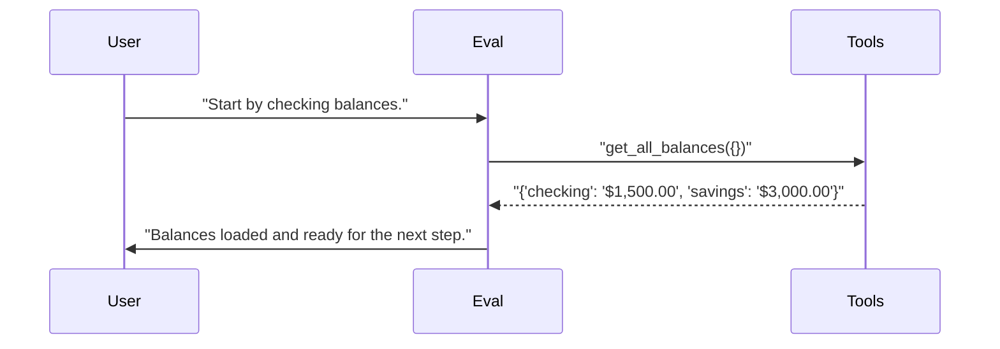
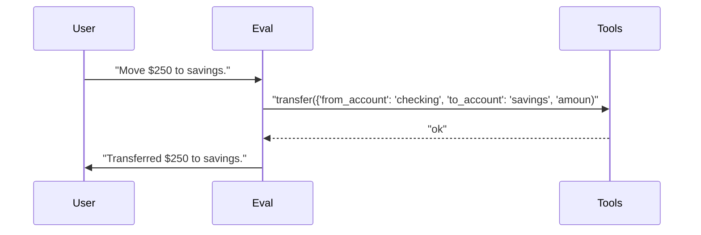

# fixture-03-sessions

> **4** tests | **4** passed | **0** failed | **100%** pass rate  
> Duration: 12.0s | Cost: 🧪 4 PR · 🤖 $0.001200 · 💰 $0.001200 | Tokens: 195–195  
> August 10, 2026 at 08:02 PM

*Two agents compared inside one banking session.*

## Eval Leaderboard

|#|Eval|Tests|Pass Rate|Tokens|Cost|Duration|
| :---: | :--- | :---: | :---: | ---: | ---: | ---: |
|🥇|claude-haiku-4.5 🏆|2/2|100%|390|2 PR|6.0s|
|🥈|gpt-5.4-mini|2/2|100%|390|2 PR|6.0s|

## AI Analysis

## 🎯 Recommendation

Deploy the strongest passing eval for **session grouping**.

## ❌ Failure Analysis

At least one compared result failed, so the report must keep the failure visible.

## 🔧 MCP Tool Feedback

Tool names are deterministic in these fixture reports.

## Test Results

### Session: Multi-turn session: moving money and verifying the final state.

#### ✅ First turn: establish the current balances. [gpt-5.4-mini]

✅ gpt-5.4-mini — 3.0s · 195 tokens · 3 turns · 1 PR

**Tool Calls:**

|Tool|Status|Args|
| :--- | :---: | :--- |
|`get_all_balances`|✅||

**Response:**

> Balances loaded and ready for the next step.

```mermaid
sequenceDiagram
    participant User
    participant Eval
    participant Tools

    User->>Eval: "Start by checking balances."
    Eval->>Tools: "get_all_balances({})"
    Tools-->>Eval: "{'checking': '$1,500.00', 'savings': '$3,000.00'}"
    Eval->>User: "Balances loaded and ready for the next step."
```

#### ✅ First turn: establish the current balances. [claude-haiku-4.5]

✅ claude-haiku-4.5 — 3.0s · 195 tokens · 3 turns · 1 PR

**Tool Calls:**

|Tool|Status|Args|
| :--- | :---: | :--- |
|`get_all_balances`|✅||

**Response:**

> Balances loaded and ready for the next step.

```mermaid
sequenceDiagram
    participant User
    participant Eval
    participant Tools

    User->>Eval: "Start by checking balances."
    Eval->>Tools: "get_all_balances({})"
    Tools-->>Eval: "{'checking': '$1,500.00', 'savings': '$3,000.00'}"
    Eval->>User: "Balances loaded and ready for the next step."
```

#### ✅ Second turn: transfer funds into savings. [gpt-5.4-mini]

✅ gpt-5.4-mini — 3.0s · 195 tokens · 3 turns · 1 PR

**Tool Calls:**

|Tool|Status|Args|
| :--- | :---: | :--- |
|`transfer`|✅|from_account='checking', to_account='savings', amount=250|

**Response:**

> Transferred $250 to savings.

```mermaid
sequenceDiagram
    participant User
    participant Eval
    participant Tools

    User->>Eval: "Move $250 to savings."
    Eval->>Tools: "transfer({'from_account': 'checking', 'to_account': 'savings', 'amoun)"
    Tools-->>Eval: "ok"
    Eval->>User: "Transferred $250 to savings."
```

#### ✅ Second turn: transfer funds into savings. [claude-haiku-4.5]

✅ claude-haiku-4.5 — 3.0s · 195 tokens · 3 turns · 1 PR

**Tool Calls:**

|Tool|Status|Args|
| :--- | :---: | :--- |
|`transfer`|✅|from_account='checking', to_account='savings', amount=250|

**Response:**

> Transferred $250 to savings.

```mermaid
sequenceDiagram
    participant User
    participant Eval
    participant Tools

    User->>Eval: "Move $250 to savings."
    Eval->>Tools: "transfer({'from_account': 'checking', 'to_account': 'savings', 'amoun)"
    Tools-->>Eval: "ok"
    Eval->>User: "Transferred $250 to savings."
```

*Generated by [pytest-skill-engineering](https://github.com/sbroenne/pytest-skill-engineering) on August 10, 2026 at 08:02 PM*
