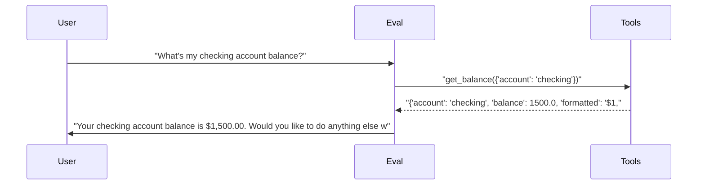
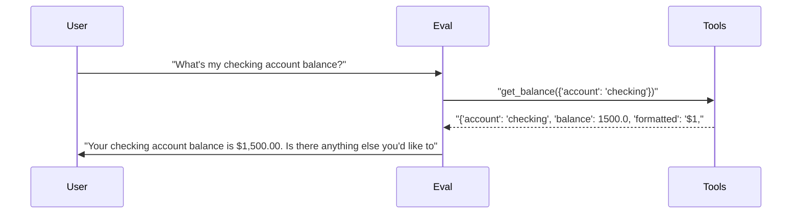
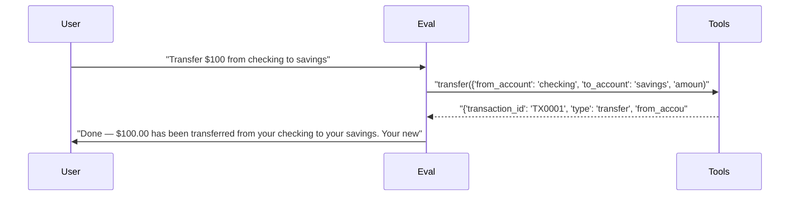
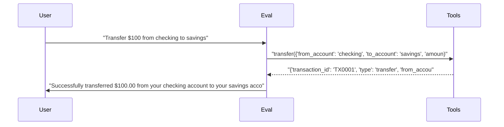
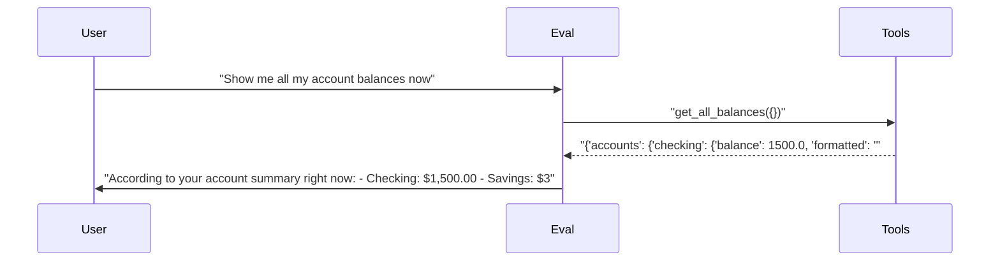
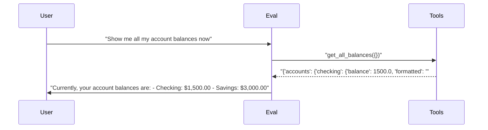

# pytest-skill-engineering

> **6** tests | **6** passed | **0** failed | **100%** pass rate  
> Duration: 50.1s | Cost: 🧪 $0.003773 · 🤖 $0.0240 · 💰 $0.0277 | Tokens: 711–1,941  
> February 07, 2026 at 02:01 PM

*Multi-turn banking session with 2 agents.*


## Eval Leaderboard


|#|Eval|Tests|Pass Rate|Tokens|Cost|Duration|
| :---: | :--- | :---: | :---: | ---: | ---: | ---: |
|🥇|gpt-4.1-mini 🏆|3/3|100%|3,005|$0.001419|19.9s|
|🥈|gpt-5-mini|3/3|100%|4,180|$0.002354|30.2s|


## AI Analysis

## 🎯 Recommendation

**Deploy: gpt-4.1-mini + default system prompt**

Achieves 100% pass rate at ~40% lower total cost than gpt-5-mini with comparable response quality and correct tool usage.

**Reasoning:**  
Both agents passed all tests (100% pass rate). gpt-4.1-mini completed the full multi‑turn session at **$0.001419 total cost**, compared to **$0.002354** for gpt-5-mini, a **~40% cost reduction**. Response quality and tool selection were equivalent across all turns, making cost the decisive factor.

**Alternatives:**  
- **gpt-5-mini**: Same pass rate and behavior, but ~66% higher cost for this test set. No quality advantage observed to justify the premium.

## 🔧 MCP Tool Feedback

### pytest_skill_engineering.testing.banking_mcp
Overall, tools are clearly named and consistently selected. No confusion between similar tools observed.

| Tool | Status | Calls | Issues |
|------|--------|-------|--------|
| get_balance | ✅ | 2 | Working well |
| transfer | ✅ | 2 | Working well |
| get_all_balances | ✅ | 2 | Working well |
| deposit | ✅ | 0 | Not exercised |
| withdraw | ✅ | 0 | Not exercised |
| get_transactions | ✅ | 0 | Not exercised |

## 📦 Tool Response Optimization

### get_balance (from pytest_skill_engineering.testing.banking_mcp)
- **Current response size:** ~20–25 tokens
- **Issues found:** Redundant fields (`balance` and `formatted`) where only the formatted value is used in responses.
- **Suggested optimization:** Return a single balance field optimized for display.
- **Estimated savings:** ~30–40% tokens per call

**Example current vs optimized:**
```json
// Current (~24 tokens)
{"account":"checking","balance":1500.0,"formatted":"$1,500.00"}

// Optimized (~14 tokens)
{"account":"checking","balance":"$1,500.00"}
```

### transfer (from pytest_skill_engineering.testing.banking_mcp)
- **Current response size:** ~55–65 tokens
- **Issues found:** Multiple redundant fields (`amount` vs `amount_formatted`, verbose `message`) not required by the agent.
- **Suggested optimization:** Keep IDs and new balances only; let the agent generate phrasing.
- **Estimated savings:** ~40–45% tokens per call

**Example current vs optimized:**
```json
// Current (~60 tokens)
{
  "transaction_id":"TX0001",
  "type":"transfer",
  "from_account":"checking",
  "to_account":"savings",
  "amount":100,
  "amount_formatted":"$100.00",
  "new_balance_from":1400.0,
  "new_balance_to":3100.0,
  "message":"Successfully transferred $100.00 from checking to savings."
}

// Optimized (~32 tokens)
{
  "transaction_id":"TX0001",
  "from":"checking",
  "to":"savings",
  "new_balance_from":1400.0,
  "new_balance_to":3100.0
}
```

### get_all_balances (from pytest_skill_engineering.testing.banking_mcp)
- **Current response size:** ~45–55 tokens
- **Issues found:** Nested structure and duplicate numeric vs formatted totals.
- **Suggested optimization:** Flatten balances and remove unused numeric totals.
- **Estimated savings:** ~35% tokens per call

**Example current vs optimized:**
```json
// Current (~50 tokens)
{
  "accounts":{
    "checking":{"balance":1500.0,"formatted":"$1,500.00"},
    "savings":{"balance":3000.0,"formatted":"$3,000.00"}
  },
  "total":4500.0,
  "total_formatted":"$4,500.00"
}

// Optimized (~32 tokens)
{
  "checking":"$1,500.00",
  "savings":"$3,000.00",
  "total":"$4,500.00"
}
```

## 💡 Optimizations

1. **Session state validation in tests** (recommended)
   - Current: After a transfer, `get_all_balances` returns the original balances (checking $1,500 / savings $3,000), not the post‑transfer values shown in the transfer response.
   - Change: Add an assertion that verifies balance consistency across turns within the same session.
   - Impact: Improves test correctness and prevents false positives; no cost increase, higher signal quality in failures.

2. **Prefer gpt-4.1-mini as default model** (recommended)
   - Current: Both models used interchangeably.
   - Change: Set gpt-4.1-mini as the default for this banking MCP test suite.
   - Impact: **~40% cost reduction** per session with no loss in pass rate or tool accuracy.


## Test Results


### Session: Multi-turn banking session with 2 agents.


#### ✅ First turn: check account balance.

<details>
<summary>✅ gpt-5-mini — 11.4s · 906 tokens · 3 turns · $0.000333</summary>

**Assertions:**

- ✅ `llm`: states the checking account balance amount

**Tool Calls:**


|Tool|Status|Args|
| :--- | :---: | :--- |
|`get_balance`|✅|account='checking'|


**Response:**

> Your checking account balance is $1,500.00. Would you like to do anything else with your accounts (transfer, withdraw, deposit, see recent transactions)?


```mermaid
sequenceDiagram
    participant User
    participant Eval
    participant Tools

    User->>Eval: "What's my checking account balance?"
    Eval->>Tools: "get_balance({'account': 'checking'})"
    Tools-->>Eval: "{'account': 'checking', 'balance': 1500.0, 'formatted': '$1,"
    Eval->>User: "Your checking account balance is $1,500.00. Would you like to do anything else w"
```

</details>

<details>
<summary>✅ gpt-4.1-mini — 6.6s · 711 tokens · 3 turns · $0.000332</summary>

**Assertions:**

- ✅ `llm`: states the checking account balance amount

**Tool Calls:**


|Tool|Status|Args|
| :--- | :---: | :--- |
|`get_balance`|✅|account='checking'|


**Response:**

> Your checking account balance is $1,500.00. Is there anything else you'd like to know or do?


```mermaid
sequenceDiagram
    participant User
    participant Eval
    participant Tools

    User->>Eval: "What's my checking account balance?"
    Eval->>Tools: "get_balance({'account': 'checking'})"
    Tools-->>Eval: "{'account': 'checking', 'balance': 1500.0, 'formatted': '$1,"
    Eval->>User: "Your checking account balance is $1,500.00. Is there anything else you'd like to"
```

</details>


#### ✅ Second turn: transfer money.

<details>
<summary>✅ gpt-5-mini — 8.8s · 1,333 tokens · 3 turns · $0.000708</summary>

**Assertions:**

- ✅ `llm`: confirms the transfer of $100 from checking to savings

**Tool Calls:**


|Tool|Status|Args|
| :--- | :---: | :--- |
|`transfer`|✅|from_account='checking', to_account='savings', amount=100|


**Response:**

> Done — $100.00 has been transferred from your checking to your savings. Your new balances are:
> - Checking: $1,400.00
> - Savings: $3,100.00
> 
> Anything else I can help with?


```mermaid
sequenceDiagram
    participant User
    participant Eval
    participant Tools

    User->>Eval: "Transfer $100 from checking to savings"
    Eval->>Tools: "transfer({'from_account': 'checking', 'to_account': 'savings', 'amoun)"
    Tools-->>Eval: "{'transaction_id': 'TX0001', 'type': 'transfer', 'from_accou"
    Eval->>User: "Done — $100.00 has been transferred from your checking to your savings. Your new"
```

</details>

<details>
<summary>✅ gpt-4.1-mini — 6.8s · 985 tokens · 3 turns · $0.000485</summary>

**Assertions:**

- ✅ `llm`: confirms the transfer of $100 from checking to savings

**Tool Calls:**


|Tool|Status|Args|
| :--- | :---: | :--- |
|`transfer`|✅|from_account='checking', to_account='savings', amount=100|


**Response:**

> Successfully transferred $100.00 from your checking account to your savings account. Your new checking balance is $1,400.00 and your new savings balance is $3,100.00. Is there anything else you would like to do?


```mermaid
sequenceDiagram
    participant User
    participant Eval
    participant Tools

    User->>Eval: "Transfer $100 from checking to savings"
    Eval->>Tools: "transfer({'from_account': 'checking', 'to_account': 'savings', 'amoun)"
    Tools-->>Eval: "{'transaction_id': 'TX0001', 'type': 'transfer', 'from_accou"
    Eval->>User: "Successfully transferred $100.00 from your checking account to your savings acco"
```

</details>


#### ✅ Third turn: verify the transfer.

<details>
<summary>✅ gpt-5-mini — 10.0s · 1,941 tokens · 3 turns · $0.001313</summary>

**Assertions:**

- ✅ `llm`: shows balances for multiple accounts

**Tool Calls:**


|Tool|Status|Args|
| :--- | :---: | :--- |
|`get_all_balances`|✅||


**Response:**

> According to your account summary right now:
> - Checking: $1,500.00
> - Savings: $3,000.00
> - Total across accounts: $4,500.00
> 
> Would you like me to transfer money, show recent transactions, or refresh/check again?


```mermaid
sequenceDiagram
    participant User
    participant Eval
    participant Tools

    User->>Eval: "Show me all my account balances now"
    Eval->>Tools: "get_all_balances({})"
    Tools-->>Eval: "{'accounts': {'checking': {'balance': 1500.0, 'formatted': '"
    Eval->>User: "According to your account summary right now: - Checking: $1,500.00 - Savings: $3"
```

</details>

<details>
<summary>✅ gpt-4.1-mini — 6.5s · 1,309 tokens · 3 turns · $0.000602</summary>

**Assertions:**

- ✅ `llm`: shows balances for multiple accounts

**Tool Calls:**


|Tool|Status|Args|
| :--- | :---: | :--- |
|`get_all_balances`|✅||


**Response:**

> Currently, your account balances are:
> - Checking: $1,500.00
> - Savings: $3,000.00
> The total balance across both accounts is $4,500.00.
> 
> Let me know if you need anything else!


```mermaid
sequenceDiagram
    participant User
    participant Eval
    participant Tools

    User->>Eval: "Show me all my account balances now"
    Eval->>Tools: "get_all_balances({})"
    Tools-->>Eval: "{'accounts': {'checking': {'balance': 1500.0, 'formatted': '"
    Eval->>User: "Currently, your account balances are: - Checking: $1,500.00 - Savings: $3,000.00"
```

</details>

*Generated by [pytest-skill-engineering](https://github.com/sbroenne/pytest-skill-engineering) on February 07, 2026 at 02:01 PM*
