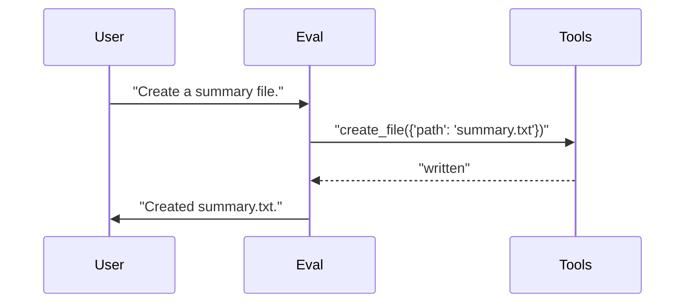

# fixture-04-agent-selector

> **3** tests | **2** passed | **1** failed | **67%** pass rate  
> Duration: 9.0s | Cost: 🧪 2 PR · 🤖 $0.001200 · 💰 $0.001200 | Tokens: 195–195  
> August 10, 2026 at 08:03 PM

*Three agents for testing the agent selector UI.*

## Eval Leaderboard

|#|Eval|Tests|Pass Rate|Tokens|Cost|Duration|
| :---: | :--- | :---: | :---: | ---: | ---: | ---: |
|🥇|claude-haiku-4.5 🏆|1/1|100%|195|1 PR|3.0s|
|🥈|gpt-5.4-mini|1/1|100%|195|1 PR|3.0s|
|🥉|gemini-3.6-flash|0/1|0%|0|N/A|3.0s|

## AI Analysis

## 🎯 Recommendation

Deploy the strongest passing eval for **agent selector**.

## ❌ Failure Analysis

At least one compared result failed, so the report must keep the failure visible.

## 🔧 MCP Tool Feedback

Tool names are deterministic in these fixture reports.

## Test Results

### tests/fixtures/scenario_04_agent_selector.py

#### ✅ Compare three agents with selector controls. [gpt-5.4-mini]

✅ gpt-5.4-mini — 3.0s · 195 tokens · 3 turns · 1 PR

**Tool Calls:**

|Tool|Status|Args|
| :--- | :---: | :--- |
|`create_file`|✅|path='summary.txt'|

**Response:**

> Created summary.txt.

```mermaid
sequenceDiagram
    participant User
    participant Eval
    participant Tools

    User->>Eval: "Create a summary file."
    Eval->>Tools: "create_file({'path': 'summary.txt'})"
    Tools-->>Eval: "written"
    Eval->>User: "Created summary.txt."
```

#### ✅ Compare three agents with selector controls. [claude-haiku-4.5]

✅ claude-haiku-4.5 — 3.0s · 195 tokens · 3 turns · 1 PR

**Tool Calls:**

|Tool|Status|Args|
| :--- | :---: | :--- |
|`create_file`|✅|path='summary.txt'|

**Response:**

> Created summary.txt.

```mermaid
sequenceDiagram
    participant User
    participant Eval
    participant Tools

    User->>Eval: "Create a summary file."
    Eval->>Tools: "create_file({'path': 'summary.txt'})"
    Tools-->>Eval: "written"
    Eval->>User: "Created summary.txt."
```

#### ❌ Compare three agents with selector controls. [gemini-3.6-flash]

❌ gemini-3.6-flash — 3.0s · 0 tokens · 0 turns · N/A

**Error:** `AssertionError: summary.txt was not created`

*Generated by [pytest-skill-engineering](https://github.com/sbroenne/pytest-skill-engineering) on August 10, 2026 at 08:03 PM*
