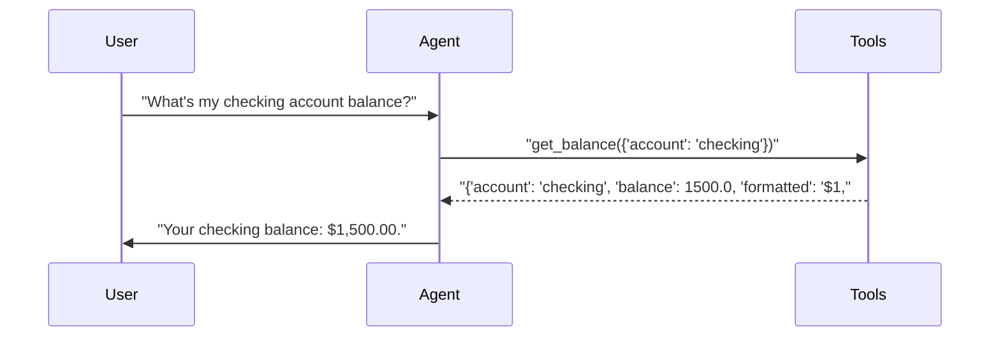
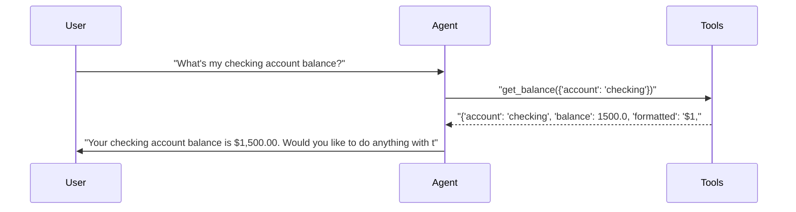
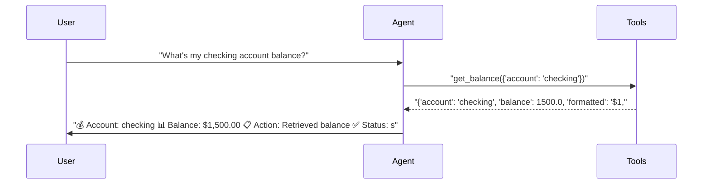
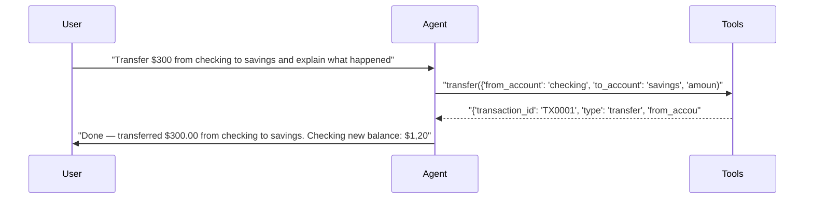
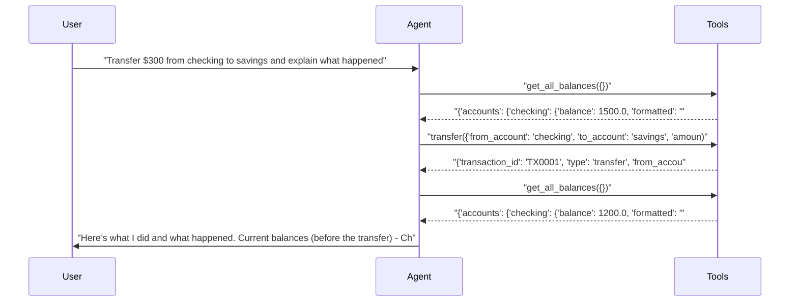
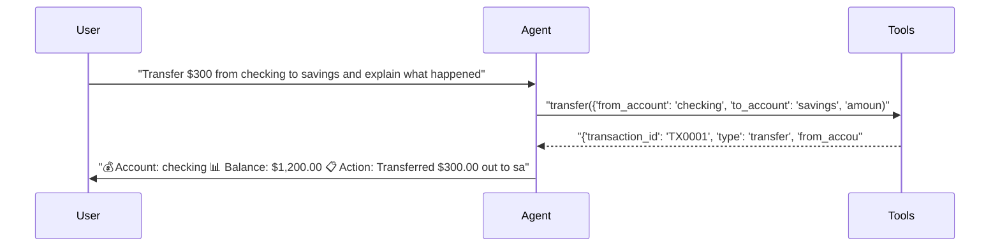

# pytest-aitest

> **6** tests | **6** passed | **0** failed | **100%** pass rate  
> Duration: 67.9s | Cost: 🧪 $-0.018319 · 🤖 $0.0249 · 💰 $0.006595 | Tokens: 910–3,452  
> February 07, 2026 at 07:36 PM

*Prompt comparison — same model, different system prompts.*


## Agent Leaderboard


|#|Agent|Tests|Pass Rate|Tokens|Cost|Duration|
| :---: | :--- | :---: | :---: | ---: | ---: | ---: |
|🥇|gpt-5-mini + concise 🏆|2/2|100%|1,956|$0.000727|19.3s|
|🥈|gpt-5-mini + structured|2/2|100%|3,067|$0.002753|23.4s|
|🥉|gpt-5-mini + detailed|2/2|100%|4,523|$0.003115|25.2s|


## AI Analysis

## 🎯 Recommendation

**Deploy: gpt-5-mini + concise**

Achieves **100% pass rate at the lowest cost**, with **~82% lower cost** than the next closest alternative while still using tools correctly.

**Reasoning:**  
All three prompt variants passed all tests, so pass rate is tied at 100%. Cost is the decisive factor. The **concise** prompt consistently produced correct tool usage and compliant answers at a fraction of the cost:
- Balance query: $0.000296 vs $0.000472–$0.000485 (≈40% cheaper)
- Transfer with explanation: $0.000431 vs $0.002281–$0.002631 (**81–84% cheaper**)

Response quality met test requirements without unnecessary tool calls or verbosity.

**Alternatives:**  
- **structured:** Same pass rate, clearer formatting, but **~5× higher cost** on transfers. Consider only if strict response formatting is required downstream.  
- **detailed:** Same pass rate, but **~6× higher cost** due to extra tool calls and verbose explanations. Not cost-effective for production.

## 🔧 MCP Tool Feedback

### pytest_aitest.testing.banking_mcp
Overall, tools are discoverable and correctly used. The concise and structured prompts select the minimal required tools, while the detailed prompt triggers unnecessary calls.

| Tool | Status | Calls | Issues |
|------|--------|-------|--------|
| get_balance | ✅ | 3 | Working well |
| get_all_balances | ⚠️ | 2 | Overused by detailed prompt for a simple transfer |
| transfer | ✅ | 3 | Working well |
| deposit | ✅ | 0 | Not exercised in tests |
| withdraw | ✅ | 0 | Not exercised in tests |
| get_transactions | ✅ | 0 | Not exercised in tests |

**Suggested rewrite for `get_all_balances`:**
> Get balances for all accounts **only when a total or multi-account summary is explicitly required**. For single-account checks, prefer `get_balance`.

This clarification would discourage unnecessary pre/post calls in prompts like **detailed**.

## 📝 System Prompt Feedback

### concise (effective)
- **Token count:** ~25
- **Assessment:** Clear, minimal, and aligned with test expectations. No changes recommended.

### structured (mixed)
- **Token count:** ~45
- **Problem:** Forces structured output even when not required, increasing token usage and response length.
- **Suggested change (replace last line):**
  ```
  Use tools for all account operations. Never guess balances — always check.
  ```
  ⟶
  ```
  Use tools for all account operations. Never guess balances — always check. Use the format only when it adds clarity.
  ```

### detailed (ineffective for cost)
- **Token count:** ~90+
- **Problem:** Mandates balance checks before and after every operation, causing redundant `get_all_balances` calls and extreme cost inflation.
- **Suggested change (replace bullet list intro):**
  ```
  For every operation:
  ```
  ⟶
  ```
  For operations where balances change or totals are requested:
  ```

## 💡 Optimizations

1. **Avoid redundant balance aggregation** (recommended)
   - Current: The detailed prompt triggers `get_all_balances` before and after transfers even when the transfer tool already returns new balances.
   - Change: Update the prompt to trust `transfer.new_balance_from` and `transfer.new_balance_to` unless totals are explicitly requested.
   - Impact: **~80% cost reduction** on transfer tests (eliminates 2 tool calls and long summaries).

2. **Prefer concise prompt for default agent** (recommended)
   - Current: Multiple prompt variants tested equally.
   - Change: Set **concise** as the production default; keep others only for specialized UX needs.
   - Impact: **70–85% lower cost per test** with no loss in pass rate.

## 📦 Tool Response Optimization

### transfer (from pytest_aitest.testing.banking_mcp)
- **Current response size:** ~110 tokens
- **Issues found:** Includes verbose fields (`type`, `message`, duplicated formatted and raw amounts) not required by the agent.
- **Suggested optimization:** Remove redundant fields and rely on numeric values only; let the agent format currency.

**Example current vs optimized:**
```json
// Current (~110 tokens)
{
  "transaction_id": "TX0001",
  "type": "transfer",
  "from_account": "checking",
  "to_account": "savings",
  "amount": 300,
  "amount_formatted": "$300.00",
  "new_balance_from": 1200.0,
  "new_balance_to": 3300.0,
  "message": "Successfully transferred $300.00 from checking to savings."
}

// Optimized (~55 tokens)
{
  "id": "TX0001",
  "from": "checking",
  "to": "savings",
  "amount": 300,
  "balance_from": 1200.0,
  "balance_to": 3300.0
}
```
- **Estimated savings:** ~50 tokens per call (**~45% reduction**)

### get_balance (from pytest_aitest.testing.banking_mcp)
- **Current response size:** ~40 tokens
- **Issues found:** Duplicate numeric and formatted values.
- **Suggested optimization:** Return only the numeric balance.
- **Estimated savings:** ~15 tokens per call (~35% reduction)

These changes further amplify the cost advantage of the **concise** prompt without affecting correctness.


## Test Results


### tests/fixtures/scenario_05_prompt_comparison.py


#### ✅ Balance query — tests how prompt style affects response form…

<details>
<summary>✅ gpt-5-mini + concise — 11.8s · 910 tokens · 3 turns · $0.000296</summary>

**Assertions:**

- ✅ `llm`: states the checking account balance

**Tool Calls:**


|Tool|Status|Args|
| :--- | :---: | :--- |
|`get_balance`|✅|account='checking'|


**Response:**

> Your checking balance: $1,500.00.



</details>

<details>
<summary>✅ gpt-5-mini + detailed — 7.7s · 1,071 tokens · 3 turns · $0.000485</summary>

**Assertions:**

- ✅ `llm`: states the checking account balance

**Tool Calls:**


|Tool|Status|Args|
| :--- | :---: | :--- |
|`get_balance`|✅|account='checking'|


**Response:**

> Your checking account balance is $1,500.00. Would you like to do anything with that account (transfer, withdraw, view transactions, etc.)?



</details>

<details>
<summary>✅ gpt-5-mini + structured — 6.9s · 1,047 tokens · 3 turns · $0.000472</summary>

**Assertions:**

- ✅ `llm`: states the checking account balance

**Tool Calls:**


|Tool|Status|Args|
| :--- | :---: | :--- |
|`get_balance`|✅|account='checking'|


**Response:**

> 💰 Account: checking
> 📊 Balance: $1,500.00
> 📋 Action: Retrieved balance
> ✅ Status: success



</details>


#### ✅ Transfer with explanation — tests prompt impact on response …

<details>
<summary>✅ gpt-5-mini + concise — 7.6s · 1,046 tokens · 3 turns · $0.000431</summary>

**Assertions:**

- ✅ `llm`: confirms the transfer was completed

**Tool Calls:**


|Tool|Status|Args|
| :--- | :---: | :--- |
|`transfer`|✅|from_account='checking', to_account='savings', amount=300|


**Response:**

> Done — transferred $300.00 from checking to savings.
> 
> Checking new balance: $1,200.00
> Savings new balance: $3,300.00
> 
> What happened: $300.00 was debited from your checking and credited to your savings. Transaction ID TX0001.



</details>

<details>
<summary>✅ gpt-5-mini + detailed — 17.5s · 3,452 tokens · 5 turns · $0.002631</summary>

**Assertions:**

- ✅ `llm`: confirms the transfer was completed

**Tool Calls:**


|Tool|Status|Args|
| :--- | :---: | :--- |
|`get_all_balances`|✅||
|`transfer`|✅|from_account='checking', to_account='savings', amount=300|
|`get_all_balances`|✅||


**Response:**

> Here’s what I did and what happened.
> 
> Current balances (before the transfer)
> - Checking: $1,500.00
> - Savings: $3,000.00
> - Total across accounts: $4,500.00
> 
> Requested action
> - Transfer $300.00 from checking to savings.
> 
> Transfer details and result
> - Amount transferred: $300.00
> - From account: checking
> - To account: savings
> - Transaction ID: TX0001
> - Status: Successful
> 
> Balances after the transfer
> - Checking: $1,200.00 (was $1,500.00)
> - Savings: $3,300.00 (was $3,000.00)
> - Total across accounts: $



</details>

<details>
<summary>✅ gpt-5-mini + structured — 16.5s · 2,020 tokens · 3 turns · $0.002281</summary>

**Assertions:**

- ✅ `llm`: confirms the transfer was completed

**Tool Calls:**


|Tool|Status|Args|
| :--- | :---: | :--- |
|`transfer`|✅|from_account='checking', to_account='savings', amount=300|


**Response:**

> 💰 Account: checking
> 📊 Balance: $1,200.00
> 📋 Action: Transferred $300.00 out to savings (TX0001)
> ✅ Status: success
> 
> 💰 Account: savings
> 📊 Balance: $3,300.00
> 📋 Action: Received $300.00 transfer from checking (TX0001)
> ✅ Status: success
> 
> What happened: I moved $300.00 from your checking account into your savings account. The transfer debited checking and credited savings immediately, resulting in the balances shown above. Transaction ID TX0001 confirms the successful transfer. If you’d like, I can sho



</details>

*Generated by [pytest-aitest](https://github.com/sbroenne/pytest-aitest) on February 07, 2026 at 07:36 PM*
