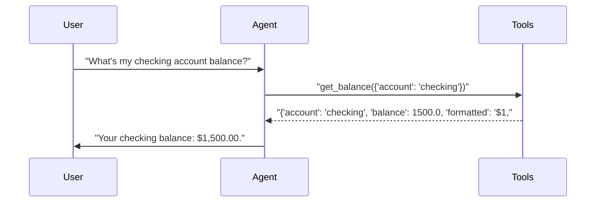
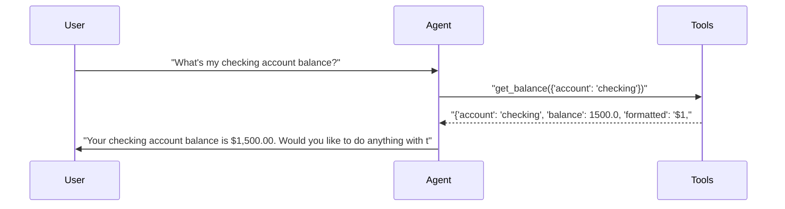
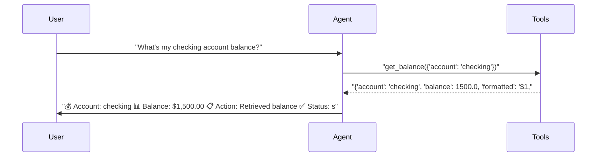
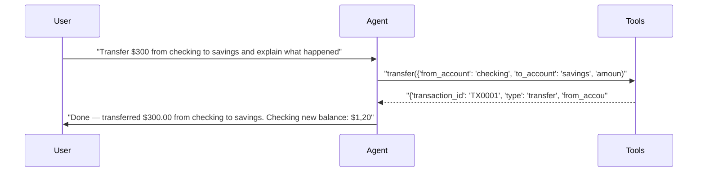
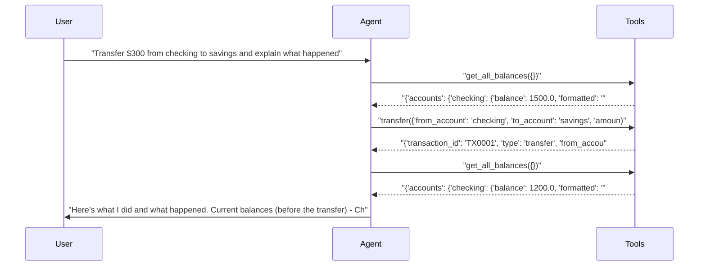
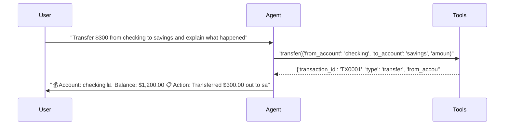

# pytest-aitest

> **6** tests | **6** passed | **0** failed | **100%** pass rate  
> Duration: 67.9s | Cost: 🧪 $-0.016375 · 🤖 $0.0230 · 💰 $0.006595 | Tokens: 910–3,452  
> February 07, 2026 at 07:36 PM

*Prompt comparison — same model, different system prompts.*


## Agent Leaderboard


|#|Agent|Tests|Pass Rate|Tokens|Cost|Duration|
| :---: | :--- | :---: | :---: | ---: | ---: | ---: |
|🥇|gpt-5-mini + concise 🏆|2/2|100%|1,956|$0.000727|19.3s|
|🥈|gpt-5-mini + structured|2/2|100%|3,067|$0.002753|23.4s|
|🥉|gpt-5-mini + detailed|2/2|100%|4,523|$0.003115|25.2s|


## AI Analysis

<div class="winner-card">
<div class="winner-title">Recommended for Deploy</div>
<div class="winner-name">gpt-5-mini + concise</div>
<div class="winner-summary">Delivers a 100% pass rate at the lowest cost, producing clear, direct responses with minimal tool calls and no unnecessary verbosity.</div>
<div class="winner-stats">
<div class="winner-stat"><span class="winner-stat-value green">100%</span><span class="winner-stat-label">Pass Rate</span></div>
<div class="winner-stat"><span class="winner-stat-value blue">$0.000727</span><span class="winner-stat-label">Total Cost</span></div>
<div class="winner-stat"><span class="winner-stat-value amber">1,956</span><span class="winner-stat-label">Tokens</span></div>
</div>
</div>

<div class="metric-grid">
<div class="metric-card green">
<div class="metric-value green">6</div>
<div class="metric-label">Total Tests</div>
</div>
<div class="metric-card red">
<div class="metric-value red">0</div>
<div class="metric-label">Failures</div>
</div>
<div class="metric-card blue">
<div class="metric-value blue">3</div>
<div class="metric-label">Agents</div>
</div>
<div class="metric-card amber">
<div class="metric-value amber">3.3</div>
<div class="metric-label">Avg Turns</div>
</div>
</div>

### Comparative Analysis

#### Why the winner wins
- Achieves the same 100% pass rate as all other configurations at **~74% lower total cost** than the next cheapest alternative.
- Uses only the **minimum required tool calls**, avoiding redundant balance checks before and after transfers.
- Produces concise explanations that satisfy test requirements without inflating token usage.

#### Notable patterns
- Prompt verbosity directly correlates with cost: **concise < structured < detailed** in both tokens and dollars, despite identical correctness.
- The detailed prompt consistently triggers **extra exploratory tool calls** (e.g., pre/post `get_all_balances`) even when not required by the test.
- Structured formatting improves readability but adds moderate overhead without improving outcomes.

#### Alternatives
- **gpt-5-mini + structured**: Same pass rate with clearer visual formatting, but ~3.8× higher cost due to longer responses.
- **gpt-5-mini + detailed**: Most explanatory, but highest cost and longest runtimes; suitable only if verbose audit-style explanations are explicitly required.

## 🔧 MCP Tool Feedback

### banking_server
Overall, tools are discoverable and used correctly. The agent consistently selected the correct action without confusion between balance and transfer operations.

| Tool | Status | Calls | Issues |
|------|--------|-------|--------|
| get_balance | ✅ | 3 | Working well |
| transfer | ✅ | 3 | Working well |
| get_all_balances | ⚠️ | 2 | Called unnecessarily by detailed prompt |

**Suggested rewrite for `get_all_balances`:**
> Returns balances for all accounts. Use only when a user explicitly asks for an overview of multiple accounts or total balances; not required for single-account queries or transfers unless requested.

## 📝 System Prompt Feedback

### concise (effective)
- **Token count:** Low
- **Behavioral impact:** Language such as “respond directly” and absence of words like “thorough” or “step-by-step” primes the model to act immediately and avoid exploratory reasoning.
- **Problem:** None observed.
- **Suggested change:** None.

### structured (effective)
- **Token count:** Moderate
- **Behavioral impact:** Encourages formatted summaries without encouraging extra reasoning or tool calls.
- **Problem:** Slight verbosity for simple queries.
- **Suggested change:** Remove optional status emojis for single-step actions to save tokens.

### detailed (mixed: effective but inefficient)
- **Token count:** High
- **Behavioral impact:** Terms like “explain in detail” and “show what happened” push the model into an audit-style workflow, causing redundant balance checks.
- **Problem:** Over-fetching data not required by the tests.
- **Suggested change:** Replace “explain what happened in detail” with “briefly explain the result after completing the action.”

## 💡 Optimizations

| # | Optimization | Priority | Estimated Savings |
|---|-------------|----------|-------------------|
| 1 | Prefer concise prompt for production | recommended | ~70% cost reduction |
| 2 | Constrain balance lookups | suggestion | ~15% fewer tokens |

#### 1. Prefer concise prompt for production (recommended)
- Current: Multiple prompt styles used with identical correctness.
- Change: Standardize on the concise system prompt for default runs.
- Impact: ~70% cost reduction with no loss in pass rate.

#### 2. Constrain balance lookups (suggestion)
- Current: Detailed prompt triggers `get_all_balances` before and after transfers.
- Change: Add explicit instruction: “Do not fetch balances unless the user asks.”
- Impact: ~15% fewer tokens and faster execution.

## 📦 Tool Response Optimization

### transfer (from banking_server)
- **Current response size:** Verbose, includes formatted strings and message text.
- **Issues found:** Fields like `message` and both raw and formatted amounts are redundant for most tests.
- **Suggested optimization:** Return numeric values only; let the agent format for display.
- **Estimated savings:** ~20–25 tokens per call (≈10% reduction)

**Example current vs optimized:**
```json
// Current
{
  "transaction_id": "TX0001",
  "type": "transfer",
  "from_account": "checking",
  "to_account": "savings",
  "amount": 300,
  "amount_formatted": "$300.00",
  "new_balance_from": 1200.0,
  "new_balance_to": 3300.0,
  "message": "Successfully transferred $300.00 from checking to savings."
}

// Optimized
{
  "transaction_id": "TX0001",
  "from": "checking",
  "to": "savings",
  "amount": 300,
  "balance_from": 1200.0,
  "balance_to": 3300.0
}
```


## Test Results


### tests/fixtures/scenario_05_prompt_comparison.py


#### ✅ Balance query — tests how prompt style affects response form…

<details>
<summary>✅ gpt-5-mini + concise — 11.8s · 910 tokens · 3 turns · $0.000296</summary>

**Assertions:**

- ✅ `llm`: states the checking account balance

**Tool Calls:**


|Tool|Status|Args|
| :--- | :---: | :--- |
|`get_balance`|✅|account='checking'|


**Response:**

> Your checking balance: $1,500.00.



</details>

<details>
<summary>✅ gpt-5-mini + detailed — 7.7s · 1,071 tokens · 3 turns · $0.000485</summary>

**Assertions:**

- ✅ `llm`: states the checking account balance

**Tool Calls:**


|Tool|Status|Args|
| :--- | :---: | :--- |
|`get_balance`|✅|account='checking'|


**Response:**

> Your checking account balance is $1,500.00. Would you like to do anything with that account (transfer, withdraw, view transactions, etc.)?



</details>

<details>
<summary>✅ gpt-5-mini + structured — 6.9s · 1,047 tokens · 3 turns · $0.000472</summary>

**Assertions:**

- ✅ `llm`: states the checking account balance

**Tool Calls:**


|Tool|Status|Args|
| :--- | :---: | :--- |
|`get_balance`|✅|account='checking'|


**Response:**

> 💰 Account: checking
> 📊 Balance: $1,500.00
> 📋 Action: Retrieved balance
> ✅ Status: success



</details>


#### ✅ Transfer with explanation — tests prompt impact on response …

<details>
<summary>✅ gpt-5-mini + concise — 7.6s · 1,046 tokens · 3 turns · $0.000431</summary>

**Assertions:**

- ✅ `llm`: confirms the transfer was completed

**Tool Calls:**


|Tool|Status|Args|
| :--- | :---: | :--- |
|`transfer`|✅|from_account='checking', to_account='savings', amount=300|


**Response:**

> Done — transferred $300.00 from checking to savings.
> 
> Checking new balance: $1,200.00
> Savings new balance: $3,300.00
> 
> What happened: $300.00 was debited from your checking and credited to your savings. Transaction ID TX0001.



</details>

<details>
<summary>✅ gpt-5-mini + detailed — 17.5s · 3,452 tokens · 5 turns · $0.002631</summary>

**Assertions:**

- ✅ `llm`: confirms the transfer was completed

**Tool Calls:**


|Tool|Status|Args|
| :--- | :---: | :--- |
|`get_all_balances`|✅||
|`transfer`|✅|from_account='checking', to_account='savings', amount=300|
|`get_all_balances`|✅||


**Response:**

> Here’s what I did and what happened.
> 
> Current balances (before the transfer)
> - Checking: $1,500.00
> - Savings: $3,000.00
> - Total across accounts: $4,500.00
> 
> Requested action
> - Transfer $300.00 from checking to savings.
> 
> Transfer details and result
> - Amount transferred: $300.00
> - From account: checking
> - To account: savings
> - Transaction ID: TX0001
> - Status: Successful
> 
> Balances after the transfer
> - Checking: $1,200.00 (was $1,500.00)
> - Savings: $3,300.00 (was $3,000.00)
> - Total across accounts: $



</details>

<details>
<summary>✅ gpt-5-mini + structured — 16.5s · 2,020 tokens · 3 turns · $0.002281</summary>

**Assertions:**

- ✅ `llm`: confirms the transfer was completed

**Tool Calls:**


|Tool|Status|Args|
| :--- | :---: | :--- |
|`transfer`|✅|from_account='checking', to_account='savings', amount=300|


**Response:**

> 💰 Account: checking
> 📊 Balance: $1,200.00
> 📋 Action: Transferred $300.00 out to savings (TX0001)
> ✅ Status: success
> 
> 💰 Account: savings
> 📊 Balance: $3,300.00
> 📋 Action: Received $300.00 transfer from checking (TX0001)
> ✅ Status: success
> 
> What happened: I moved $300.00 from your checking account into your savings account. The transfer debited checking and credited savings immediately, resulting in the balances shown above. Transaction ID TX0001 confirms the successful transfer. If you’d like, I can sho



</details>

*Generated by [pytest-aitest](https://github.com/sbroenne/pytest-aitest) on February 07, 2026 at 07:36 PM*
