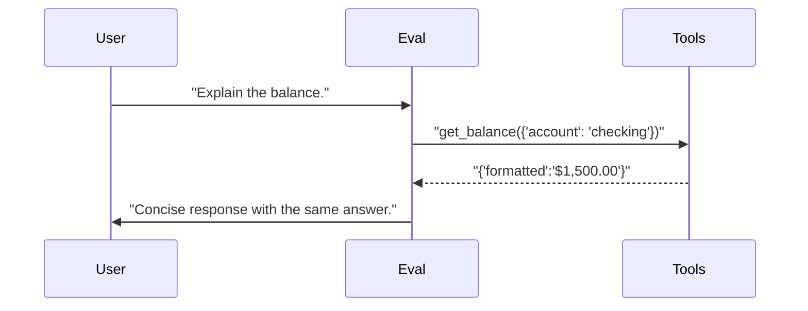
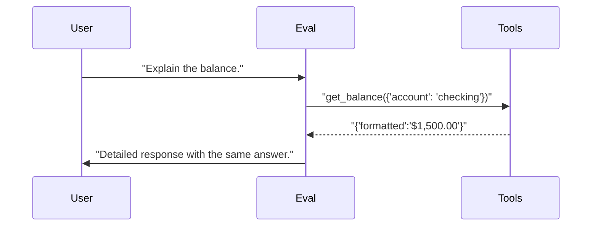
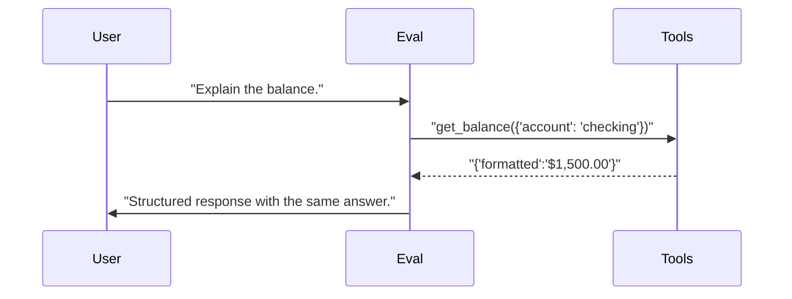

# fixture-05-prompt-comparison

> **3** tests | **3** passed | **0** failed | **100%** pass rate  
> Duration: 9.0s | Cost: 🧪 3 PR · 🤖 $0.001200 · 💰 $0.001200 | Tokens: 195–195  
> August 10, 2026 at 08:04 PM

*System prompt comparison across three prompt variants.*

## Eval Leaderboard

|#|Eval|Tests|Pass Rate|Tokens|Cost|Duration|
| :---: | :--- | :---: | :---: | ---: | ---: | ---: |
|🥇|gpt-5.4-mini / concise 🏆|1/1|100%|195|1 PR|3.0s|
|🥈|gpt-5.4-mini / detailed|1/1|100%|195|1 PR|3.0s|
|🥉|gpt-5.4-mini / structured|1/1|100%|195|1 PR|3.0s|

## AI Analysis

## 🎯 Recommendation

Deploy the strongest passing eval for **prompt comparison**.

## ❌ Failure Analysis

At least one compared result failed, so the report must keep the failure visible.

## 🔧 MCP Tool Feedback

Tool names are deterministic in these fixture reports.

## Test Results

### tests/fixtures/scenario_05_prompt_comparison.py

#### ✅ Compare prompt variants for a balance question. [gpt-5.4-mini + concise]

✅ gpt-5.4-mini / concise — 3.0s · 195 tokens · 3 turns · 1 PR

**Tool Calls:**

|Tool|Status|Args|
| :--- | :---: | :--- |
|`get_balance`|✅|account='checking'|

**Response:**

> Concise response with the same answer.

```mermaid
sequenceDiagram
    participant User
    participant Eval
    participant Tools

    User->>Eval: "Explain the balance."
    Eval->>Tools: "get_balance({'account': 'checking'})"
    Tools-->>Eval: "{'formatted':'$1,500.00'}"
    Eval->>User: "Concise response with the same answer."
```

#### ✅ Compare prompt variants for a balance question. [gpt-5.4-mini + detailed]

✅ gpt-5.4-mini / detailed — 3.0s · 195 tokens · 3 turns · 1 PR

**Tool Calls:**

|Tool|Status|Args|
| :--- | :---: | :--- |
|`get_balance`|✅|account='checking'|

**Response:**

> Detailed response with the same answer.

```mermaid
sequenceDiagram
    participant User
    participant Eval
    participant Tools

    User->>Eval: "Explain the balance."
    Eval->>Tools: "get_balance({'account': 'checking'})"
    Tools-->>Eval: "{'formatted':'$1,500.00'}"
    Eval->>User: "Detailed response with the same answer."
```

#### ✅ Compare prompt variants for a balance question. [gpt-5.4-mini + structured]

✅ gpt-5.4-mini / structured — 3.0s · 195 tokens · 3 turns · 1 PR

**Tool Calls:**

|Tool|Status|Args|
| :--- | :---: | :--- |
|`get_balance`|✅|account='checking'|

**Response:**

> Structured response with the same answer.

```mermaid
sequenceDiagram
    participant User
    participant Eval
    participant Tools

    User->>Eval: "Explain the balance."
    Eval->>Tools: "get_balance({'account': 'checking'})"
    Tools-->>Eval: "{'formatted':'$1,500.00'}"
    Eval->>User: "Structured response with the same answer."
```

*Generated by [pytest-skill-engineering](https://github.com/sbroenne/pytest-skill-engineering) on August 10, 2026 at 08:04 PM*
