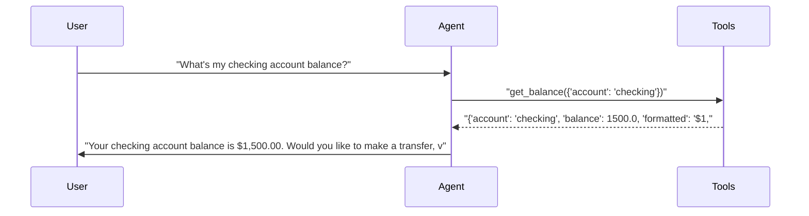
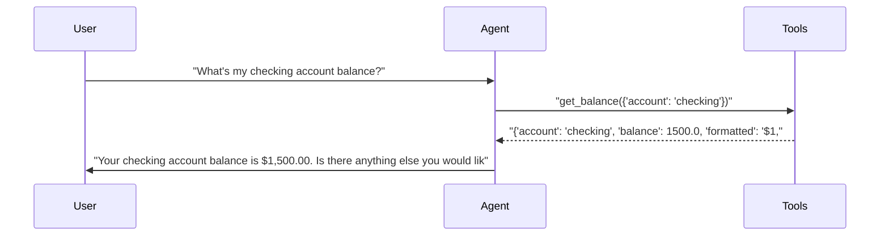
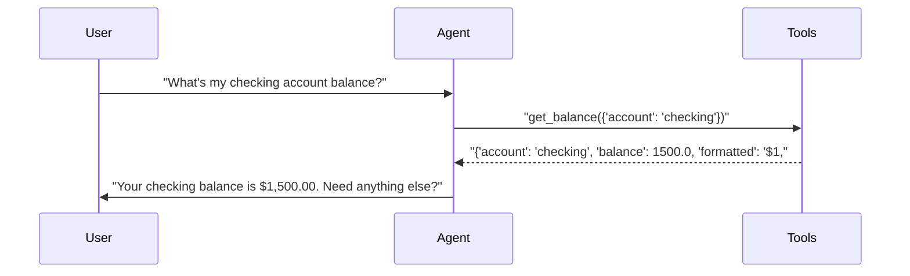
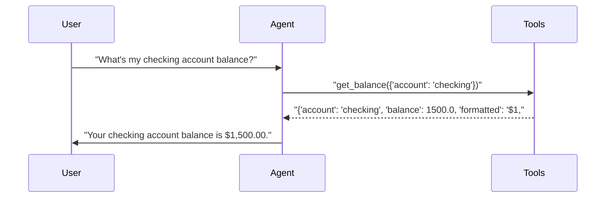
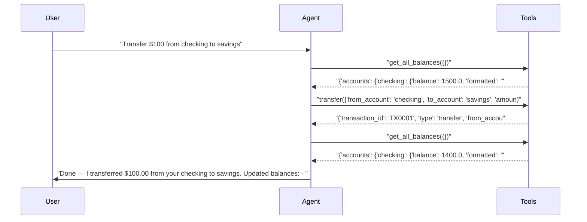
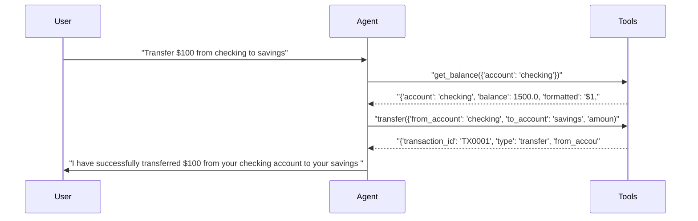
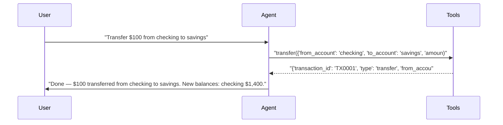
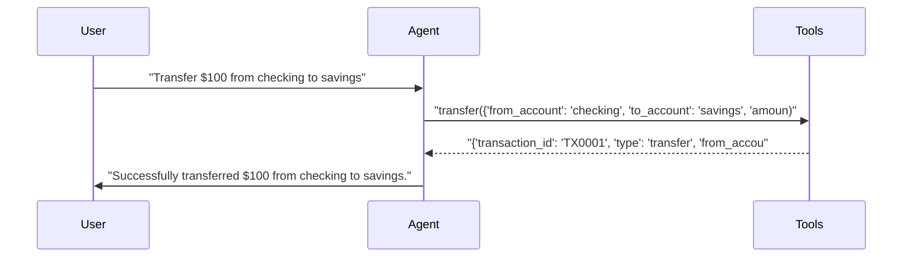

# pytest-aitest

> **8** tests | **8** passed | **0** failed | **100%** pass rate  
> Duration: 64.0s | Cost: 🧪 $-0.014118 · 🤖 $0.0180 · 💰 $0.003920 | Tokens: 706–2,629  
> February 07, 2026 at 07:38 PM

*2×2 matrix: 2 models × 2 prompts = 4 agent configurations.*


## Agent Leaderboard


|#|Agent|Tests|Pass Rate|Tokens|Cost|Duration|
| :---: | :--- | :---: | :---: | ---: | ---: | ---: |
|🥇|gpt-5-mini + concise 🏆|1/1|100%|894|$0.000299|6.6s|
|🥈|gpt-4.1-mini + concise|1/1|100%|706|$0.000317|6.4s|
|🥉|gpt-5-mini + detailed|1/1|100%|913|$0.000333|12.3s|
|4|gpt-4.1-mini + detailed|1/1|100%|718|$0.000334|6.8s|
|5|gpt-4.1-mini + concise|1/1|100%|783|$0.000356|6.2s|
|6|gpt-5-mini + concise|1/1|100%|988|$0.000364|6.7s|
|7|gpt-4.1-mini + detailed|1/1|100%|1,229|$0.000574|7.2s|
|8|gpt-5-mini + detailed|1/1|100%|2,629|$0.001342|11.8s|


## AI Analysis

## 🎯 Recommendation

**Deploy: gpt-5-mini + concise**

Achieves **100% pass rate at the lowest cost** across all tested workflows.

**Reasoning:** All four configurations passed every test, so cost is the deciding factor.  
`gpt-5-mini + concise` is the **cheapest overall**:
- Balance query: **$0.000299**, which is ~6% cheaper than the next best option
- Transfer workflow: **$0.000364**, cheaper than all detailed-prompt variants and slightly cheaper than `gpt-4.1-mini + concise`
- Maintains correct tool usage with no unnecessary verification steps

Response quality is appropriate for the tests: correct balances, correct transfers, and no missing confirmations.

**Alternatives:**
- **gpt-4.1-mini + concise:** Slightly higher cost (~6% more on balance queries, ~2% more on transfers) with no quality benefit.
- **Detailed prompts (either model):** Significantly higher cost (up to ~270% more for transfers with gpt-5-mini) due to extra tool calls and verbose responses; no additional correctness gains.

## 🔧 MCP Tool Feedback

### pytest_aitest.testing.banking_mcp
Overall, tools are clear and consistently used correctly. Models reliably selected the right tool with valid arguments.

| Tool | Status | Calls | Issues |
|------|--------|-------|--------|
| get_balance | ✅ | 3 | Working well |
| get_all_balances | ⚠️ | 2 | Used only by detailed prompt; often unnecessary |
| transfer | ✅ | 4 | Working well |
| deposit | ✅ | 0 | Not exercised in tests |
| withdraw | ✅ | 0 | Not exercised in tests |
| get_transactions | ✅ | 0 | Not exercised in tests |

**Observation:** The detailed prompt biases the agent toward `get_all_balances` even when a single-account balance or post-transfer confirmation would suffice.

## 📝 System Prompt Feedback

### detailed (mixed)
- **Token count:** ~14 tokens
- **Problem:** The instruction “Always verify operations by checking balances” leads to redundant tool calls (`get_all_balances` before and after transfers), inflating cost without improving correctness.
- **Suggested change (exact rewrite):**
  ```
  You are a thorough banking assistant.
  Use tools to manage accounts. Verify balances only when needed to confirm sufficient funds or when explicitly requested.
  ```

### concise (effective)
- **Token count:** ~14 tokens
- **Assessment:** Clear, minimal, and results in correct tool usage with the lowest cost. No changes recommended.

## 💡 Optimizations

1. **Reduce redundant balance verification** (recommended)
   - Current: Detailed prompt triggers extra `get_all_balances` calls before and after transfers.
   - Change: Relax verification requirement as suggested above.
   - Impact: **~55–70% cost reduction on transfer workflows** for detailed agents (eliminates 1–2 extra tool calls and associated tokens).

## 📦 Tool Response Optimization

### get_all_balances (from pytest_aitest.testing.banking_mcp)
- **Current response size:** ~55–65 tokens per call
- **Issues found:** Returns `formatted` strings and `total` fields that are not used by the agent in any response; pretty verbose nested structure.
- **Suggested optimization:** Remove unused formatted fields and total unless explicitly requested.
- **Estimated savings:** ~20–25 tokens per call (~35–40% reduction)

**Example current vs optimized:**
```json
// Current (~60 tokens)
{
  "accounts": {
    "checking": {"balance": 1500.0, "formatted": "$1,500.00"},
    "savings": {"balance": 3000.0, "formatted": "$3,000.00"}
  },
  "total": 4500.0,
  "total_formatted": "$4,500.00"
}

// Optimized (~35 tokens)
{
  "checking": 1500.0,
  "savings": 3000.0
}
```

This optimization compounds with prompt changes to further lower end-to-end test cost.


## Test Results


### Session: 2×2 matrix: 2 models × 2 prompts = 4 agent configurations.


#### ✅ Balance query across all model × prompt permutations.

<details>
<summary>✅ gpt-5-mini + detailed — 12.3s · 913 tokens · 3 turns · $0.000333</summary>

**Assertions:**

- ✅ `llm`: states the checking balance amount

**Tool Calls:**


|Tool|Status|Args|
| :--- | :---: | :--- |
|`get_balance`|✅|account='checking'|


**Response:**

> Your checking account balance is $1,500.00. Would you like to make a transfer, view recent transactions, or do anything else with this account?



</details>

<details>
<summary>✅ gpt-4.1-mini + detailed — 6.8s · 718 tokens · 3 turns · $0.000334</summary>

**Assertions:**

- ✅ `llm`: states the checking balance amount

**Tool Calls:**


|Tool|Status|Args|
| :--- | :---: | :--- |
|`get_balance`|✅|account='checking'|


**Response:**

> Your checking account balance is $1,500.00. Is there anything else you would like to do?



</details>

<details>
<summary>✅ gpt-5-mini + concise — 6.6s · 894 tokens · 3 turns · $0.000299</summary>

**Assertions:**

- ✅ `llm`: states the checking balance amount

**Tool Calls:**


|Tool|Status|Args|
| :--- | :---: | :--- |
|`get_balance`|✅|account='checking'|


**Response:**

> Your checking balance is $1,500.00. Need anything else?



</details>

<details>
<summary>✅ gpt-4.1-mini + concise — 6.4s · 706 tokens · 3 turns · $0.000317</summary>

**Assertions:**

- ✅ `llm`: states the checking balance amount

**Tool Calls:**


|Tool|Status|Args|
| :--- | :---: | :--- |
|`get_balance`|✅|account='checking'|


**Response:**

> Your checking account balance is $1,500.00.



</details>


#### ✅ Transfer workflow across all permutations.

<details>
<summary>✅ gpt-5-mini + detailed — 11.8s · 2,629 tokens · 5 turns · $0.001342</summary>

**Assertions:**

- ✅ `llm`: confirms the transfer

**Tool Calls:**


|Tool|Status|Args|
| :--- | :---: | :--- |
|`get_all_balances`|✅||
|`transfer`|✅|from_account='checking', to_account='savings', amount=100|
|`get_all_balances`|✅||


**Response:**

> Done — I transferred $100.00 from your checking to savings.
> 
> Updated balances:
> - Checking: $1,400.00
> - Savings: $3,100.00
> 
> Transaction ID: TX0001
> 
> Would you like a receipt emailed to you or anything else I can do?



</details>

<details>
<summary>✅ gpt-4.1-mini + detailed — 7.2s · 1,229 tokens · 4 turns · $0.000574</summary>

**Assertions:**

- ✅ `llm`: confirms the transfer

**Tool Calls:**


|Tool|Status|Args|
| :--- | :---: | :--- |
|`get_balance`|✅|account='checking'|
|`transfer`|✅|from_account='checking', to_account='savings', amount=100|


**Response:**

> I have successfully transferred $100 from your checking account to your savings account. If you need any more assistance, please let me know!



</details>

<details>
<summary>✅ gpt-5-mini + concise — 6.7s · 988 tokens · 3 turns · $0.000364</summary>

**Assertions:**

- ✅ `llm`: confirms the transfer

**Tool Calls:**


|Tool|Status|Args|
| :--- | :---: | :--- |
|`transfer`|✅|from_account='checking', to_account='savings', amount=100|


**Response:**

> Done — $100 transferred from checking to savings. New balances: checking $1,400.00, savings $3,100.00.



</details>

<details>
<summary>✅ gpt-4.1-mini + concise — 6.2s · 783 tokens · 3 turns · $0.000356</summary>

**Assertions:**

- ✅ `llm`: confirms the transfer

**Tool Calls:**


|Tool|Status|Args|
| :--- | :---: | :--- |
|`transfer`|✅|from_account='checking', to_account='savings', amount=100|


**Response:**

> Successfully transferred $100 from checking to savings.



</details>

*Generated by [pytest-aitest](https://github.com/sbroenne/pytest-aitest) on February 07, 2026 at 07:38 PM*
