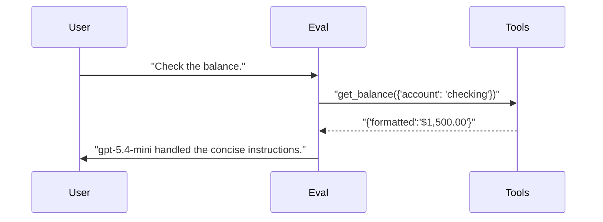
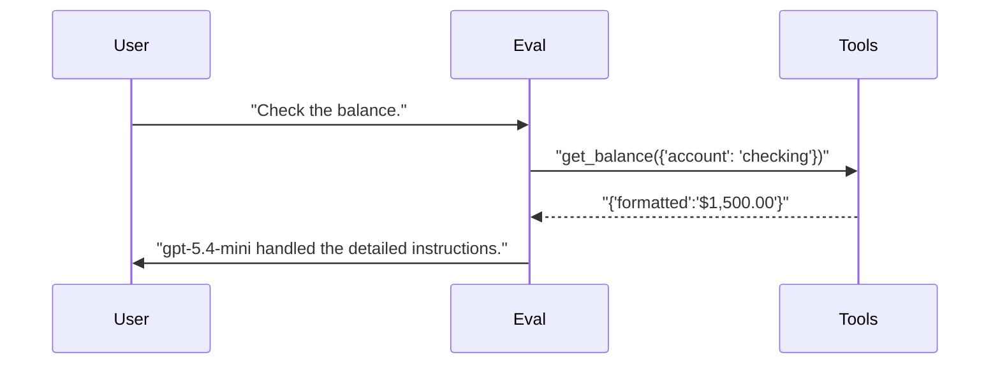
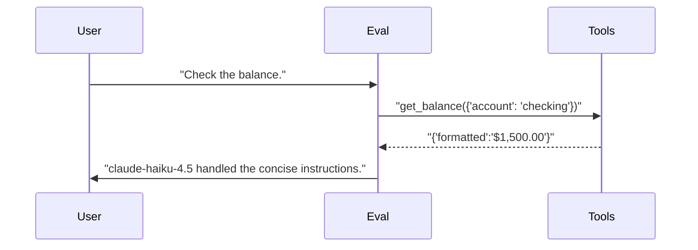
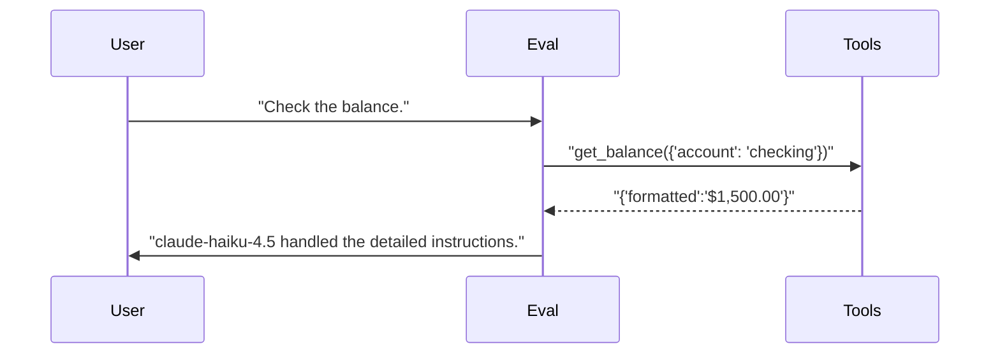

# fixture-06-model-prompt-matrix

> **4** tests | **4** passed | **0** failed | **100%** pass rate  
> Duration: 12.0s | Cost: 🧪 4 PR · 🤖 $0.001200 · 💰 $0.001200 | Tokens: 195–195  
> August 10, 2026 at 08:05 PM

*Model × prompt matrix fixture.*

## Eval Leaderboard

|#|Eval|Tests|Pass Rate|Tokens|Cost|Duration|
| :---: | :--- | :---: | :---: | ---: | ---: | ---: |
|🥇|claude-haiku-4.5 / concise 🏆|1/1|100%|195|1 PR|3.0s|
|🥈|claude-haiku-4.5 / detailed|1/1|100%|195|1 PR|3.0s|
|🥉|gpt-5.4-mini / concise|1/1|100%|195|1 PR|3.0s|
|4|gpt-5.4-mini / detailed|1/1|100%|195|1 PR|3.0s|

## AI Analysis

## 🎯 Recommendation

Deploy the strongest passing eval for **model prompt matrix**.

## ❌ Failure Analysis

At least one compared result failed, so the report must keep the failure visible.

## 🔧 MCP Tool Feedback

Tool names are deterministic in these fixture reports.

## Test Results

### Session: Model × prompt matrix cases.

#### ✅ Measure one point in the model × prompt matrix. [concise-gpt-5.4-mini]

✅ gpt-5.4-mini / concise — 3.0s · 195 tokens · 3 turns · 1 PR

**Tool Calls:**

|Tool|Status|Args|
| :--- | :---: | :--- |
|`get_balance`|✅|account='checking'|

**Response:**

> gpt-5.4-mini handled the concise instructions.

```mermaid
sequenceDiagram
    participant User
    participant Eval
    participant Tools

    User->>Eval: "Check the balance."
    Eval->>Tools: "get_balance({'account': 'checking'})"
    Tools-->>Eval: "{'formatted':'$1,500.00'}"
    Eval->>User: "gpt-5.4-mini handled the concise instructions."
```

#### ✅ Measure one point in the model × prompt matrix. [detailed-gpt-5.4-mini]

✅ gpt-5.4-mini / detailed — 3.0s · 195 tokens · 3 turns · 1 PR

**Tool Calls:**

|Tool|Status|Args|
| :--- | :---: | :--- |
|`get_balance`|✅|account='checking'|

**Response:**

> gpt-5.4-mini handled the detailed instructions.

```mermaid
sequenceDiagram
    participant User
    participant Eval
    participant Tools

    User->>Eval: "Check the balance."
    Eval->>Tools: "get_balance({'account': 'checking'})"
    Tools-->>Eval: "{'formatted':'$1,500.00'}"
    Eval->>User: "gpt-5.4-mini handled the detailed instructions."
```

#### ✅ Measure one point in the model × prompt matrix. [concise-claude-haiku-4.5]

✅ claude-haiku-4.5 / concise — 3.0s · 195 tokens · 3 turns · 1 PR

**Tool Calls:**

|Tool|Status|Args|
| :--- | :---: | :--- |
|`get_balance`|✅|account='checking'|

**Response:**

> claude-haiku-4.5 handled the concise instructions.

```mermaid
sequenceDiagram
    participant User
    participant Eval
    participant Tools

    User->>Eval: "Check the balance."
    Eval->>Tools: "get_balance({'account': 'checking'})"
    Tools-->>Eval: "{'formatted':'$1,500.00'}"
    Eval->>User: "claude-haiku-4.5 handled the concise instructions."
```

#### ✅ Measure one point in the model × prompt matrix. [detailed-claude-haiku-4.5]

✅ claude-haiku-4.5 / detailed — 3.0s · 195 tokens · 3 turns · 1 PR

**Tool Calls:**

|Tool|Status|Args|
| :--- | :---: | :--- |
|`get_balance`|✅|account='checking'|

**Response:**

> claude-haiku-4.5 handled the detailed instructions.

```mermaid
sequenceDiagram
    participant User
    participant Eval
    participant Tools

    User->>Eval: "Check the balance."
    Eval->>Tools: "get_balance({'account': 'checking'})"
    Tools-->>Eval: "{'formatted':'$1,500.00'}"
    Eval->>User: "claude-haiku-4.5 handled the detailed instructions."
```

*Generated by [pytest-skill-engineering](https://github.com/sbroenne/pytest-skill-engineering) on August 10, 2026 at 08:05 PM*
