# pytest-aitest

> **8** tests | **8** passed | **0** failed | **100%** pass rate  
> Duration: 64.0s | Cost: 🧪 $-0.020056 · 🤖 $0.0240 · 💰 $0.003920 | Tokens: 706–2,629  
> February 07, 2026 at 07:38 PM

*2×2 matrix: 2 models × 2 prompts = 4 agent configurations.*


## Agent Leaderboard


|#|Agent|Tests|Pass Rate|Tokens|Cost|Duration|
| :---: | :--- | :---: | :---: | ---: | ---: | ---: |
|🥇|gpt-5-mini + concise 🏆|1/1|100%|894|$0.000299|6.6s|
|🥈|gpt-4.1-mini + concise|1/1|100%|706|$0.000317|6.4s|
|🥉|gpt-5-mini + detailed|1/1|100%|913|$0.000333|12.3s|
|4|gpt-4.1-mini + detailed|1/1|100%|718|$0.000334|6.8s|
|5|gpt-4.1-mini + concise|1/1|100%|783|$0.000356|6.2s|
|6|gpt-5-mini + concise|1/1|100%|988|$0.000364|6.7s|
|7|gpt-4.1-mini + detailed|1/1|100%|1,229|$0.000574|7.2s|
|8|gpt-5-mini + detailed|1/1|100%|2,629|$0.001342|11.8s|


## AI Analysis

<div class="winner-card">
<div class="winner-title">Recommended for Deploy</div>
<div class="winner-name">gpt-5-mini + concise</div>
<div class="winner-summary">Delivers a perfect pass rate at the lowest observed cost, with direct tool usage and minimal conversational overhead across both balance and transfer workflows.</div>
<div class="winner-stats">
<div class="winner-stat"><span class="winner-stat-value green">100%</span><span class="winner-stat-label">Pass Rate</span></div>
<div class="winner-stat"><span class="winner-stat-value blue">$0.000299</span><span class="winner-stat-label">Total Cost</span></div>
<div class="winner-stat"><span class="winner-stat-value amber">894</span><span class="winner-stat-label">Tokens</span></div>
</div>
</div>

<div class="metric-grid">
<div class="metric-card green">
<div class="metric-value green">8</div>
<div class="metric-label">Total Tests</div>
</div>
<div class="metric-card red">
<div class="metric-value red">0</div>
<div class="metric-label">Failures</div>
</div>
<div class="metric-card blue">
<div class="metric-value blue">8</div>
<div class="metric-label">Agents</div>
</div>
<div class="metric-card amber">
<div class="metric-value amber">3.4</div>
<div class="metric-label">Avg Turns</div>
</div>
</div>

## Comparative Analysis

#### Why the winner wins
- Lowest realized cost per test while maintaining a 100% pass rate, edging out the next-best configuration by a measurable margin despite similar behavior.
- Concise prompt consistently triggers **immediate, correct tool calls** (e.g., direct `transfer` without pre-check balance calls), reducing turns and tool-response tokens.
- gpt-5-mini handles both single-step (balance) and multi-step (transfer) intents without verbose confirmations or exploratory calls.

#### Notable patterns
- **Prompt verbosity directly impacts cost**: detailed prompts often triggered extra tool calls (`get_all_balances`) and longer final messages, inflating tokens without improving correctness.
- **Model choice mattered less than prompt style** for correctness: all model × prompt permutations passed, but concise prompts were cheaper across both models.
- gpt-4.1-mini was competitive on balance queries (slightly fewer tokens), but lost its edge on transfers due to less aggressive shortcutting.

#### Alternatives
- **gpt-4.1-mini + concise**: Near-parity behavior with slightly higher cost; a viable fallback if gpt-5-mini availability is constrained.
- **Detailed prompt variants**: Functionally correct but consistently more expensive due to additional narration and safety checks. Not recommended where cost efficiency matters.

## 🔧 MCP Tool Feedback

### banking_server
Overall, tools are discoverable and well-used. The concise prompt variants demonstrate that the tool schemas are clear enough to enable direct invocation without exploratory calls.

| Tool | Status | Calls | Issues |
|------|--------|-------|--------|
| get_balance | ✅ | 3 | Working well |
| get_all_balances | ⚠️ | 1 | Used only by detailed prompt, not strictly required |
| transfer | ✅ | 4 | Working well |

**Suggested rewrite for `get_all_balances`:**
> Returns balances for all accounts. Use only when the user explicitly asks for multiple accounts or a total overview; not required for single-account transfers.

## 📝 System Prompt Feedback

### concise (effective)
- **Token count:** Low
- **Behavioral impact:** Language emphasizes direct action (“answer succinctly”, “call tools when needed”), priming the model to skip confirmations and narration.
- **Problem:** None observed.
- **Suggested change:** None — this prompt is well-calibrated.

### detailed (mixed)
- **Token count:** Higher
- **Behavioral impact:** Words like “thorough” and “provide context” encourage precautionary steps (e.g., checking all balances) and longer summaries.
- **Problem:** Unnecessary tool calls and verbose responses increase cost without improving outcomes.
- **Suggested change:** Replace “Be thorough and explain the result” with “Be accurate; omit intermediate reasoning unless the user asks.”

## 💡 Optimizations

| # | Optimization | Priority | Estimated Savings |
|---|-------------|----------|-------------------|
| 1 | Remove pre-transfer balance checks | recommended | ~20% cost reduction |
| 2 | Slim tool response fields | suggestion | ~10–15% fewer tokens |

#### 1. Remove pre-transfer balance checks (recommended)
- Current: Detailed prompts sometimes call `get_balance` or `get_all_balances` before `transfer`.
- Change: Update prompt to state: “For transfers, call `transfer` directly unless the user asks to verify balances.”
- Impact: ~20% cost reduction by eliminating redundant tool calls.

#### 2. Slim tool response fields (suggestion)
- Current: Tool responses include formatted strings and messages that are rephrased by the assistant anyway.
- Change: Return only numeric balances and IDs by default.
- Impact: ~10–15% fewer tokens per tool call.

## 📦 Tool Response Optimization

### transfer (from banking_server)
- **Current response size:** ~90 tokens
- **Issues found:** Redundant fields (`message`, `amount_formatted`) duplicate information the assistant restates.
- **Suggested optimization:** Remove human-readable strings; keep structured data only.
- **Estimated savings:** ~25 tokens per call (~28% reduction)

**Example current vs optimized:**
```json
// Current (~90 tokens)
{
  "transaction_id": "TX0001",
  "type": "transfer",
  "from_account": "checking",
  "to_account": "savings",
  "amount": 100,
  "amount_formatted": "$100.00",
  "new_balance_from": 1400.0,
  "new_balance_to": 3100.0,
  "message": "Successfully transferred $100.00 from checking to savings."
}

// Optimized (~65 tokens)
{
  "transaction_id": "TX0001",
  "from": "checking",
  "to": "savings",
  "amount": 100,
  "new_balance_from": 1400.0,
  "new_balance_to": 3100.0
}
```


## Test Results


### Session: 2×2 matrix: 2 models × 2 prompts = 4 agent configurations.


#### ✅ Balance query across all model × prompt permutations.

<details>
<summary>✅ gpt-5-mini + detailed — 12.3s · 913 tokens · 3 turns · $0.000333</summary>

**Assertions:**

- ✅ `llm`: states the checking balance amount

**Tool Calls:**


|Tool|Status|Args|
| :--- | :---: | :--- |
|`get_balance`|✅|account='checking'|


**Response:**

> Your checking account balance is $1,500.00. Would you like to make a transfer, view recent transactions, or do anything else with this account?


</details>

<details>
<summary>✅ gpt-4.1-mini + detailed — 6.8s · 718 tokens · 3 turns · $0.000334</summary>

**Assertions:**

- ✅ `llm`: states the checking balance amount

**Tool Calls:**


|Tool|Status|Args|
| :--- | :---: | :--- |
|`get_balance`|✅|account='checking'|


**Response:**

> Your checking account balance is $1,500.00. Is there anything else you would like to do?


</details>

<details>
<summary>✅ gpt-5-mini + concise — 6.6s · 894 tokens · 3 turns · $0.000299</summary>

**Assertions:**

- ✅ `llm`: states the checking balance amount

**Tool Calls:**


|Tool|Status|Args|
| :--- | :---: | :--- |
|`get_balance`|✅|account='checking'|


**Response:**

> Your checking balance is $1,500.00. Need anything else?


</details>

<details>
<summary>✅ gpt-4.1-mini + concise — 6.4s · 706 tokens · 3 turns · $0.000317</summary>

**Assertions:**

- ✅ `llm`: states the checking balance amount

**Tool Calls:**


|Tool|Status|Args|
| :--- | :---: | :--- |
|`get_balance`|✅|account='checking'|


**Response:**

> Your checking account balance is $1,500.00.


</details>


#### ✅ Transfer workflow across all permutations.

<details>
<summary>✅ gpt-5-mini + detailed — 11.8s · 2,629 tokens · 5 turns · $0.001342</summary>

**Assertions:**

- ✅ `llm`: confirms the transfer

**Tool Calls:**


|Tool|Status|Args|
| :--- | :---: | :--- |
|`get_all_balances`|✅||
|`transfer`|✅|from_account='checking', to_account='savings', amount=100|
|`get_all_balances`|✅||


**Response:**

> Done — I transferred $100.00 from your checking to savings.
> 
> Updated balances:
> - Checking: $1,400.00
> - Savings: $3,100.00
> 
> Transaction ID: TX0001
> 
> Would you like a receipt emailed to you or anything else I can do?

```mermaid
sequenceDiagram
    participant User
    participant Agent
    participant Tools

    User->>Agent: "Transfer $100 from checking to savings"
    Agent->>Tools: "get_all_balances({})"
    Tools-->>Agent: "{'accounts': {'checking': {'balance': 1500.0, 'formatted': '"
    Agent->>Tools: "transfer({'from_account': 'checking', 'to_account': 'savings', 'amoun)"
    Tools-->>Agent: "{'transaction_id': 'TX0001', 'type': 'transfer', 'from_accou"
    Agent->>Tools: "get_all_balances({})"
    Tools-->>Agent: "{'accounts': {'checking': {'balance': 1400.0, 'formatted': '"
    Agent->>User: "Done — I transferred $100.00 from your checking to savings. Updated balances: - "
```



</details>

<details>
<summary>✅ gpt-4.1-mini + detailed — 7.2s · 1,229 tokens · 4 turns · $0.000574</summary>

**Assertions:**

- ✅ `llm`: confirms the transfer

**Tool Calls:**


|Tool|Status|Args|
| :--- | :---: | :--- |
|`get_balance`|✅|account='checking'|
|`transfer`|✅|from_account='checking', to_account='savings', amount=100|


**Response:**

> I have successfully transferred $100 from your checking account to your savings account. If you need any more assistance, please let me know!


</details>

<details>
<summary>✅ gpt-5-mini + concise — 6.7s · 988 tokens · 3 turns · $0.000364</summary>

**Assertions:**

- ✅ `llm`: confirms the transfer

**Tool Calls:**


|Tool|Status|Args|
| :--- | :---: | :--- |
|`transfer`|✅|from_account='checking', to_account='savings', amount=100|


**Response:**

> Done — $100 transferred from checking to savings. New balances: checking $1,400.00, savings $3,100.00.

```mermaid
sequenceDiagram
    participant User
    participant Agent
    participant Tools

    User->>Agent: "Transfer $100 from checking to savings"
    Agent->>Tools: "transfer({'from_account': 'checking', 'to_account': 'savings', 'amoun)"
    Tools-->>Agent: "{'transaction_id': 'TX0001', 'type': 'transfer', 'from_accou"
    Agent->>User: "Done — $100 transferred from checking to savings. New balances: checking $1,400."
```



</details>

<details>
<summary>✅ gpt-4.1-mini + concise — 6.2s · 783 tokens · 3 turns · $0.000356</summary>

**Assertions:**

- ✅ `llm`: confirms the transfer

**Tool Calls:**


|Tool|Status|Args|
| :--- | :---: | :--- |
|`transfer`|✅|from_account='checking', to_account='savings', amount=100|


**Response:**

> Successfully transferred $100 from checking to savings.


</details>

*Generated by [pytest-aitest](https://github.com/sbroenne/pytest-aitest) on February 07, 2026 at 07:38 PM*
