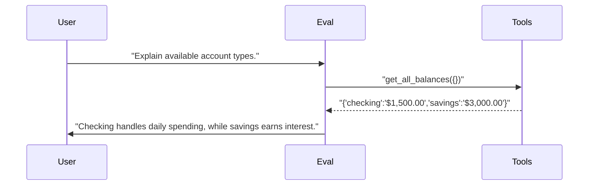

# fixture-07-skill-improvement

> **2** tests | **1** passed | **1** failed | **50%** pass rate  
> Duration: 6.0s | Cost: 🧪 1 PR · 🤖 $0.001200 · 💰 $0.001200 | Tokens: 195–195  
> August 10, 2026 at 08:06 PM

*Skill treatment improves domain language and tool usage.*

## Eval Leaderboard

|#|Eval|Tests|Pass Rate|Tokens|Cost|Duration|
| :---: | :--- | :---: | :---: | ---: | ---: | ---: |
|🥇|with skill 🏆|1/1|100%|195|1 PR|3.0s|
|🥈|baseline|0/1|0%|0|N/A|3.0s|

## AI Analysis

## 🎯 Recommendation

Deploy the strongest passing eval for **skill improvement**.

## ❌ Failure Analysis

At least one compared result failed, so the report must keep the failure visible.

## 🔧 MCP Tool Feedback

Tool names are deterministic in these fixture reports.

## Test Results

### tests/fixtures/scenario_07_skill_improvement.py

#### ❌ Baseline agent without the skill.

❌ baseline — 3.0s · 0 tokens · 0 turns · N/A

**Assertions:**

- ❌ `llm`: uses domain-correct banking terminology

**Error:** `AssertionError: expected banking terminology was missing`

#### ✅ Treatment agent with the financial-literacy skill.

✅ with skill — 3.0s · 195 tokens · 3 turns · 1 PR

**Assertions:**

- ✅ `llm`: uses domain-correct banking terminology

**Tool Calls:**

|Tool|Status|Args|
| :--- | :---: | :--- |
|`get_all_balances`|✅||

**Response:**

> Checking handles daily spending, while savings earns interest.

```mermaid
sequenceDiagram
    participant User
    participant Eval
    participant Tools

    User->>Eval: "Explain available account types."
    Eval->>Tools: "get_all_balances({})"
    Tools-->>Eval: "{'checking':'$1,500.00','savings':'$3,000.00'}"
    Eval->>User: "Checking handles daily spending, while savings earns interest."
```

*Generated by [pytest-skill-engineering](https://github.com/sbroenne/pytest-skill-engineering) on August 10, 2026 at 08:06 PM*
