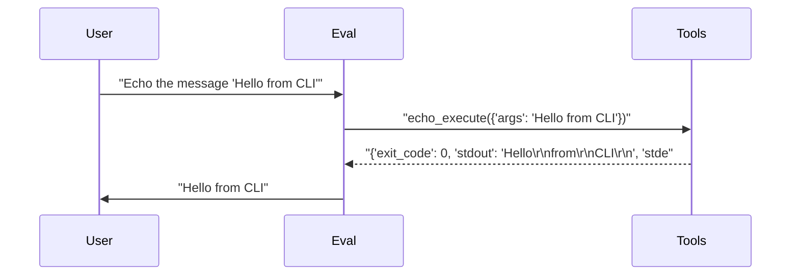
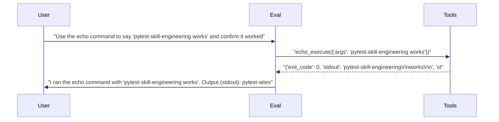

# pytest-skill-engineering

> **2** tests | **2** passed | **0** failed | **100%** pass rate  
> Duration: 15.8s | Cost: 🧪 $-0.012878 · 🤖 $0.0147 · 💰 $0.001814 | Tokens: 473–1,106  
> February 07, 2026 at 08:33 PM

*CLI server tests — demonstrates CLIServer usage.*

> **cli-agent** — ✅ All Passed  
> 2/2 tests | $0.001814 | 1,579 tokens | 15.8s


## AI Analysis

<div class="winner-card">
<div class="winner-title">Recommended for Deploy</div>
<div class="winner-name">cli-agent</div>
<div class="winner-summary">Achieves a 100% pass rate at extremely low cost with reliable CLI tool usage and clean, deterministic outputs.</div>
<div class="winner-stats">
<div class="winner-stat"><span class="winner-stat-value green">100%</span><span class="winner-stat-label">Pass Rate</span></div>
<div class="winner-stat"><span class="winner-stat-value blue">$0.001814</span><span class="winner-stat-label">Total Cost</span></div>
<div class="winner-stat"><span class="winner-stat-value amber">1,579</span><span class="winner-stat-label">Tokens</span></div>
</div>
</div>

<div class="metric-grid">
<div class="metric-card green">
<div class="metric-value green">2</div>
<div class="metric-label">Total Tests</div>
</div>
<div class="metric-card red">
<div class="metric-value red">0</div>
<div class="metric-label">Failures</div>
</div>
<div class="metric-card blue">
<div class="metric-value blue">1</div>
<div class="metric-label">Agents</div>
</div>
<div class="metric-card amber">
<div class="metric-value amber">3.0</div>
<div class="metric-label">Avg Turns</div>
</div>
</div>

## ✅ Overall Assessment

This is a **clean single-agent run** with full coverage of the intended behavior. The agent consistently:
- Correctly selected and invoked the CLI tool without hesitation
- Interpreted tool output accurately
- Confirmed success using concrete signals (stdout + exit code)
- Stayed concise while still explaining results when asked

Given the **100% pass rate at a total cost of $0.001814**, this configuration is safe to deploy as-is for basic CLI command validation and confirmation tasks.

## 🔧 MCP Tool Feedback

### cli (echo_execute)
The tool is easy to discover and was invoked correctly in all tests. The agent showed no confusion and used the tool exactly when required.

| Tool | Status | Calls | Issues |
|------|--------|-------|--------|
| echo_execute | ✅ | 2 | Working well |

## 📦 Tool Response Optimization

### echo_execute (from cli)
- **Current response size:** ~25–30 tokens per call
- **Issues found:**
  - `stdout` includes line breaks between words (`\r\n`), which increases token count
  - Output formatting is not ideal for LLM consumption when the command intent is a single string
- **Suggested optimization:** Normalize `stdout` to preserve spaces instead of inserting line breaks for each tokenized word
- **Estimated savings:** ~10–15 tokens per call (40–50% reduction for this tool)

**Example current vs optimized:**
```json
// Current (~28 tokens)
{
  "exit_code": 0,
  "stdout": "pytest-skill-engineering\r\nworks\r\n",
  "stderr": ""
}

// Optimized (~14 tokens)
{
  "exit_code": 0,
  "stdout": "pytest-skill-engineering works",
  "stderr": ""
}
```

This change would not affect correctness but would meaningfully reduce token usage across large test suites.

## 💡 Optimizations

| # | Optimization | Priority | Estimated Savings |
|---|-------------|----------|-------------------|
| 1 | Normalize CLI stdout formatting | recommended | ~40–50% fewer tool-response tokens |

#### 1. Normalize CLI stdout formatting (recommended)
- Current: `echo_execute` returns line-broken output that inflates token count and requires interpretation
- Change: Return space-preserved strings for simple echo-style commands
- Impact: Small per-call savings, but compounds across large test matrices; improves readability and reduces parsing ambiguity

---

**Deployment recommendation:** ✅ **Deploy `cli-agent` unchanged.**  
Optional tool-response optimization can further reduce costs but is not required for correctness.


## Test Results


### tests/fixtures/scenario_08_cli_server.py


#### ✅ Basic CLI tool usage — echo a message.

<details>
<summary>5.4s · 473 tokens · 3 turns · $0.000291</summary>

**Tool Calls:**


|Tool|Status|Args|
| :--- | :---: | :--- |
|`echo_execute`|✅|args='Hello from CLI'|


**Response:**

> Hello
> from
> CLI



</details>


#### ✅ CLI tool with reasoning — echo and explain.

<details>
<summary>10.4s · 1,106 tokens · 3 turns · $0.001522</summary>

**Assertions:**

- ✅ `llm`: confirms the echo command executed successfully

**Tool Calls:**


|Tool|Status|Args|
| :--- | :---: | :--- |
|`echo_execute`|✅|args='pytest-skill-engineering works'|


**Response:**

> I ran the echo command with "pytest-skill-engineering works". Output (stdout):
> pytest-skill-engineering
> works
> 
> Exit code: 0 — so it worked.



</details>

*Generated by [pytest-skill-engineering](https://github.com/sbroenne/pytest-skill-engineering) on February 07, 2026 at 08:33 PM*
