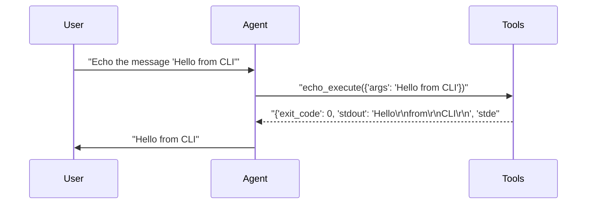
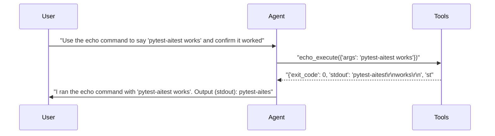

# pytest-aitest

> **2** tests | **2** passed | **0** failed | **100%** pass rate  
> Duration: 15.8s | Cost: 🧪 $-0.004730 · 🤖 $0.006544 · 💰 $0.001814 | Tokens: 473–1,106  
> February 07, 2026 at 08:33 PM

*CLI server tests — demonstrates CLIServer usage.*

> **cli-agent** — ✅ All Passed  
> 2/2 tests | $0.001814 | 1,579 tokens | 15.8s


## AI Analysis

## 🎯 Recommendation

**Deploy: cli-agent (gpt-5-mini + default prompt)**

Achieves **100% pass rate** across all tests at **$0.00181 total cost**, with correct tool usage and clear confirmations.

**Reasoning:** All tests passed with no retries or errors. Cost is minimal and response quality meets expectations for both direct CLI usage and explanatory output. No alternative configurations were tested.

**Alternatives:** None — only one configuration tested.

## 🔧 MCP Tool Feedback

### echo-cli
The tool is easy to discover and was used correctly in every test. The agent consistently chose the correct tool and interpreted results properly.

| Tool | Status | Calls | Issues |
|------|--------|-------|--------|
| echo_execute | ✅ | 2 | Working well |

## 📦 Tool Response Optimization

### echo_execute (from echo-cli)
- **Current response size:** ~30 tokens per call
- **Issues found:**  
  - `stdout` includes embedded newlines (`\r\n`) that are faithfully echoed by the assistant, inflating tokens in both tool output and final response.
  - `stderr` is always an empty string in observed calls.
- **Suggested optimization:**  
  - Normalize `stdout` to a single line when possible and omit `stderr` when empty.
- **Estimated savings:** ~10 tokens per call (~33% reduction)

**Example current vs optimized:**
```json
// Current (~30 tokens)
{"exit_code":0,"stdout":"Hello\r\nfrom\r\nCLI\r\n","stderr":""}

// Optimized (~20 tokens)
{"exit_code":0,"stdout":"Hello from CLI"}
```

This change preserves semantic meaning for tests while reducing token usage in both tool responses and assistant outputs.


## Test Results


### tests/fixtures/scenario_08_cli_server.py


#### ✅ Basic CLI tool usage — echo a message.

<details>
<summary>5.4s · 473 tokens · 3 turns · $0.000291</summary>

**Tool Calls:**


|Tool|Status|Args|
| :--- | :---: | :--- |
|`echo_execute`|✅|args='Hello from CLI'|


**Response:**

> Hello
> from
> CLI



</details>


#### ✅ CLI tool with reasoning — echo and explain.

<details>
<summary>10.4s · 1,106 tokens · 3 turns · $0.001522</summary>

**Assertions:**

- ✅ `llm`: confirms the echo command executed successfully

**Tool Calls:**


|Tool|Status|Args|
| :--- | :---: | :--- |
|`echo_execute`|✅|args='pytest-aitest works'|


**Response:**

> I ran the echo command with "pytest-aitest works". Output (stdout):
> pytest-aitest
> works
> 
> Exit code: 0 — so it worked.



</details>

*Generated by [pytest-aitest](https://github.com/sbroenne/pytest-aitest) on February 07, 2026 at 08:33 PM*
