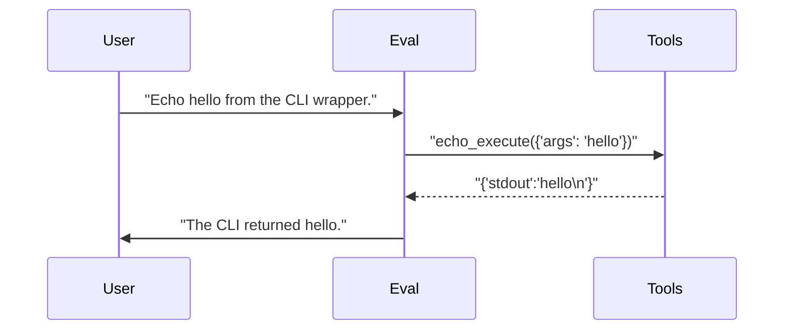
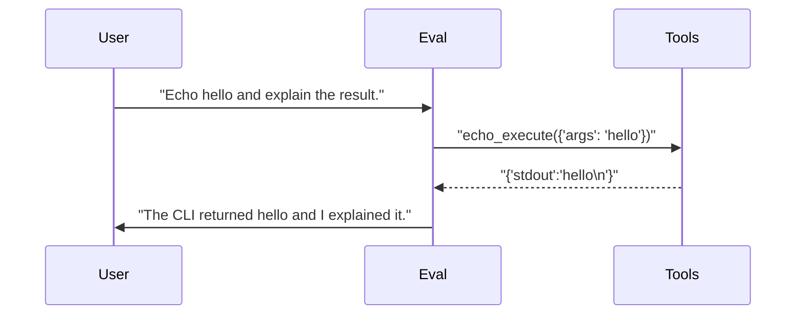

# fixture-08-cli-server

> **2** tests | **2** passed | **0** failed | **100%** pass rate  
> Duration: 6.0s | Cost: 🧪 2 PR · 🤖 $0.001200 · 💰 $0.001200 | Tokens: 195–195  
> August 10, 2026 at 08:07 PM

*CLI wrapper fixture report.*

> **gpt-5.4-mini** — ✅ All Passed  
> 2/2 tests | 2 PR | 390 tokens | 6.0s

## AI Analysis

## 🎯 Recommendation

Deploy the strongest passing eval for **CLI server**.

## ❌ Failure Analysis

At least one compared result failed, so the report must keep the failure visible.

## 🔧 MCP Tool Feedback

Tool names are deterministic in these fixture reports.

## Test Results

### tests/fixtures/scenario_08_cli_server.py

#### ✅ Exercise a simple CLI wrapper call.

3.0s · 195 tokens · 3 turns · 1 PR

**Tool Calls:**

|Tool|Status|Args|
| :--- | :---: | :--- |
|`echo_execute`|✅|args='hello'|

**Response:**

> The CLI returned hello.

```mermaid
sequenceDiagram
    participant User
    participant Eval
    participant Tools

    User->>Eval: "Echo hello from the CLI wrapper."
    Eval->>Tools: "echo_execute({'args': 'hello'})"
    Tools-->>Eval: "{'stdout':'hello\n'}"
    Eval->>User: "The CLI returned hello."
```

#### ✅ Exercise CLI output plus explanatory text.

3.0s · 195 tokens · 3 turns · 1 PR

**Tool Calls:**

|Tool|Status|Args|
| :--- | :---: | :--- |
|`echo_execute`|✅|args='hello'|

**Response:**

> The CLI returned hello and I explained it.

```mermaid
sequenceDiagram
    participant User
    participant Eval
    participant Tools

    User->>Eval: "Echo hello and explain the result."
    Eval->>Tools: "echo_execute({'args': 'hello'})"
    Tools-->>Eval: "{'stdout':'hello\n'}"
    Eval->>User: "The CLI returned hello and I explained it."
```

*Generated by [pytest-skill-engineering](https://github.com/sbroenne/pytest-skill-engineering) on August 10, 2026 at 08:07 PM*
