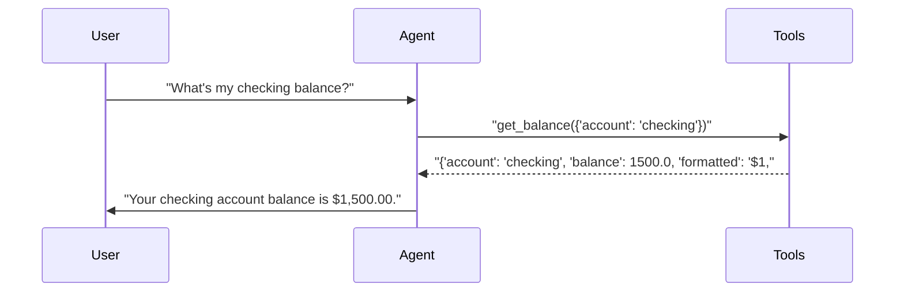
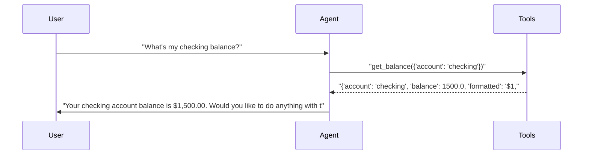
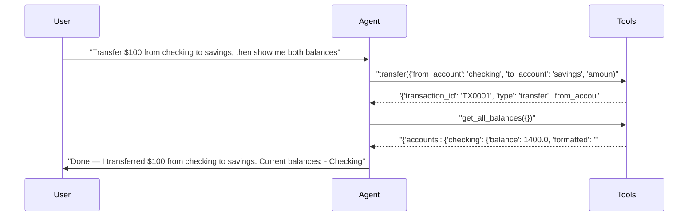

# pytest-skill-engineering

> **4** tests | **4** passed | **0** failed | **100%** pass rate  
> Duration: 32.7s | Cost: 🧪 $-0.018149 · 🤖 $0.0205 · 💰 $0.002304 | Tokens: 892–2,033  
> February 07, 2026 at 08:33 PM

*A/B server comparison — verbose vs terse system prompts.*

## Agent Leaderboard

|#|Agent|Tests|Pass Rate|Tokens|Cost|Duration|
| :---: | :--- | :---: | :---: | ---: | ---: | ---: |
|🥇|terse-prompt 🏆|2/2|100%|2,602|$0.001062|13.6s|
|🥈|verbose-prompt|2/2|100%|3,086|$0.001242|19.1s|

## AI Analysis

Recommended for Deploy

terse-prompt

Delivers a 100% pass rate at lower realized cost than the verbose alternative, with equally reliable multi-step tool usage and faster, more concise responses.

100%Pass Rate

$0.001062Total Cost

2,602Tokens

4

Total Tests

0

Failures

2

Agents

3.5

Avg Turns

## Comparative Analysis

### Why the winner wins
- **Lower cost with identical reliability:** terse-prompt achieves the same 100% pass rate as verbose-prompt at a lower total cost ($0.001062 vs $0.001242), a ~15% realized savings across the suite.
- **Equivalent tool chaining:** Both agents correctly executed multi-step sequences (`transfer` → `get_all_balances`) without retries or ordering errors.
- **Lean responses:** The terse prompt avoids additional conversational flourishes while still confirming outcomes, keeping token usage lower in both single-step and multi-step tests.

### Notable patterns
- **Verbosity does not improve correctness here:** Despite expectations that verbosity might help multi-step tasks, both prompts performed identically on tool selection and sequencing.
- **Extra helpfulness adds cost:** The verbose-prompt consistently adds follow-up questions and optional offers (e.g., receipts, transaction IDs), increasing tokens without improving test outcomes.
- **Model robustness:** With `gpt-5-mini`, both prompts reliably inferred required tools from natural language without explicit step-by-step instruction.

### Alternatives
- **verbose-prompt:** A viable alternative if product requirements favor more conversational guidance and optional follow-ups, but it carries higher cost with no measurable reliability gain in this test set.

## 🔧 MCP Tool Feedback

### banking-server
Overall, tool discoverability and usage are strong. The agent consistently selected the correct tool and parameters from natural language instructions, including correct sequencing for multi-step operations.

| Tool | Status | Calls | Issues |
|------|--------|-------|--------|
| get_balance | ✅ | 2 | Working well |
| transfer | ✅ | 2 | Working well |
| get_all_balances | ✅ | 2 | Working well |

## 📝 System Prompt Feedback

### terse-prompt (effective)
- **Token count:** Low relative to verbose variant
- **Behavioral impact:** Direct language encourages immediate tool invocation and concise confirmations without unnecessary preambles.
- **Problem:** None observed in this test suite.
- **Suggested change:** None required.

### verbose-prompt (effective, higher cost)
- **Token count:** Higher due to additional explanatory and conversational text
- **Behavioral impact:** Language that invites helpfulness (“Would you like…”, offering receipts/IDs) increases verbosity but does not alter tool behavior.
- **Problem:** Adds tokens without improving correctness or coverage.
- **Suggested change:** Remove optional follow-up offers unless explicitly requested by the user:
  > Remove sentences offering receipts, transaction IDs, or next actions unless the user asks for them.

## 💡 Optimizations

| # | Optimization | Priority | Estimated Savings |
|---|-------------|----------|-------------------|
| 1 | Trim optional follow-up text in verbose prompt | recommended | ~15% cost reduction |
| 2 | Standardize concise confirmation pattern | suggestion | ~5–10% fewer tokens |

#### 1. Trim optional follow-up text in verbose prompt (recommended)
- Current: Responses include optional offers (receipts, transaction IDs, next actions) after successful operations.
- Change: Restrict responses to confirmation + requested data only.
- Impact: ~15% cost reduction across similar transactional tests.

#### 2. Standardize concise confirmation pattern (suggestion)
- Current: Confirmation phrasing varies and sometimes repeats information already present in tool output.
- Change: Use a fixed, minimal confirmation template for successful operations.
- Impact: ~5–10% fewer tokens per multi-step test, with no loss in clarity.

## Test Results

### tests/fixtures/scenario_09_ab_servers.py

#### ✅ Simple query — should work with both prompts.

✅ verbose-prompt — 7.9s · 1,053 tokens · 3 turns · $0.000333

**Tool Calls:**

|Tool|Status|Args|
| :--- | :---: | :--- |
|`get_balance`|✅|account='checking'|

**Response:**

> Your checking account balance is $1,500.00.

✅ terse-prompt — 4.8s · 892 tokens · 3 turns · $0.000326

**Tool Calls:**

|Tool|Status|Args|
| :--- | :---: | :--- |
|`get_balance`|✅|account='checking'|

**Response:**

> Your checking account balance is $1,500.00. Would you like to do anything with this account (transfer, withdraw, deposit, see transactions)?

#### ✅ Multi-step operation — verbose prompt may perform better.

✅ verbose-prompt — 11.2s · 2,033 tokens · 4 turns · $0.000909

**Assertions:**

- ✅ `llm`: confirms a transfer and shows balances

**Tool Calls:**

|Tool|Status|Args|
| :--- | :---: | :--- |
|`transfer`|✅|from_account='checking', to_account='savings', amount=100|
|`get_all_balances`|✅||

**Response:**

> Done — I transferred $100 from checking to savings.
> 
> Current balances:
> - Checking: $1,400.00
> - Savings: $3,100.00
> 
> Would you like a receipt for the transfer or the transaction ID?

✅ terse-prompt — 8.8s · 1,710 tokens · 4 turns · $0.000735

**Assertions:**

- ✅ `llm`: confirms a transfer and shows balances

**Tool Calls:**

|Tool|Status|Args|
| :--- | :---: | :--- |
|`transfer`|✅|from_account='checking', to_account='savings', amount=100|
|`get_all_balances`|✅||

**Response:**

> Done — I transferred $100 from checking to savings.
> 
> Current balances:
> - Checking: $1,400.00
> - Savings: $3,100.00
> 
> Total across both accounts: $4,500.00
> 
> Would you like a receipt or transaction ID for this transfer?

*Generated by [pytest-skill-engineering](https://github.com/sbroenne/pytest-skill-engineering) on February 07, 2026 at 08:33 PM*
