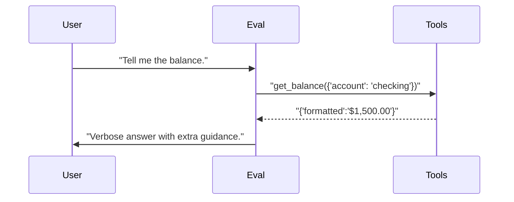
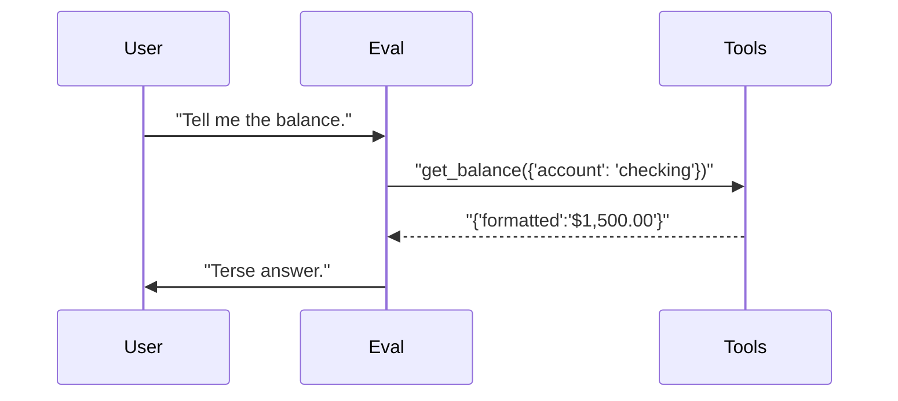

# fixture-09-ab-servers

> **2** tests | **2** passed | **0** failed | **100%** pass rate  
> Duration: 6.0s | Cost: 🧪 2 PR · 🤖 $0.001200 · 💰 $0.001200 | Tokens: 195–195  
> August 10, 2026 at 08:08 PM

*A/B prompt comparison with identical tool behavior.*

## Eval Leaderboard

|#|Eval|Tests|Pass Rate|Tokens|Cost|Duration|
| :---: | :--- | :---: | :---: | ---: | ---: | ---: |
|🥇|terse-prompt 🏆|1/1|100%|195|1 PR|3.0s|
|🥈|verbose-prompt|1/1|100%|195|1 PR|3.0s|

## AI Analysis

## 🎯 Recommendation

Deploy the strongest passing eval for **A/B prompts**.

## ❌ Failure Analysis

At least one compared result failed, so the report must keep the failure visible.

## 🔧 MCP Tool Feedback

Tool names are deterministic in these fixture reports.

## Test Results

### tests/fixtures/scenario_09_ab_servers.py

#### ✅ Verbose variant for the same banking request. [verbose-prompt]

✅ verbose-prompt — 3.0s · 195 tokens · 3 turns · 1 PR

**Tool Calls:**

|Tool|Status|Args|
| :--- | :---: | :--- |
|`get_balance`|✅|account='checking'|

**Response:**

> Verbose answer with extra guidance.

```mermaid
sequenceDiagram
    participant User
    participant Eval
    participant Tools

    User->>Eval: "Tell me the balance."
    Eval->>Tools: "get_balance({'account': 'checking'})"
    Tools-->>Eval: "{'formatted':'$1,500.00'}"
    Eval->>User: "Verbose answer with extra guidance."
```

#### ✅ Terse variant for the same banking request. [terse-prompt]

✅ terse-prompt — 3.0s · 195 tokens · 3 turns · 1 PR

**Tool Calls:**

|Tool|Status|Args|
| :--- | :---: | :--- |
|`get_balance`|✅|account='checking'|

**Response:**

> Terse answer.

```mermaid
sequenceDiagram
    participant User
    participant Eval
    participant Tools

    User->>Eval: "Tell me the balance."
    Eval->>Tools: "get_balance({'account': 'checking'})"
    Tools-->>Eval: "{'formatted':'$1,500.00'}"
    Eval->>User: "Terse answer."
```

*Generated by [pytest-skill-engineering](https://github.com/sbroenne/pytest-skill-engineering) on August 10, 2026 at 08:08 PM*
