# pytest-aitest

> **4** tests | **4** passed | **0** failed | **100%** pass rate  
> Duration: 32.7s | Cost: 🧪 $-0.013016 · 🤖 $0.0153 · 💰 $0.002304 | Tokens: 892–2,033  
> February 07, 2026 at 08:33 PM

*A/B server comparison — verbose vs terse system prompts.*


## Agent Leaderboard


|#|Agent|Tests|Pass Rate|Tokens|Cost|Duration|
| :---: | :--- | :---: | :---: | ---: | ---: | ---: |
|🥇|terse-prompt 🏆|2/2|100%|2,602|$0.001062|13.6s|
|🥈|verbose-prompt|2/2|100%|3,086|$0.001242|19.1s|


## AI Analysis

## 🎯 Recommendation

**Deploy: terse-prompt (gpt-5-mini)**

Achieves **100% pass rate at ~13% lower total cost** than the verbose prompt while producing equivalent tool usage and correct multi-step behavior.

**Reasoning:** Both prompts passed all tests (100% pass rate). The terse prompt is cheaper across both scenarios ($0.001061 vs $0.001242 total, ~13% cost reduction) and used fewer tokens while still calling the correct tools in the correct order. Response quality is equivalent for test purposes; the extra verbosity in the verbose prompt does not improve correctness.

**Alternatives:**  
- **verbose-prompt (gpt-5-mini):** Same pass rate, but ~13% higher cost with no measurable reliability or correctness benefit in these tests.

## 🔧 MCP Tool Feedback

### pytest_aitest.testing.banking_mcp
Overall, tools are clearly named and were invoked correctly in all tests. No confusion between similar tools was observed.

| Tool | Status | Calls | Issues |
|------|--------|-------|--------|
| get_balance | ✅ | 2 | Working well |
| get_all_balances | ✅ | 2 | Working well |
| transfer | ✅ | 2 | Working well |
| deposit | ✅ | 0 | Not exercised in tests |
| withdraw | ✅ | 0 | Not exercised in tests |
| get_transactions | ✅ | 0 | Not exercised in tests |

## 📝 System Prompt Feedback

### verbose-prompt (effective but inefficient)
- **Token count:** High (contributed to +161 and +323 token overhead vs terse prompt in simple and multi-step tests)
- **Problem:** Redundant instructions and explicit tool lists increase context size without improving tool selection or correctness.
- **Suggested change (exact rewrite):**
  ```
  You are a banking assistant. Use the provided tools to answer account-related requests.
  Always call the appropriate tool before answering. Never guess balances or transaction results.
  ```

### terse-prompt (effective)
- **Token count:** Low
- **Assessment:** Instructions were sufficient for correct tool usage in both single-step and multi-step scenarios. No changes required.

## 💡 Optimizations

1. **Standardize on terse system prompt** (recommended)
   - Current: Two prompt variants maintained with overlapping intent.
   - Change: Remove the verbose prompt and deploy the terse prompt as the default.
   - Impact: ~13% cost reduction per test run with identical pass rates and behavior.

## 📦 Tool Response Optimization

### get_all_balances (from pytest_aitest.testing.banking_mcp)
- **Current response size:** High due to duplicated formatted values and totals not always used.
- **Issues found:**  
  - `total` and `total_formatted` are unused in one of the two multi-step responses.  
  - Both raw and formatted values are returned for each account, but only `formatted` is used in assistant output.
- **Suggested optimization:**  
  Return only formatted balances by default; make totals optional via a flag.
- **Estimated savings:** ~20–25 tokens per call (~15–20% reduction)

**Example current vs optimized:**
```json
// Current (~120 tokens)
{
  "accounts": {
    "checking": {"balance": 1400.0, "formatted": "$1,400.00"},
    "savings": {"balance": 3100.0, "formatted": "$3,100.00"}
  },
  "total": 4500.0,
  "total_formatted": "$4,500.00"
}

// Optimized (~90 tokens)
{
  "accounts": {
    "checking": "$1,400.00",
    "savings": "$3,100.00"
  }
}
```

This optimization would reduce response size without affecting test correctness or agent behavior in the observed scenarios.


## Test Results


### tests/fixtures/scenario_09_ab_servers.py


#### ✅ Simple query — should work with both prompts.

<details>
<summary>✅ verbose-prompt — 7.9s · 1,053 tokens · 3 turns · $0.000333</summary>

**Tool Calls:**


|Tool|Status|Args|
| :--- | :---: | :--- |
|`get_balance`|✅|account='checking'|


**Response:**

> Your checking account balance is $1,500.00.


</details>

<details>
<summary>✅ terse-prompt — 4.8s · 892 tokens · 3 turns · $0.000326</summary>

**Tool Calls:**


|Tool|Status|Args|
| :--- | :---: | :--- |
|`get_balance`|✅|account='checking'|


**Response:**

> Your checking account balance is $1,500.00. Would you like to do anything with this account (transfer, withdraw, deposit, see transactions)?


</details>


#### ✅ Multi-step operation — verbose prompt may perform better.

<details>
<summary>✅ verbose-prompt — 11.2s · 2,033 tokens · 4 turns · $0.000909</summary>

**Assertions:**

- ✅ `llm`: confirms a transfer and shows balances

**Tool Calls:**


|Tool|Status|Args|
| :--- | :---: | :--- |
|`transfer`|✅|from_account='checking', to_account='savings', amount=100|
|`get_all_balances`|✅||


**Response:**

> Done — I transferred $100 from checking to savings.
> 
> Current balances:
> - Checking: $1,400.00
> - Savings: $3,100.00
> 
> Would you like a receipt for the transfer or the transaction ID?

```mermaid
sequenceDiagram
    participant User
    participant Agent
    participant Tools

    User->>Agent: "Transfer $100 from checking to savings, then show me both balances"
    Agent->>Tools: "transfer({'from_account': 'checking', 'to_account': 'savings', 'amoun)"
    Tools-->>Agent: "{'transaction_id': 'TX0001', 'type': 'transfer', 'from_accou"
    Agent->>Tools: "get_all_balances({})"
    Tools-->>Agent: "{'accounts': {'checking': {'balance': 1400.0, 'formatted': '"
    Agent->>User: "Done — I transferred $100 from checking to savings. Current balances: - Checking"
```



</details>

<details>
<summary>✅ terse-prompt — 8.8s · 1,710 tokens · 4 turns · $0.000735</summary>

**Assertions:**

- ✅ `llm`: confirms a transfer and shows balances

**Tool Calls:**


|Tool|Status|Args|
| :--- | :---: | :--- |
|`transfer`|✅|from_account='checking', to_account='savings', amount=100|
|`get_all_balances`|✅||


**Response:**

> Done — I transferred $100 from checking to savings.
> 
> Current balances:
> - Checking: $1,400.00
> - Savings: $3,100.00
> 
> Total across both accounts: $4,500.00
> 
> Would you like a receipt or transaction ID for this transfer?


</details>

*Generated by [pytest-aitest](https://github.com/sbroenne/pytest-aitest) on February 07, 2026 at 08:33 PM*
