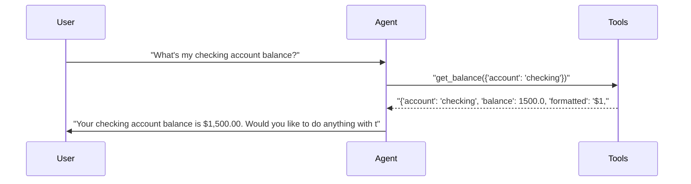
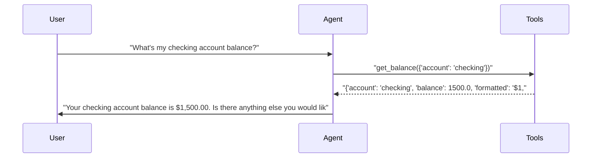
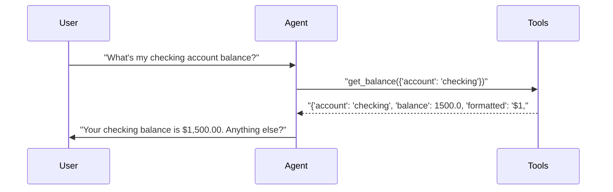
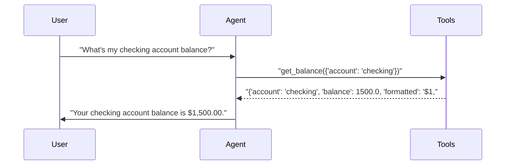

# pytest-aitest

> **4** tests | **4** passed | **0** failed | **100%** pass rate  
> Duration: 23.6s | Cost: 🧪 $-0.019520 · 🤖 $0.0208 · 💰 $0.001297 | Tokens: 706–913  
> February 07, 2026 at 08:34 PM

*2×2 matrix proving dimension auto-detection.*


## Agent Leaderboard


|#|Agent|Tests|Pass Rate|Tokens|Cost|Duration|
| :---: | :--- | :---: | :---: | ---: | ---: | ---: |
|🥇|gpt-5-mini + concise 🏆|1/1|100%|893|$0.000297|4.7s|
|🥈|gpt-4.1-mini + concise|1/1|100%|706|$0.000317|5.1s|
|🥉|gpt-4.1-mini + detailed|1/1|100%|717|$0.000340|5.7s|
|4|gpt-5-mini + detailed|1/1|100%|913|$0.000344|8.2s|


## AI Analysis

<div class="winner-card">
<div class="winner-title">Recommended for Deploy</div>
<div class="winner-name">gpt-5-mini + concise</div>
<div class="winner-summary">Delivers a 100% pass rate at the lowest realized cost, with direct tool usage and minimal conversational overhead.</div>
<div class="winner-stats">
<div class="winner-stat"><span class="winner-stat-value green">100%</span><span class="winner-stat-label">Pass Rate</span></div>
<div class="winner-stat"><span class="winner-stat-value blue">$0.000297</span><span class="winner-stat-label">Total Cost</span></div>
<div class="winner-stat"><span class="winner-stat-value amber">893</span><span class="winner-stat-label">Tokens</span></div>
</div>
</div>

<div class="metric-grid">
<div class="metric-card green">
<div class="metric-value green">4</div>
<div class="metric-label">Total Tests</div>
</div>
<div class="metric-card red">
<div class="metric-value red">0</div>
<div class="metric-label">Failures</div>
</div>
<div class="metric-card blue">
<div class="metric-value blue">4</div>
<div class="metric-label">Agents</div>
</div>
<div class="metric-card amber">
<div class="metric-value amber">3.0</div>
<div class="metric-label">Avg Turns</div>
</div>
</div>

## Comparative Analysis

#### Why the winner wins
- **Lowest cost at identical pass rate:** gpt-5-mini + concise achieves the same 100% pass rate as all alternatives at the **lowest total cost ($0.000297)**.
- **Direct tool execution:** The concise prompt consistently triggers an immediate `get_balance` call without extra framing or follow-up questions.
- **Controlled verbosity:** Produces a short, task-complete response, avoiding optional suggestions that add tokens without improving correctness.

#### Notable patterns
- **Prompt verbosity impacts cost more than model choice:** Across both models, the **concise** prompt is cheaper than **detailed**, even when tokens are similar.
- **Cheaper model isn’t always fewer tokens:** gpt-5-mini + concise uses more tokens than gpt-4.1-mini + concise, yet still costs less overall—reinforcing that **realized cost**, not token count, should drive selection.
- **No tool confusion across the matrix:** All agents correctly identified and called `get_balance`, validating MCP tool discoverability.

#### Alternatives
- **gpt-4.1-mini + concise:** Slightly higher cost with marginally fewer tokens; acceptable if standardizing on the 4.1 family.
- **Detailed prompts (both models):** Functionally correct but add conversational padding (follow-up offers), increasing cost without test benefit.

## 🔧 MCP Tool Feedback

### banking-server
The tool is easy to discover and consistently called correctly across all agents.

| Tool | Status | Calls | Issues |
|------|--------|-------|--------|
| get_balance | ✅ | 4 | Working well |

**Suggested rewrite for `get_balance`:**  
> *Optional optimization* — clarify minimal return fields for balance-only queries:  
> “Returns the numeric balance for the specified account. Include formatted strings only if explicitly requested.”

## 📝 System Prompt Feedback

### concise (effective with gpt-5-mini, gpt-4.1-mini)
- **Token count:** Low
- **Behavioral impact:** Language such as “answer directly” and absence of “explain” or “offer options” primes immediate tool use and brief completion.
- **Problem:** None observed.
- **Suggested change:** None.

### detailed (mixed — effective but costlier with both models)
- **Token count:** Higher
- **Behavioral impact:** Words like “helpful” and implied completeness encourage follow-up suggestions (“Would you like to…”) after the tool result.
- **Problem:** Adds unnecessary conversational turns and tokens for simple retrieval tasks.
- **Suggested change:**  
  Replace any closing guidance with:  
  > “After completing the request, stop unless the user asks for next steps.”

## 💡 Optimizations

| # | Optimization | Priority | Estimated Savings |
|---|-------------|----------|-------------------|
| 1 | Trim post-answer suggestions | recommended | ~10–15% cost reduction |
| 2 | Minimize tool response fields | suggestion | ~5–10% token reduction per call |

#### 1. Trim post-answer suggestions (recommended)
- Current: Detailed prompts elicit follow-up offers after returning the balance.
- Change: Instruct the agent to stop after fulfilling the user’s request unless prompted.
- Impact: ~10–15% cost reduction from shorter final messages.

#### 2. Minimize tool response fields (suggestion)
- Current: Tool returns both `balance` and `formatted`, but the agent only needs one.
- Change: Default to returning a single numeric field unless formatting is requested.
- Impact: ~5–10% token reduction per call.

## 📦 Tool Response Optimization

### get_balance (from banking-server)
- **Current response size:** Includes redundant fields for this test.
- **Issues found:** Both numeric and formatted values returned; the agent uses only one.
- **Suggested optimization:** Return a minimal schema by default.

**Example current vs optimized:**
```json
// Current
{"account":"checking","balance":1500.0,"formatted":"$1,500.00"}

// Optimized
{"balance":1500.0}
```

- **Estimated savings:** ~8–12 tokens per call (≈10% reduction)

---

**Bottom line:** Deploy **gpt-5-mini + concise**. It matches perfect correctness at the lowest observed cost, with clean tool usage and no behavioral risk.


## Test Results


### 2×2 matrix proving dimension auto-detection.


#### ✅ Balance query across 2 models × 2 prompts = 4 runs.

<details>
<summary>✅ gpt-5-mini + detailed — 8.2s · 913 tokens · 3 turns · $0.000344</summary>

**Tool Calls:**


|Tool|Status|Args|
| :--- | :---: | :--- |
|`get_balance`|✅|account='checking'|


**Response:**

> Your checking account balance is $1,500.00. Would you like to do anything with this account (transfer, withdraw, view transactions)? I can also show balances for all accounts.



</details>

<details>
<summary>✅ gpt-4.1-mini + detailed — 5.7s · 717 tokens · 3 turns · $0.000340</summary>

**Tool Calls:**


|Tool|Status|Args|
| :--- | :---: | :--- |
|`get_balance`|✅|account='checking'|


**Response:**

> Your checking account balance is $1,500.00. Is there anything else you would like to check or do with your accounts?



</details>

<details>
<summary>✅ gpt-5-mini + concise — 4.7s · 893 tokens · 3 turns · $0.000297</summary>

**Tool Calls:**


|Tool|Status|Args|
| :--- | :---: | :--- |
|`get_balance`|✅|account='checking'|


**Response:**

> Your checking balance is $1,500.00. Anything else?



</details>

<details>
<summary>✅ gpt-4.1-mini + concise — 5.1s · 706 tokens · 3 turns · $0.000317</summary>

**Tool Calls:**


|Tool|Status|Args|
| :--- | :---: | :--- |
|`get_balance`|✅|account='checking'|


**Response:**

> Your checking account balance is $1,500.00.



</details>

*Generated by [pytest-aitest](https://github.com/sbroenne/pytest-aitest) on February 07, 2026 at 08:34 PM*
